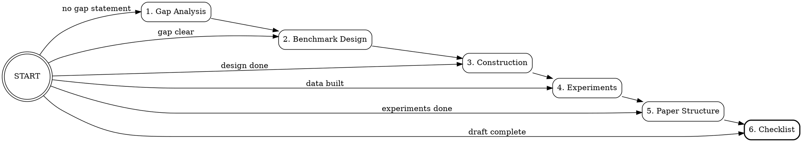

# Benchmark/Evaluation Paper Writing System

A systematic workflow for writing Benchmark/Evaluation papers targeting top-tier AI venues (NeurIPS, ICLR, ICML, ACL, EMNLP, CVPR).

## Core Philosophy

A Benchmark paper's narrative axis is fundamentally different from a Technique Paper:

| Dimension | Technique Paper | Benchmark Paper |
|-----------|----------------|-----------------|
| Core claim | "Our method is better" | "This evaluation dimension is overlooked" |
| Role of problem definition | Goal stated in one sentence | Problem definition IS the contribution (defining "what to evaluate", "how to measure", "what insights emerge") |
| Introduction axis | Key Idea / Mechanism | Evaluation Gap + Our Benchmark Design |
| Main chapter | Method / Approach (largest section) | Construction Pipeline is core; companion method is bonus. For VLDB Evaluation Papers, evaluation dimensions & perspectives are the key. |
| Experiment goal | Prove SOTA | Reveal model capability boundaries + deep insights for future research |
| Key figures & tables | Architecture diagram | Benchmark comparison table + Construction Pipeline figure + Multi-dimensional analysis charts |
| Key contribution | Novel technique | New evaluation paradigm + empirical findings |

**The benchmark paper's core is NOT "proposing a dataset", it is defining a new evaluation dimension, providing systematic measurement infrastructure, and revealing deep insights about model capabilities.**

The Gap and the Motivation must be made explicit. The paper needs to state plainly, in its own Introduction, exactly why this benchmark or this evaluation paper needs to exist.

## The Five Pillars

Every excellent benchmark paper addresses these five elements:

1. **Research Gap** (evaluation blind spot), a clear, defensible evaluation blind spot
2. **Construction Pipeline** (construction methodology), systematic, scalable, high-quality data creation
3. **Evaluation Framework** (evaluation framework detail), multi-dimensional taxonomy with fine-grained diagnostics
4. **Empirical Findings** (empirical insights), insights beyond leaderboard numbers, with "Finding X" summaries
5. **Companion Method** (companion method, optional but recommended), a model leveraging the benchmark to improve capability

## Stage Detection & Routing



When invoked, ask the user: **"Which stage is the benchmark paper currently at?"** and present:

| Stage | Condition | Invoke Skill | Key Question Answered |
|-------|-----------|-------------|----------------------|
| 1. Gap Analysis | Still exploring why this benchmark needs to exist | `bench-gap-analysis` | Why does this benchmark need to exist? |
| 2. Benchmark Design | Gap confirmed, currently designing the benchmark system | `bench-design` | What does the benchmark look like? |
| 3. Construction Pipeline | Design locked, planning the data construction pipeline | `bench-construction` | How is the data built? |
| 4. Experiment Design | Data ready or under construction, experiments need to be designed | `bench-experiments` | What experiments reveal the deepest insights? |
| 5. Paper Structure | Experiments complete, currently writing the paper | `bench-paper-structure` | How to organize and write the paper? |
| 6. Pre-submission Checklist | First draft complete, running pre-submission checks | `bench-checklist` | Is the paper ready to submit? |

If the user describes their situation without choosing a number, infer the stage from context and confirm before routing.

## Reference Exemplars

This skill system draws from three published benchmark papers as recurring case studies:

| Paper | Venue | Domain | Key Innovation |
|-------|-------|--------|---------------|
| **StatQA** | NeurIPS 2024 | Math/Statistics | Reverse synthesis: fix answer first, then generate question |
| **nvBench 2.0** | NeurIPS 2025 | Text-to-Visualization | Controlled ambiguity injection from unambiguous seeds |
| **VisJudge-Bench** | ICLR 2026 | Visualization Evaluation | Adaptive question generation + 3-stage expert annotation |

Each sub-skill references these papers as concrete examples of successful strategies. A detailed instantiation template is available in `references/instantiation-template.md`.

## Recommended Paper Structure

For reference, the recommended section structure is:

```
Section 1: Introduction (1.5 pages)
Section 2: The Proposed Benchmark (3-4 pages), core chapter
Section 3: Specialized Model/Method (1-2 pages, optional)
Section 4: Experiments & Empirical Findings (4-5 pages)
Section 5: Discussion & Research Opportunities (1 page)
Section 6: Related Work (1 page)
Section 7: Conclusion (0.5 page)
```
