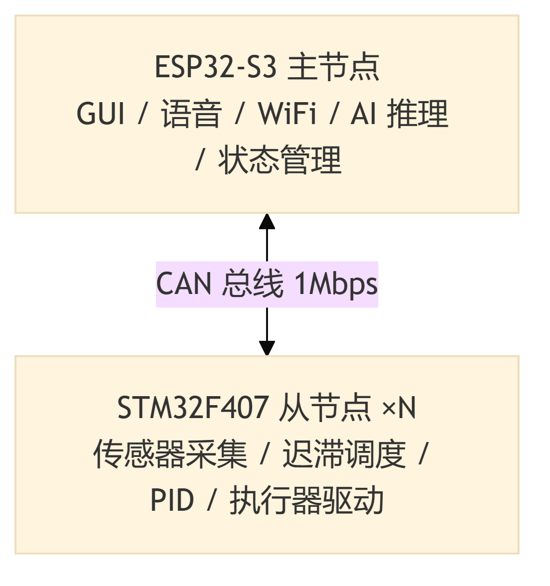
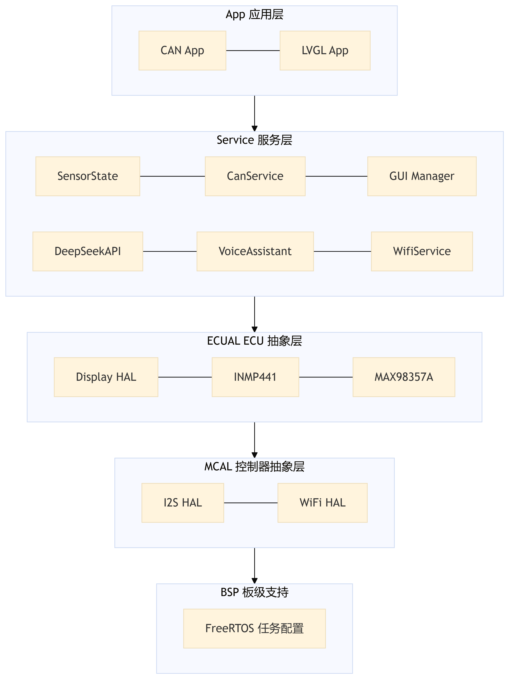
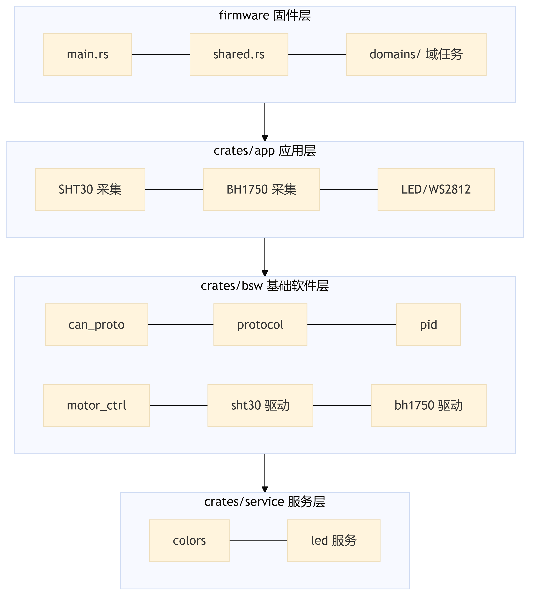
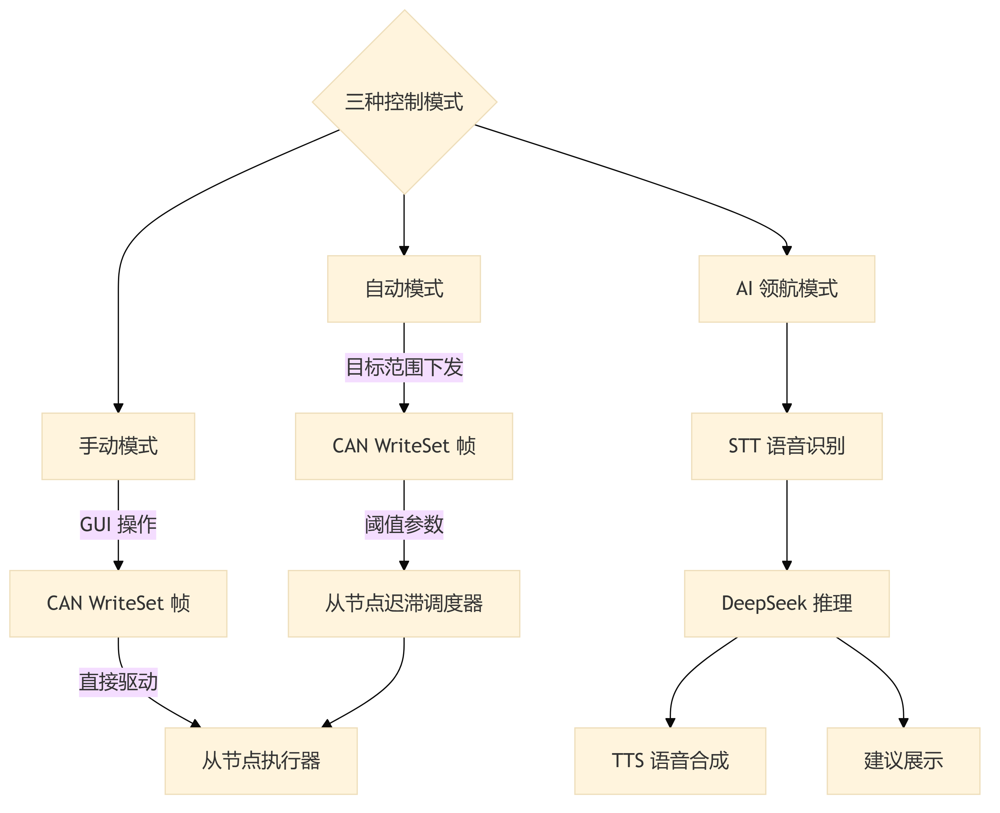

# 第1章 绪论

## 1.1 研究背景与意义

农业是国民经济的基础产业，而温室设施农业作为现代农业的重要组成部分，通过人为创造适宜作物生长的环境条件，有效突破了自然气候对农业生产的季节性限制。近年来，随着全球人口持续增长与耕地面积不断缩减的矛盾日益加剧，提高单位面积产量和资源利用效率已成为农业可持续发展的核心命题[@karunathilake2023smart]。智能温室控制系统通过实时监测与精准调控温度、湿度、光照、土壤水分等环境参数，能够为作物创造最优生长条件，从而显著提升产量与品质，降低水肥资源消耗[@shamshiri2018advances]。

物联网（Internet of Things, IoT）技术的快速发展为智能温室的环境监控提供了坚实的技术基础。基于各类传感器节点与无线通信网络，物联网技术实现了温室环境参数的实时采集、远程传输与集中管理，使温室管理从传统的人工经验驱动向数据驱动转型[@navarro2020iot]。多项研究表明，基于物联网的温室监控系统能够有效降低人工巡检成本，提高环境调控的时效性与准确性[@subahi2020iot; @liu2015intelligent]。与此同时，微控制器技术的进步——特别是以 STM32 系列为代表的高性能嵌入式处理器和以 ESP32 系列为代表的 WiFi/蓝牙双模物联网芯片——为温室控制系统的硬件平台提供了丰富且低成本的选型方案[@ma2025stm32monitor; @hercog2023esp32]。

然而，传统物联网温室系统在决策智能化方面仍存在明显不足。大多数系统的控制逻辑停留在基于阈值的开关控制或预设规则的自动调度层面，缺乏对复杂环境变化的自适应能力。近年来，以大语言模型（Large Language Model, LLM）为代表的人工智能技术取得了突破性进展，其强大的自然语言理解与生成能力为农业智能决策开辟了新的技术路径。Tzachor 等[@tzachor2023llm]探讨了大语言模型在农业推广服务中的应用潜力，指出 LLM 能够整合多源农业知识，为种植者提供个性化的环境调控建议。Shaikh 等[@shaikh2025llm]进一步综述了大语言模型在农业领域的多种应用场景，包括病虫害识别、灌溉策略优化与环境预测。将大语言模型引入温室控制系统，使其不仅能够基于传感器数据进行自动控制，还能够通过自然语言交互理解用户的管理意图，结合多维度环境信息给出综合决策建议，是智能温室向更高智能化水平演进的重要方向。

此外，随着温室规模的扩大和管理精细化程度的提高，单一控制器的集中式架构面临着布线复杂、扩展性差、单点故障风险高等问题。分布式控制系统通过将控制任务分散到多个独立的微控制器节点上，各节点通过现场总线进行数据交换与协调，能够有效提升系统的可靠性、实时性与可扩展性[@sumalan2020greenhouse]。CAN（Controller Area Network）总线作为一种成熟的现场总线技术，具有高可靠性、实时性强、原生支持多主多从拓扑等优点，已在工业控制领域得到广泛应用[@niveditha2018can]，将其引入温室分布式控制系统的通信架构具有重要的工程实践价值。

基于上述分析，本课题设计并实现了一种基于 ESP32 与 STM32 的分布式智能温室控制系统。系统采用"ESP32 主节点 + 多个 STM32 从节点"的分布式架构，主节点负责图形界面显示、语音交互、WiFi 联网及大语言模型推理等交互层功能，从节点负责传感器数据采集、本地自动控制及执行器驱动等控制层功能，主从节点之间通过 CAN 总线实现可靠的数据通信。系统的总体架构如图 1-1 所示。

**图 1-1 分布式智能温室控制系统总体架构**

在此基础上，系统集成了 DeepSeek 大语言模型，实现了手动控制、自动控制和 AI 领航三种控制模式，构建了"多节点感知—集中决策—分布式执行"的智能温室控制体系。本研究对于推动物联网与人工智能技术在设施农业中的深度融合、提升温室管理的智能化水平具有一定的理论意义和工程应用价值。

## 1.2 国内外研究现状

### 1.2.1 国外研究现状

在智能温室领域，国外的研究起步较早，技术体系相对成熟。早期的温室自动化控制系统主要基于可编程逻辑控制器（PLC）构建，通过硬接线连接各类传感器与执行器，实现环境参数的自动调节。这类系统虽然具有高可靠性，但存在成本高昂、扩展困难、维护复杂等局限性[@shamshiri2013review]。

随着嵌入式系统和开源硬件的普及，基于 Raspberry Pi 和 Arduino 等平台的温室监控方案逐渐兴起。这类方案具有开发门槛低、社区生态丰富、成本低廉等优势，适合中小规模温室和科研实验场景。Mahbub[@mahbub2020smart]提出了一种基于嵌入式电子设备与无线传感器网络的智慧农业方案，验证了低成本物联网技术在温室环境监控中的可行性。Soheli 等[@soheli2022smart]设计了一种结合物联网与人工智能的温室监控系统，利用机器学习算法对传感器数据进行分析，实现了环境参数的预测与异常检测。

近年来，云计算平台的引入进一步拓展了温室管理的远程化与智能化水平。基于 AWS IoT、Azure IoT 等云服务的温室管理方案能够实现多温室数据的集中存储、可视化分析与远程控制[@chen2024optimization]。Morchid 等[@morchid2024irrigation]设计了一种基于物联网的智能灌溉管理系统，通过嵌入式系统采集土壤与气象数据，经由遥测网络上传至云端进行决策分析，实现了灌溉策略的优化。此外，Hooshmand[@hooshmand2025smart]提出了一种基于物联网、LabVIEW 与 PSO-PID 的模块化温室控制方案，将粒子群优化算法与 PID 控制相结合，实现了温室温湿度的自适应调节，展示了智能优化算法在温室控制中的应用潜力。

在人工智能与农业的交叉研究方面，大语言模型的兴起为农业智能决策带来了新的范式变革。Tzachor 等[@tzachor2023llm]在 Nature Food 上发表的研究指出，大语言模型在农业知识问答、种植建议生成和病虫害诊断等方面展现出巨大潜力，有望重塑传统农业推广服务的模式。Shaikh 等[@shaikh2025llm]系统综述了大语言模型在农业领域的应用前景，涵盖精准农业决策支持、环境数据解读与自然语言人机交互等多个维度。然而，将大语言模型与嵌入式温室控制系统进行深度集成的研究尚处于探索阶段，相关成果较为有限。

### 1.2.2 国内研究现状

国内在智能温室领域的研究同样取得了显著进展，尤其在基于 STM32 和 ESP32 系列微控制器的温室环境监测与控制方面积累了丰富的成果。Wei[@wei2022intelligent]设计了一种基于 STM32 单片机的温室智能温度控制系统，采用 PID 算法实现温度的闭环调节，验证了 STM32 平台在温室温控场景中的适用性。Ma 等[@ma2025stm32monitor]设计了一种基于 STM32 微控制器的农业温室智能监测系统，集成了温湿度、光照等多种传感器，实现了环境数据的实时采集与显示。Li 和 Wu[@li2025rice]针对水稻育秧温室设计了基于 STM32 的环境控制系统，实现了温湿度的精准调控。Hong[@hong2020tobacco]则将 STM32 平台应用于烟草种植温室的温湿度控制器设计，展示了嵌入式控制技术在特色农业中的应用。

在 ESP32 平台的应用方面，Zhao 等[@zhao2023esp32greenhouse]设计了基于 ESP32 的智能温室大棚控制台，利用 ESP32 内置的 WiFi 功能实现了温室数据的无线传输与远程监控。Bustomi 等[@bustomi2025esp32]提出了一种基于 ESP32 与物联网的温室自动监控系统，通过 WiFi 将传感器数据上传至云端平台，实现了环境参数的远程可视化。Cheng 等[@cheng2013embedded]较早地将嵌入式物联网技术应用于智能温室系统，为后续研究奠定了基础。

在控制算法方面，Huang 等[@huang2024vegetable]针对蔬菜温室提出了基于单神经元 PID 算法的温湿度智能调控方案，通过在线调整 PID 参数提高了控制系统的自适应能力。Zeng 等[@zeng2012nonlinear]基于 RBF 神经网络设计了温室环境的非线性自适应 PID 控制器，解决了温室系统非线性、时变性的控制难题。Li 等[@li2024greenhouse]设计了一种智能温室环境监测与控制系统，综合运用多种传感器与控制算法实现了温室环境的协同调控。

### 1.2.3 现有研究的不足

综合分析国内外研究现状，现有智能温室系统仍存在以下不足之处：

（1）**大语言模型与温室控制的融合不足**。尽管大语言模型在农业知识问答和决策支持方面已展现出潜力[@tzachor2023llm; @shaikh2025llm]，但将其与嵌入式温室控制系统进行深度集成、实现传感器数据实时注入与自然语言交互驱动控制决策的研究仍较为匮乏。现有温室系统主要依赖预设规则或传统控制算法，缺乏基于大语言模型的智能决策能力。

（2）**单 MCU 架构为主，扩展性与实时性难以兼顾**。现有研究大多采用单一微控制器（STM32 或 ESP32）同时承担传感器采集、控制计算、通信与显示等多重任务[@wei2022intelligent; @ma2025stm32monitor]。这种集中式架构在小规模温室中尚可满足需求，但当温室规模扩大、传感器与执行器数量增多时，单一控制器的处理能力将成为瓶颈，且单点故障会导致整个系统瘫痪。

（3）**用户交互方式单一**。大多数系统的用户交互局限于触摸屏显示或手机 APP 远程控制[@bustomi2025esp32; @li2024greenhouse]，缺乏语音交互等更自然的人机交互方式。在温室作业场景中，操作人员可能双手不便操作屏幕，语音交互能够提供更便捷的控制途径。

（4）**分布式架构的工程实践不足**。虽然分布式控制的理念已被提出[@sumalan2020greenhouse; @niveditha2018can]，但将 CAN 总线应用于温室多节点分布式控制、并结合大语言模型实现"感知-决策-执行"闭环的完整工程方案尚不多见。

## 1.3 研究内容与技术路线

针对上述研究现状与不足，本课题围绕"分布式多节点架构 + 大语言模型智能决策"的核心理念，开展以下研究工作：

（1）**分布式多节点架构设计**。设计"ESP32 主节点 + 多个 STM32 从节点"的分布式系统架构，主节点负责交互层功能（GUI 显示、语音交互、WiFi 联网、AI 推理），从节点负责控制层功能（传感器采集、本地自动控制、执行器驱动），实现任务解耦与功能分离。系统的分层架构如图 1-2 和图 1-3 所示。

**图 1-2 ESP32 主节点分层架构**

**图 1-3 STM32 从节点分层架构**

（2）**CAN 总线多节点通信协议设计**。基于 CAN 2.0A 标准设计适用于温室场景的多节点通信协议，采用 11-bit CAN ID 结构（4-bit 功能码 + 7-bit 节点 ID），支持最多 127 个从节点的寻址与通信，定义数据上报、控制命令、时间同步与异常告警等功能码。

（3）**三种控制模式实现**。设计并实现手动控制、自动控制和 AI 领航三种控制模式。手动模式由用户通过主节点触摸屏直接操控指定从节点的执行器；自动模式由各从节点独立运行迟滞调度器进行本地闭环控制；AI 领航模式通过集成 DeepSeek 大语言模型，实现语音交互驱动的智能环境调控。系统的控制策略如图 1-4 所示。

**图 1-4 系统控制策略**

（4）**DeepSeek 大语言模型集成与语音交互**。将 DeepSeek 大语言模型 API 嵌入 ESP32 主节点，设计多节点传感器数据聚合注入与 LLM 上下文构建策略，结合百度语音识别（STT）与语音合成（TTS）API，实现"语音输入—大模型推理—语音输出"的完整交互链路。

（5）**多节点状态管理与数字孪生**。在 ESP32 主节点设计多节点状态管理模块，实时维护所有在线从节点的传感器数据与控制状态，为 GUI 界面展示和 LLM 上下文构建提供统一的数据接口。

技术路线方面，本课题遵循"需求分析→硬件设计→软件设计→系统集成→测试验证"的工程开发流程。首先进行系统功能需求与性能需求分析，确定系统架构；然后完成主控芯片选型、传感器与执行器模块电路设计、CAN 总线通信网络搭建等硬件设计工作；接着分别进行 STM32 从节点控制层和 ESP32 主节点交互层的软件设计与开发；最后完成系统联调与功能验证。

## 1.4 论文组织结构

本论文共分为六章，各章节内容安排如下：

第1章 绪论。阐述本课题的研究背景与意义，综述国内外智能温室系统的研究现状，分析现有研究的不足，明确本课题的研究内容与技术路线，并概述论文的组织结构。

第2章 需求分析与总体设计。对系统进行功能需求、性能需求与非功能需求分析，设计分布式多节点系统总体架构，包括 CAN 总线通信架构与分层软件架构，并详细阐述手动、自动、AI 领航三种控制模式的策略设计。

第3章 硬件电路设计。介绍系统的硬件总体框图，详细阐述 ESP32 主节点与 STM32 从节点的主控芯片选型依据，以及传感器模块、执行器模块、CAN 通信模块与音频输入输出模块的电路设计原理与元器件选型。

第4章 STM32 从节点控制层软件设计。详细介绍 STM32 从节点的软件架构、SHT30 温湿度传感器与 BH1750 光照传感器的驱动设计、PID 控制算法的原理与实现、CAN 协议栈的帧格式定义与收发机制，以及本地自动调度器的迟滞控制策略。

第5章 ESP32 主节点交互层软件设计。详细介绍 ESP32 主节点的软件架构、LVGL 图形界面的页面设计与状态机、DeepSeek 大语言模型的 API 集成策略、语音助手的交互流程与状态机设计，以及 CAN 通信与多节点状态管理模块的实现。

第6章 总结与展望。对本课题的主要工作进行总结，提炼创新点，分析系统的不足之处，并对未来的改进方向进行展望。
