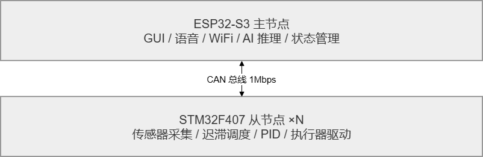
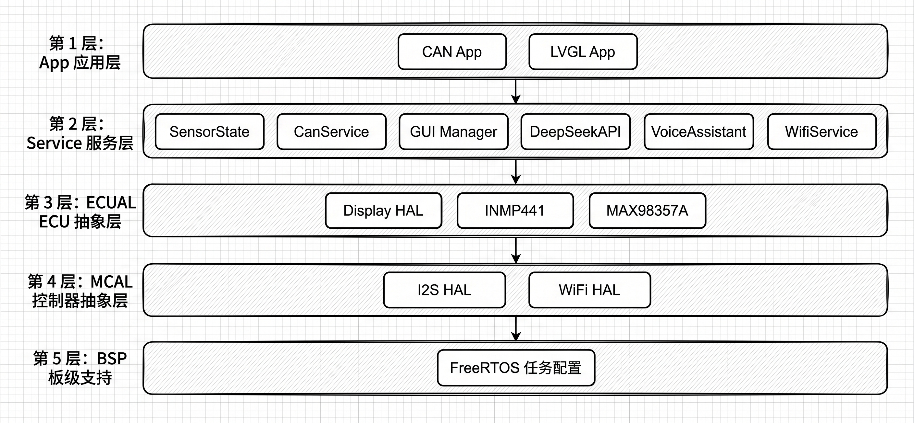
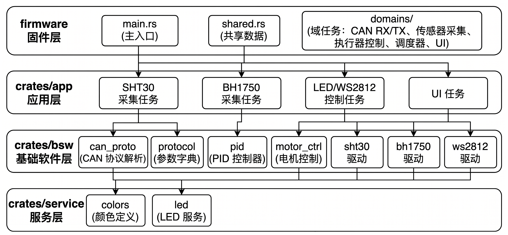
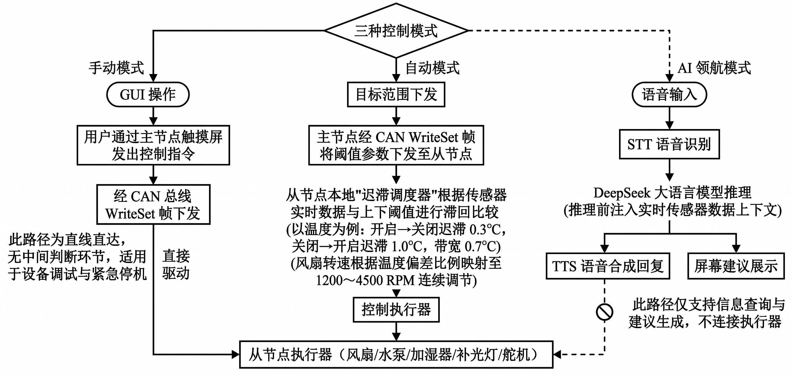

# 第二章 需求分析与总体设计

构建稳定且可扩展的温室控制系统，必须建立在严谨的系统需求与架构边界剖析之上。本章结合现代农业环境管理的实际作业场景，细化感知、控制及分布式通信层面的技术指标，并在此基础上提出以 ESP32 为交互中枢、STM32 为执行阵列的分布式总体拓扑架构，确立底层总线协议与多模式控制的协同机制。

## 2.1 系统需求分析

### 2.1.1 功能需求

根据温室环境管理的实际作业场景，本系统的功能需求归纳为以下三个方面：

（1）**数据采集与执行器控制**。系统需实时采集温室内的空气温度、空气湿度、土壤湿度和光照强度，并对通风风扇、水泵、加湿器、补光灯和遮阳舵机五种执行器进行精确控制，具体选型详见第三章。

（2）**多种控制模式与人机交互**。系统需支持手动控制、自动控制和 AI 领航三种控制模式，并提供图形界面与语音交互两种人机交互方式。

（3）**分布式通信**。系统需在主节点与多个从节点之间建立可靠的 CAN 总线通信通道，支持数据上报、命令下发、异常告警及时间同步等功能。

### 2.1.2 性能需求

系统需支持 7×24 小时连续运行，传感器采样与本地自动调度需满足实时性要求。具体指标包括：传感器采样周期不超过 1 秒，PID（Proportional-Integral-Derivative）控制周期 100 ms，迟滞调度周期 500 ms；CAN 总线波特率 1 Mbps，满足多节点高频数据上报需求；LVGL（Light and Versatile Graphics Library）界面刷新周期 20 ms，保证触摸交互的流畅性。主节点通过 FreeRTOS（Free Real-Time Operating System）实现多任务并发，从节点通过 Embassy 嵌入式异步运行时框架实现非阻塞调度，并通过硬件看门狗确保异常时自动复位。

### 2.1.3 非功能需求

系统通过 CAN 总线实现节点即插即用扩展，通过分层架构实现模块独立开发。从节点通过心跳机制与超时检测实现故障自动发现，主节点超过 5 分钟未收到从节点报文即判定其离线。主从节点软件分别采用 Rust 和 C/C++ 语言开发，通过 CAN 协议层的统一帧格式实现跨语言互操作。

## 2.2 系统总体架构设计

### 2.2.1 分布式多节点架构设计

为解决传统单 MCU 架构在扩展性与实时性方面的不足，本系统采用"ESP32-S3 主节点 + 多个 STM32F407 从节点"的分布式多节点架构，将系统功能划分为交互层与控制层两个层次，通过 CAN 总线实现跨节点的数据交换与协调控制。系统总体架构如图 2-1 所示。

::: {custom-style="图片"}

:::
::: {custom-style="表题"}
图 2-1 分布式多节点系统总体架构
:::

主节点承担交互层功能（图形界面、语音助手、AI 推理、网络管理），从节点承担控制层功能（传感器采集、自动调度、执行器驱动）[@esp32techref]。

### 2.2.2 CAN 总线多节点通信架构

主从节点间通信基于 CAN 2.0A 标准帧，采用总线型拓扑，波特率 1 Mbps。11-bit 标识符划分为 4-bit 功能码与 7-bit 节点 ID，见式（2.1）：

$$\text{CAN\_ID} = (\text{func\_code} \ll 7) \, | \, \text{node\_id}$$

其中 $\text{func\_code}$ 为 4-bit 功能码，$\text{node\_id}$ 为 7-bit 节点地址。功能码定义 4 类报文：Alert（0x0，异常告警）、TimeSync（0x1，时间同步）、WriteSet（0x2，参数下发）、Report（0x3，数据上报），帧格式与参数字典如表 2-1 和表 2-2 所示。数据帧载荷采用"1 字节索引 + 4 字节数据"格式，参数索引按系统级（0x00–0x0F）、开关执行器（0x10–0x2F）、传感器（0x30–0x4F）、高级控制（0x50–0x5F）四组划分，温度与湿度等浮点量采用 ×100 缩放传输，其余参数直接传输。

::: {custom-style="表题"}
表 2-1 CAN 2.0A 帧格式
:::

| 字段 | 位置 | 长度 | 说明 |
|:---|:---|:---|:---|
| 功能码 | CAN ID Bit 10-7 | 4-bit | 0x0=Alert(告警), 0x1=TimeSync(同步), 0x2=WriteSet(下发), 0x3=Report(上报) |
| 节点地址 | CAN ID Bit 6-0 | 7-bit | 节点 ID，取值范围 1–127 |
| 参数索引 | Byte 0 | 1 字节 | 参数字典索引值（表 2-2） |
| 保留 | Byte 1-3 | 3 字节 | 填充 0x00 |
| 参数值 | Byte 4-7 | 4 字节 | 小端序 32 位整数，浮点量按缩放因子转换 |

::: {custom-style="表题"}
表 2-2 CAN 参数字典
:::

| 分组 | 索引值 | 参数名称 | 缩放因子 | 数据类型/单位 |
|:---|:---|:---|:---|:---|
| 系统级 | 0x00 | System Timestamp | ×1 | uint32，Unix 时间戳(s) |
| | 0x01 | Heartbeat | ×1 | uint32，运行时间(s) |
| | 0x02 | Error Code | ×1 | uint32，错误位掩码 |
| | 0x03 | Control Mode | ×1 | 0=手动，1=自动 |
| 开关执行器 | 0x10 | Light Main Power | ×1 | bool，主照明电源 |
| | 0x11 | Water Pump | ×1 | bool，灌溉水泵 |
| | 0x12 | Humidifier | ×1 | bool，加湿器 |
| | 0x13 | Ventilation Fan | ×1 | bool，通风风扇 |
| | 0x14 | Sunshade Motor | ×1 | bool，遮阳幕布电机 |
| | 0x15 | Heater | ×1 | bool，加热器 |
| | 0x16 | Window Actuator | ×1 | bool，开窗推杆电机 |
| 传感器 | 0x30 | Temperature | ×100 | °C |
| | 0x31 | Humidity(Air) | ×100 | % |
| | 0x32 | Humidity(Soil) | ×100 | % |
| | 0x33 | Light Intensity | ×1 | Lux |
| | 0x34 | CO₂ Level | ×1 | ppm |
| | 0x35 | Fan Speed | ×1 | RPM |
| | 0x36 | Soil pH | ×100 | pH |
| | 0x37 | Soil EC | ×1 | μS/cm |
| | 0x38 | Water Level | ×1 | % |
| 高级控制 | 0x50 | Light Color RGB | ×1 | 0x00RRGGBB |
| | 0x51 | Light PWM Duty | ×1 | 0–100 |

### 2.2.3 分层软件架构

主节点与从节点分别采用不同的分层软件架构，如图 2-3 和图 2-4 所示。两者虽语言和运行时不同，但均遵循"分层解耦、逐层调用"的设计原则，具体实现将在第四、五章详细展开。

::: {custom-style="图片"}

:::
::: {custom-style="表题"}
图 2-3 ESP32 主节点分层软件架构
:::

::: {custom-style="图片"}

:::
::: {custom-style="表题"}
图 2-4 STM32 从节点分层软件架构
:::

本系统设计了三种控制模式，逻辑关系如图 2-5 所示。

::: {custom-style="图片"}

:::
::: {custom-style="表题"}
图 2-5 三种控制模式逻辑关系
:::

手动控制模式下，用户通过主节点触摸屏直接操控从节点执行器，操作通过 CAN 总线下发，适用于设备调试和紧急停机。

自动控制模式下，各从节点独立运行本地迟滞调度器，根据传感器数据与预设阈值自动控制执行器，阈值由主节点经 CAN 总线配置[@hu2014automatic]。迟滞控制通过设定上下阈值形成滞回区间，避免执行器在阈值附近频繁切换。以温度控制为例，风扇开启状态下温度降至目标值以下 0.3°C 时关闭，关闭状态下温度升至目标值以上 1.0°C 时开启，形成 0.7°C 的迟滞带；湿度控制采用类似策略，偏移量分别为 8%RH 和 3%RH。通风风扇启动后转速根据温湿度偏差比例动态映射至 1200～4500 RPM 区间，实现连续调节。

AI 领航模式通过集成 DeepSeek 大语言模型实现语音交互驱动的智能环境分析，每次推理前将实时传感器数据注入 LLM 上下文。当前版本仅支持信息查询与建议生成，不具备直接控制执行器的能力[@tzachor2023llm; @shaikh2025llm]。
