# 第 3 章 系统总体架构设计

## 3.1 系统总体架构概述

本智能温室控制系统采用 **ESP32-S3 + STM32** 双控制器分层架构，通过 CAN 总线实现两层之间的高速可靠通信。系统整体架构如下图所示。

**图 3-1 系统整体软硬件架构图**

如图 3-1 所示，系统在逻辑上划分为 **交互层** 和 **控制层** 两大层次，各层职责明确、松耦合设计，通过标准化的 CAN 总线协议进行数据交换。

### 3.1.1 交互层（ESP32-S3）

交互层以 ESP32-S3 为核心处理器，运行基于 FreeRTOS 的多任务软件架构，负责所有与用户交互及云端通信相关的功能。该层包含以下关键模块：

- **LVGL 图形界面**：基于 LVGL 框架构建了包含主页、数据总览、趋势图表、控制模式选择、手动/自动/AI 驾驶模式以及系统设置在内的 8 个功能页面，通过触摸屏实现直观的人机交互。
- **DeepSeek 大模型集成**：通过 HTTP 客户端接入 DeepSeek API，将温室实时传感器数据构建为上下文，由大模型进行智能分析与决策推理，实现"AI 驾驶模式"下的自主环境调控。
- **语音助手服务**：集成百度语音识别（ASR）与语音合成（TTS）服务，结合 INMP441 数字麦克风与 MAX98357A 音频功放，实现语音交互功能。
- **WiFi 网络服务**：管理 ESP32 的 WiFi 连接与 HTTP 通信，为 DeepSeek API 和百度语音服务提供网络通道。
- **传感器状态管理**：接收并缓存来自 STM32 控制层的传感器数据，为 LVGL 界面和 AI 决策提供实时数据源。
- **CAN 应用与协议服务**：实现 CAN 总线的帧打包、解包、校验及网络轮询，是交互层与控制层数据交换的桥梁。

### 3.1.2 控制层（STM32）

控制层以 STM32 为核心，运行基于 Rust 语言与 Embassy 异步框架的嵌入式软件，负责传感器数据采集与执行器精确控制。该层采用领域驱动设计（DDD），将功能拆分为独立的领域任务：

- **传感器驱动**：通过 I2C 总线驱动 SHT30 温湿度传感器和 BH1750 光照传感器，通过 ADC 采集土壤湿度数据。
- **PID 控制算法**：实现增量式 PID 控制器，根据传感器反馈自动调节水泵、通风风扇等执行器，维持温室环境参数在目标范围内。
- **执行器控制**：管理水泵、通风风扇、MG995 舵机（遮阳帘/窗户）、WS2812 RGB 灯带等多种执行机构。
- **CAN 协议栈**：解析来自 ESP32 的控制指令，上报传感器数据与系统状态，实现与交互层的双向通信。

### 3.1.3 CAN 总线通信协议

系统采用标准 CAN 2.0A 协议（11 位标准 ID），通信速率为 1 Mbps。CAN ID 采用 **4 位功能码 + 7 位节点 ID** 的编码方式，支持告警（Alert）、时间同步（TimeSync）、写入控制（Write）和状态上报（Report）四种功能码。数据帧为 8 字节定长载荷，采用小端字节序，通过参数索引（Parameter Index）寻址方式实现温湿度、光照、土壤湿度等多类传感器数据及水泵、风扇、灯带等执行器控制指令的统一编码与传输。两侧协议栈分别以 C 语言（ESP32 端）和 Rust 语言（STM32 端）实现，但遵循相同的帧格式与编解码规则，确保跨平台互操作性。

### 3.1.4 数据流与控制流

系统的数据流与控制流形成双向闭环：

- **上行数据流**：传感器 → STM32 驱动层 → CAN TX → CAN 总线 → ESP32 CAN 接收 → 传感器状态管理 → LVGL 界面显示 / DeepSeek API 上下文构建。
- **下行控制流**：用户触摸操作 / AI 决策结果 → ESP32 CAN 发送 → CAN 总线 → STM32 CAN 接收 → 任务调度器 → 执行器驱动 → 物理执行机构。

这种分层架构使得交互层与控制层可以独立开发和测试，CAN 总线作为标准化的工业通信接口，保证了数据传输的实时性与可靠性，同时为系统未来的功能扩展（如增加更多传感器节点）预留了良好的扩展能力。
