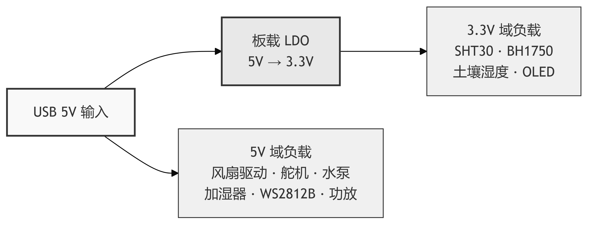

# 第3章 硬件电路设计

## 3.1 系统硬件总体框图

本系统采用分布式多节点架构，由 ESP32-S3 主节点和多个 STM32F407VET6 从节点通过 CAN 总线互联。主节点负责 GUI 显示、语音交互与云端 AI 调用，从节点负责传感器数据采集与执行器控制。系统硬件总体框图如图 3-1 所示。

**图 3-1 系统硬件总体框图**

## 3.2 主控芯片选型

主节点选用 ESP32-S3（双核 Xtensa LX7，240 MHz，8 MB PSRAM），内置 WiFi 可直接联网调用 DeepSeek API 和百度语音服务，双核架构使 Core 0 运行 WiFi 协议栈、Core 1 运行 LVGL 界面[@esp32techref][@hercog2023esp32]。从节点选用 STM32F407VET6（ARM Cortex-M4F，168 MHz），硬件 FPU 单周期完成浮点运算，适合 PID 等实时控制任务[@stm32f407datasheet][@hu2014automatic]。两款芯片均内置 CAN 控制器（TWAI/bxCAN），无需外挂 MCP2515。

## 3.3 传感器模块设计

SHT30 温湿度传感器（I2C 接口，精度 ±0.3°C/±2%RH[@sht30datasheet]）与 BH1750 光照传感器（I2C 接口，量程 1～65535 Lux[@bh1750datasheet]）共享 STM32 的 I2C2 总线（PB10/PB11）。电容式土壤湿度传感器接入 ADC1 通道（PC1），通过以下公式映射为百分制值：

$$\text{SoilHumidity} = \text{clamp}\left(\frac{4000 - \text{ADC\_Value}}{4000 - 1000} \times 100,\ 0,\ 100\right)$$

> 💡 [人类作者请注意：请在此处插入一张传感器模块实物接线照片。]

## 3.4 执行器模块设计

本系统包含五种执行器。**通风风扇**通过 TB6612 驱动模块实现 PWM 调速（TIM1，PE9），编码器接入 TIM3（PC6/PC7）提供转速反馈，离散位置式 PID 控制器以 100 ms 周期计算偏差并更新 PWM 占空比，默认参数 $K_p = 2.0$、$K_i = 0.5$、$K_d = 0.0$，控制框图如图 3-2 所示。**水泵**（PD13）与**加湿器**（PE4）采用光耦隔离继电器模块驱动。**补光灯**采用 WS2812B RGB 灯带（25 颗灯珠），通过 TIM4（PD12）配合 DMA 实现单总线协议驱动。**遮阳舵机** MG995 由 TIM5（PA1）输出 50 Hz PWM，仅使用收起（0°）和展开（90°）两个固定位置。

**图 3-2 通风风扇 PID 闭环控制框图**

## 3.5 通信与电源模块设计

CAN 总线选用 NXP TJA1051T 高速 CAN 收发器[@tja1051datasheet]，支持最高 1 Mbps 速率，ESP32 通过 TWAI（GPIO48/GPIO47）、STM32 通过 bxCAN（PB9/PB8）分别连接收发器。音频模块仅部署在 ESP32 主节点，由 INMP441 麦克风和 MAX98357A 功放组成[@inmp441datasheet][@max98357datasheet]，通过 I2S 总线全双工运行，连接如图 3-3 所示。

**图 3-3 音频模块 I2S 连接图**

系统采用 USB 供电，板载 LDO 将 5 V 转换为 3.3 V，传感器由 3.3 V 供电，执行器由 5 V 供电。电源分配如图 3-4 所示。

**图 3-4 系统电源分配框图**

