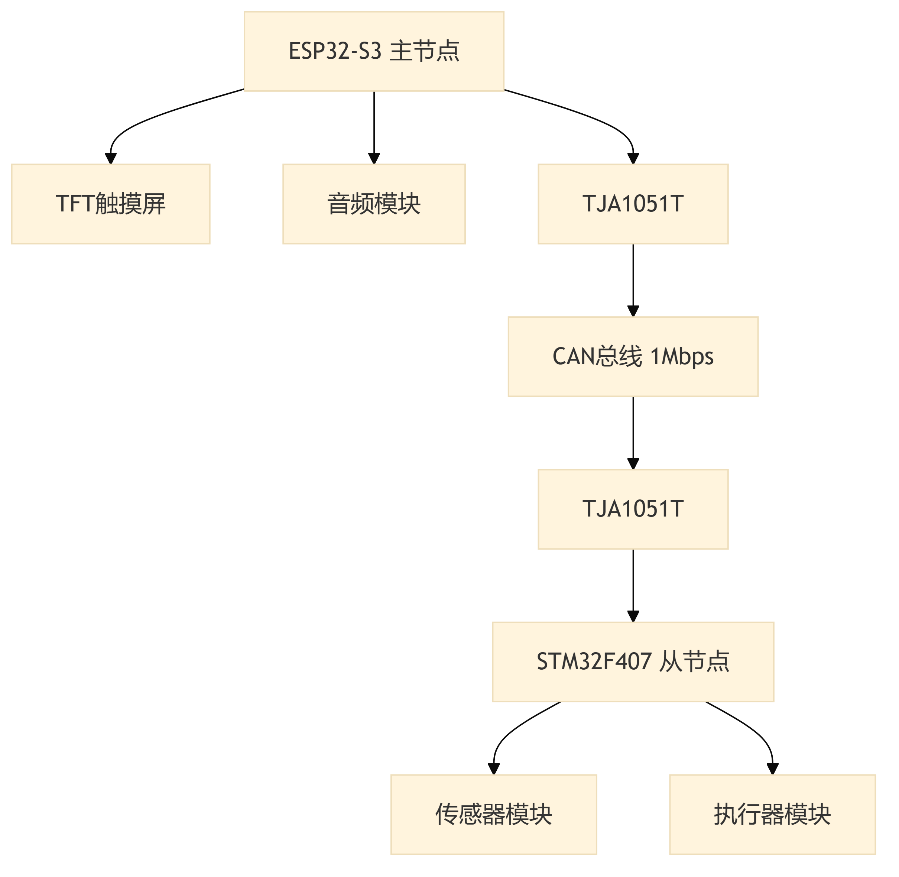

# 第3章 硬件电路设计

## 3.1 系统硬件总体框图

本系统的硬件架构遵循第2章所述的分布式多节点设计理念，由一个 ESP32-S3 主节点和多个 STM32F407VET6 从节点组成，各节点通过 CAN 总线互联。系统硬件总体框图如图 3-1 所示。

**图 3-1 系统硬件总体框图**

主节点以 ESP32-S3 微控制器为核心，承载交互层的全部硬件资源：通过并行 8080 总线驱动 240×320 像素的 TFT 彩色触摸屏，通过 I2S 接口连接 INMP441 数字麦克风与 MAX98357A 功率放大器，通过 SPI 总线连接 XPT2046 电阻式触摸控制器，并通过内置 WiFi 模块接入互联网以调用 DeepSeek 大语言模型 API 和百度语音服务。主节点的 TWAI（Two-Wire Automotive Interface）控制器经 TJA1051T CAN 收发器接入 CAN 总线。

从节点以 STM32F407VET6 微控制器为核心，承载控制层的全部硬件资源：通过 I2C 总线连接 SHT30 温湿度传感器与 BH1750 光照传感器，通过 ADC 通道采样土壤湿度传感器的模拟量输出，通过定时器输出 PWM 信号驱动通风风扇与遮阳舵机，通过 GPIO 驱动继电器控制水泵与加湿器，通过 PWM-DMA 方式驱动 WS2812B RGB 补光灯带。从节点同样通过 TJA1051T 收发器接入 CAN 总线，实现与主节点的数据交换。

CAN 总线采用总线型拓扑结构，主节点与所有从节点共享 CAN_H 与 CAN_L 差分信号线，总线两端各连接 120Ω 终端电阻以匹配特征阻抗，通信波特率为 1 Mbps。该拓扑结构使得新增从节点只需将节点接入总线并配置唯一的 7-bit 节点 ID 即可加入系统，无需修改现有布线，具有良好的可扩展性。

## 3.2 主控芯片选型

主控芯片的选型是硬件设计的首要环节，需要综合考虑处理性能、外设资源、开发生态与成本等因素。本系统根据主节点与从节点的不同功能定位，分别选择了 ESP32-S3 和 STM32F407VET6 两款微控制器。

### 3.2.1 ESP32-S3 选型分析

ESP32-S3 是乐鑫科技（Espressif Systems）推出的高性能 WiFi/蓝牙双模微控制器，采用双核 Xtensa LX7 架构，主频高达 240 MHz[@esp32techref]。本系统选用的 ESP32-S3 模组配备 8 MB PSRAM 和 16 MB Flash，为 LVGL 图形界面渲染、语音音频缓冲以及 HTTP 通信报文的存储提供了充裕的内存空间。

ESP32-S3 的核心选型优势体现在以下三个方面：

（1）**无线通信能力**。ESP32-S3 内置 WiFi 802.11 b/g/n 和蓝牙 5.0（BLE）模块，无需外挂无线通信芯片即可实现互联网接入。本系统的 AI 领航模式需要通过 WiFi 调用 DeepSeek 大语言模型 API 和百度语音识别/合成 API，内置 WiFi 模块简化了硬件设计，降低了 BOM 成本[@hercog2023esp32]。

（2）**双核并行处理**。ESP32-S3 的两个核心可分别承担不同任务：Core 0 负责 WiFi 协议栈与系统服务，Core 1 负责 LVGL 界面渲染与业务逻辑。这种硬件级的任务隔离避免了网络通信与图形渲染之间的资源竞争，确保了用户界面的流畅性。

（3）**丰富的外设接口**。ESP32-S3 提供多路 SPI、I2C、I2S、UART 等标准接口。本系统利用 I2S 接口连接 INMP441 麦克风（音频输入）和 MAX98357A 功放（音频输出），利用 SPI 接口驱动 TFT 显示屏和触摸控制器，利用 TWAI 接口实现 CAN 总线通信。TWAI 是乐鑫为 ESP32 系列提供的兼容 CAN 2.0A/2.0B 协议的控制器外设，通过 GPIO48（TX）和 GPIO47（RX）两根信号线连接外部 CAN 收发器即可接入 CAN 总线网络。

与同类方案相比，ESP8266 虽然成本更低，但仅支持单核 80 MHz，内存资源有限（约 80 KB 可用 RAM），无法同时承载 LVGL 图形渲染与网络通信任务；Raspberry Pi 等 Linux 单板计算机虽然性能更强，但功耗高、启动慢、实时性差，不适合作为嵌入式交互终端。ESP32-S3 在性能、功耗、成本与开发生态之间取得了较好的平衡，是本系统主节点的理想选型。

### 3.2.2 STM32F407VET6 选型分析

STM32F407VET6 是意法半导体（STMicroelectronics）推出的高性能 ARM Cortex-M4F 微控制器，主频为 168 MHz，内置浮点运算单元（FPU）和数字信号处理（DSP）指令集[@stm32f407datasheet]。该芯片拥有 512 KB Flash 和 192 KB SRAM，片上集成了丰富的定时器、ADC、DAC、CAN、I2C、SPI、UART 等外设资源，能够满足从节点对传感器采集、实时控制与通信的多重需求。

STM32F407VET6 的核心选型优势体现在以下三个方面：

（1）**浮点运算能力**。从节点的通风风扇采用 PID 闭环控制算法，涉及大量的浮点乘法与加法运算。Cortex-M4F 内核的硬件 FPU 能够在单周期内完成单精度浮点运算，相比无 FPU 的 Cortex-M3 内核（如 STM32F103 系列），PID 计算效率提升约 5～10 倍，确保了 100 ms 控制周期内的实时性要求[@hu2014automatic]。

（2）**丰富的定时器资源**。STM32F407VET6 拥有多达 14 个定时器，其中高级定时器 TIM1 用于生成 20 kHz 的 PWM 信号驱动通风风扇，通用定时器 TIM3 配置为正交编码器接口（QEI）模式读取风扇转速编码器反馈，TIM5 用于生成 50 Hz 的舵机控制 PWM 信号，TIM4 配合 DMA 驱动 WS2812B 补光灯带。这些定时器资源的独立配置互不干扰，是选型的关键考量。

（3）**片上 CAN 控制器**。STM32F407VET6 内置 bxCAN（Basic Extended CAN）控制器，支持 CAN 2.0A/2.0B 协议，波特率最高可达 1 Mbps。bxCAN 提供 28 个可配置的过滤器组，本系统利用其中两组 Mask32 过滤器分别匹配广播地址和本节点地址，从硬件层面过滤无关帧，降低 CPU 负载。片上 CAN 控制器避免了外挂 CAN 控制器芯片（如 MCP2515）的需求，简化了电路设计。

与同类方案相比，STM32F103 系列虽成本更低，但主频仅 72 MHz，无 FPU，CAN 控制器过滤器数量有限（14 组），难以满足多通道 PWM 输出与浮点运算的并发需求；ESP32 虽然也具备一定的控制能力，但其 GPIO 驱动能力和定时器精度不如 STM32 系列，且缺乏片上 CAN 控制器。STM32F407VET6 在实时控制性能、外设丰富度与 CAN 通信支持方面的综合表现使其成为从节点的最佳选择。

**表 3-1 主控芯片关键参数对比**

| 参数 | ESP32-S3 | STM32F407VET6 |
|:---|:---|:---|
| 内核架构 | 双核 Xtensa LX7 | ARM Cortex-M4F |
| 主频 | 240 MHz | 168 MHz |
| Flash | 16 MB（外部） | 512 KB（片上） |
| RAM | 512 KB SRAM + 8 MB PSRAM | 192 KB SRAM |
| FPU | 单精度 | 单精度 |
| WiFi/蓝牙 | 内置 | 无 |
| CAN 控制器 | TWAI（兼容 CAN 2.0） | bxCAN（CAN 2.0A/B） |
| 定时器 | 4× 通用 + 2× 看门狗 | 2× 高级 + 10× 通用 + 2× 基本 |
| I2S 接口 | 2 路 | 2 路 |
| ADC | 2× 12-bit SAR | 3× 12-bit SAR |
| 定位 | 交互层主节点 | 控制层从节点 |

## 3.3 传感器模块设计

传感器是智能温室系统的"感知器官"，负责采集温室内的环境参数。本系统部署了三类传感器：SHT30 数字温湿度传感器、BH1750 数字光照传感器和模拟量土壤湿度传感器。三类传感器的信号类型与接口方式各不相同，需要针对性地设计接口电路。

### 3.3.1 SHT30 温湿度传感器

SHT30 是瑞士 Sensirion 公司生产的高精度数字温湿度传感器，采用 I2C 总线接口，温度测量精度为 ±0.3°C（典型值），湿度测量精度为 ±2%RH（典型值），测量范围分别为 −40°C～+125°C 和 0%～100%RH[@sht30datasheet]。SHT30 内部集成了温湿度敏感元件、信号调理电路、ADC 与数字处理单元，通过 I2C 接口直接输出经过校准的数字量，无需外部信号调理电路，简化了硬件设计。

SHT30 的 I2C 通信地址由 ADDR 引脚的电平决定：ADDR 接 VSS 时地址为 0x44，ADDR 接 VDD 时地址为 0x45。本系统将 ADDR 引脚接至 GND，使用默认地址 0x44。SHT30 的 I2C 总线需要在 SDA 和 SCL 信号线上各连接一只上拉电阻至 VDD，阻值选用 4.7 kΩ，以满足 I2C 标准模式（100 kHz）的上升时间要求。

在电路设计方面，SHT30 的电源引脚（VDD）与地引脚（VSS）之间并联一只 100 nF 的陶瓷去耦电容，用于滤除电源线上的高频噪声，确保传感器内部 ADC 的采样精度。SHT30 的典型供电电压为 3.3 V，与 STM32F407VET6 的 I/O 电平兼容，无需电平转换电路。

SHT30 通过 STM32F407VET6 的 I2C2 外设连接，SCL 引脚连接至 PB10，SDA 引脚连接至 PB11。I2C2 总线配置为标准模式（100 kHz），与 BH1750 光照传感器共享同一总线（多主多从拓扑），通过不同的器件地址进行区分。传感器的安装位置应避开通风风扇和加湿器的直接气流，以减少执行器动作对测量值的干扰。

### 3.3.2 BH1750 光照传感器

BH1750 是日本 ROHM 半导体公司生产的数字环境光强度传感器，采用 I2C 总线接口，量程为 1～65535 Lux，分辨率为 1 Lux，光谱响应特性接近人眼视觉灵敏度曲线[@bh1750datasheet]。BH1750 内部集成了光电二极管、积分型 ADC 与数字处理单元，输出 16-bit 的光强数值，无需外部运算放大器或滤波电路。

BH1750 的 I2C 通信地址由 ADDR 引脚的电平决定：ADDR 接 GND 时地址为 0x23，ADDR 接 VDD 时地址为 0x5C，ADDR 接高电平（通过外部电阻上拉）时地址可进一步扩展。本系统将 ADDR 引脚接至 GND，使用地址 0x23，与 SHT30 的地址 0x44 不冲突，两者可共存于同一 I2C 总线。

BH1750 支持连续测量和单次测量两种工作模式，以及高分辨率（1 Lux）、高分辨率模式 2（0.5 Lux）和低分辨率（4 Lux）三种分辨率模式。本系统采用连续高分辨率模式（模式代码 0x10），传感器以约 120 ms 的周期持续更新光强数据，STM32 从节点的传感器采集任务以 1 秒为周期读取最新值。

电路设计方面，BH1750 的 VCC 与 GND 之间并联 100 nF 去耦电容，DVI 引脚（I2C 总线参考电压）通过 10 kΩ 电阻上拉至 VCC 并并联 100 nF 电容至 GND，用于上电时的硬件复位。BH1750 的 I2C 总线与 SHT30 共享 I2C2 外设（PB10/PB11），无需额外的总线连接。传感器的安装位置应朝向温室内作物冠层方向，避免遮挡和反射光的干扰，以获取准确的环境光照数据。

### 3.3.3 土壤湿度传感器

土壤湿度传感器采用电容式模拟量输出型传感器模块，其工作原理是通过检测探针周围土壤的介电常数变化来反映土壤含水量。与传统的电阻式土壤湿度传感器相比，电容式传感器不易受土壤盐分腐蚀的影响，使用寿命更长。传感器模块输出 0～3.3 V 的模拟电压信号，电压值与土壤湿度呈反比关系：土壤越干燥，输出电压越高；土壤越湿润，输出电压越低。

传感器的模拟量输出连接至 STM32F407VET6 的 ADC1 通道，对应的 GPIO 引脚为 PC1（ADC1_IN11）。ADC 配置为 12-bit 分辨率、单次转换模式，参考电压为 3.3 V（VDDA），量化精度为 3.3 V / 4096 ≈ 0.8 mV。ADC 采样值通过以下公式映射为百分制的土壤湿度值：

$$\text{SoilHumidity} = 100 \times \left(1 - \frac{\text{ADC\_Value}}{4096}\right)$$

该映射公式基于传感器模块的标定特性：当探针完全暴露在空气中（干燥状态）时，ADC 采样值接近满量程（约 4096），映射湿度为 0%；当探针完全浸入水中（饱和状态）时，ADC 采样值接近零，映射湿度为 100%。实际使用中，需要根据具体传感器模块的标定数据调整映射关系的端点值。

在电路设计方面，传感器的 VCC 与 GND 之间并联 100 nF 去耦电容，模拟输出信号线与 ADC 输入引脚之间串联一只 100 Ω 电阻并并联 100 nF 电容至 GND，构成一阶 RC 低通滤波器，截止频率约为 15.9 kHz，用于滤除传感器输出信号中的高频噪声，提高 ADC 采样的稳定性。

> 💡 [人类作者请注意：请在此处插入一张土壤湿度传感器模块的实物照片，展示传感器探针与控制板的接线方式。这能增强论文的真实感。]

## 3.4 执行器模块设计

执行器是智能温室系统的"执行机构"，负责根据控制指令对温室环境进行物理调节。本系统包含五种执行器：通风风扇（PID 闭环调速）、水泵（继电器开关）、加湿器（继电器开关）、补光灯（WS2812B RGB 灯带）和遮阳舵机（MG995）。各执行器的驱动方式与控制精度各不相同，需要针对性地设计驱动电路。

### 3.4.1 通风风扇驱动

通风风扇是自动控制模式中最重要的执行器之一，用于调节温室内温度与空气湿度。本系统选用直流无刷风扇，通过 H 桥驱动电路实现 PWM 调速与方向控制。风扇电机的驱动电路连接至 STM32F407VET6 的高级定时器 TIM1 的通道 1（PE9），PWM 频率配置为 20 kHz，超出人耳听觉范围（20 Hz～20 kHz 的上限），避免了低频 PWM 调速时的可闻噪声。

风扇的转速反馈通过正交编码器实现。编码器的 A 相和 B 相输出分别连接至 TIM3 的通道 1（PC6）和通道 2（PC7），TIM3 配置为正交编码器接口（QEI）模式，硬件自动对 A、B 两相信号进行 4 倍频计数，即编码器每转一圈产生 4×N 个计数值（N 为编码器线数）。定时器的计数值通过软件定时读取并换算为转速（RPM），作为 PID 控制器的反馈量。

风扇的方向控制通过两个 GPIO 引脚（PE10 和 PE11）驱动 H 桥的方向输入。PE10 为高、PE11 为低时风扇正转（送风），PE10 为低、PE11 为高时风扇反转（排风），两者同时为低时风扇制动。在本系统的温室场景中，风扇通常工作在正转模式。

PID 闭环控制的原理是：将用户设定的目标转速（设定值）与编码器实测转速（反馈值）的偏差输入离散位置式 PID 控制器，控制器输出经限幅处理后作为 PWM 占空比更新至 TIM1 的 CCR1 寄存器，从而调节风扇的实际转速。PID 控制的默认参数为 $K_p = 2.0$、$K_i = 0.5$、$K_d = 0.0$，控制周期为 100 ms。PID 参数可通过 CAN 总线远程调整（参数索引 PidP=0x52、PidI=0x53、PidD=0x54），支持在线调参与自适应控制。

> 💡 [人类作者请注意：请在此处插入一张通风风扇模块的实物接线照片，展示风扇电机、H 桥驱动板与 STM32 开发板之间的连接方式，以及编码器的安装位置。]

### 3.4.2 水泵与加湿器驱动

水泵与加湿器均属于开关型执行器，只有"开启"和"关闭"两种状态，不需要模拟量调节。两者的驱动方式相同：STM32F407VET6 的 GPIO 引脚输出高/低电平信号，通过光耦隔离电路控制继电器的通断，继电器的常开触点串联在执行器的供电回路中。

水泵的控制引脚为 PD13，加湿器的控制引脚为 PE4。GPIO 输出高电平时，光耦导通，驱动继电器线圈吸合，执行器通电工作；GPIO 输出低电平时，光耦截止，继电器释放，执行器断电停止。

驱动电路中包含以下关键元件：

（1）**光耦隔离**。采用 PC817 光电耦合器实现 STM32 GPIO 与继电器线圈之间的电气隔离，防止继电器线圈断电时产生的反向电动势（Back EMF）通过电源线耦合至 MCU 侧，损坏微控制器或干扰其他数字电路。

（2）**续流二极管**。在继电器线圈两端反向并联一只 1N4148 快恢复二极管，为线圈断电时的感应电流提供泄放通路，抑制反向电动势尖峰，保护驱动晶体管。

（3）**驱动晶体管**。光耦输出侧通过 NPN 晶体管（如 S8050）放大电流，驱动继电器线圈。晶体管基极串联限流电阻（1 kΩ），集电极连接继电器线圈，发射极接地。

水泵和加湿器在自动控制模式下由本地迟滞调度器根据土壤湿度和空气湿度的阈值自动控制启停。在手动控制模式下，由用户通过主节点触摸屏的开关控件远程操控，控制指令通过 CAN 总线以 WriteSet 功能码下发至从节点。

### 3.4.3 补光灯驱动

补光灯采用 WS2812B 可编程 RGB LED 灯带，每条灯带包含 25 颗 WS2812B 灯珠，支持独立的亮度（256 级）与颜色（16777216 种）调节。WS2812B 采用单总线通信协议，所有灯珠串联连接，通过一根数据线（DIN）即可实现级联控制，大大简化了布线复杂度。

WS2812B 的数据协议要求严格的时序：逻辑"1"为高电平 580 ns ± 150 ns 后接低电平 220 ns ± 150 ns，逻辑"0"为高电平 220 ns ± 150 ns 后接低电平 580 ns ± 150 ns，复位信号为低电平持续时间大于 50 μs。由于时序精度要求在百纳秒级别，采用软件 GPIO 翻转难以保证稳定性，因此本系统通过 STM32F407VET6 的 TIM4 通道 1（PD12）配合 DMA 传输实现精确的波形生成。具体实现方式是：将一帧 WS2812B 数据（25 颗灯珠 × 24-bit/颗 = 600-bit）预编码为 PWM 占空比数组，通过 DMA 自动搬运至 TIM4 的 CCR1 寄存器，定时器以 800 kHz 的频率输出 PWM 波形，DMA 传输完成后自动触发更新中断，确保了数据发送的精确性与非阻塞性。

WS2812B 的供电电压为 5 V，而 STM32F407VET6 的 GPIO 输出电平为 3.3 V。虽然部分 WS2812B 芯片在 3.3 V 输入时仍可正常识别逻辑电平，但为确保可靠性，数据线（PD12 至 DIN）之间串联一只 330 Ω 限流电阻，并在灯带的 VDD 与 GND 之间并联一只 100 μF 电解电容和一只 100 nF 陶瓷电容，用于滤除电源纹波和吸收灯珠开关时的电流突变。

补光灯在自动控制模式下根据光照传感器的反馈以比例控制方式调节 PWM 占空比，每次调度周期递增或递减 1%，实现平滑的亮度过渡；在手动控制模式下，用户可通过主节点触摸屏的滑动条控件独立调节亮度和颜色（HSV 色彩空间转换为 RGB 值）。

### 3.4.4 遮阳舵机驱动

遮阳舵机选用 MG995 型号，该舵机为标准尺寸的金属齿轮舵机，扭矩为 10 kg·cm（4.8 V）至 13 kg·cm（6.0 V），工作电压为 4.8～6.0 V，控制信号为 50 Hz 的 PWM 波，脉宽范围 500～2500 μs 对应转角范围 0°～300°。

舵机的控制引脚连接至 STM32F407VET6 的 TIM5 通道 2（PA1），TIM5 配置为 PWM 输出模式，周期为 20 ms（50 Hz），脉宽通过 CCR2 寄存器调节。在本系统的温室遮阳场景中，舵机仅需工作在两个固定位置：收起位置（0°，对应脉宽 500 μs，CCR2 = 2500）和展开位置（90°，对应脉宽 1000 μs，CCR2 = 5000），作为开关式遮阳执行器使用。自动控制模式下，当光照强度超过目标阈值时，调度器将舵机切换至展开位置（遮阳）；当光照强度回落至阈值以下时，切换回收起位置（采光）。

舵机的供电由开发板的 5 V 引脚直接提供。由于舵机在启停瞬间会产生较大的电流脉冲（峰值可达 1～2 A），为避免对其他共用 5 V 电源的器件造成干扰，舵机的电源线与地线应尽量短粗，并在舵机电源引脚附近并联一只 470 μF 电解电容用于储能和滤波。

## 3.5 通信模块设计

### 3.5.1 CAN 总线多节点网络设计

CAN 总线是本系统主从节点间唯一的通信通道，其硬件设计的可靠性直接决定了整个分布式系统的通信质量。本系统的 CAN 总线网络由主节点和多个从节点组成，每个节点包含一个 CAN 控制器和一个 CAN 收发器。CAN 控制器负责帧的编解码与仲裁，CAN 收发器负责将控制器的逻辑电平转换为总线上的差分信号。

本系统选用 NXP 公司的 TJA1051T 高速 CAN 收发器[@tja1051datasheet]。TJA1051T 是一款符合 ISO 11898-2 标准的高速 CAN 收发器，支持最高 1 Mbps 的通信速率，具有以下特点：

（1）**低功耗待机模式**。TJA1051T 提供静默模式（Silent Mode），在该模式下收发器仅接收总线上的差分信号而不发送，适用于仅需监听总线的场景。

（2）**宽共模电压范围**。TJA1051T 的共模电压输入范围为 −27 V～+40 V，能够在总线出现较大的地电位差时仍保持正常通信，适应温室环境中长距离布线的实际情况。

（3）**过温与短路保护**。TJA1051T 内置过温关断和总线短路保护功能，当检测到总线短路至电源或地时自动进入保护状态，避免收发器芯片损坏。

在 ESP32 主节点侧，CAN 控制器采用 ESP32-S3 内置的 TWAI 外设，TXD 引脚连接至 GPIO48，RXD 引脚连接至 GPIO47，通过 TJA1051T 收发器接入 CAN 总线。在 STM32 从节点侧，CAN 控制器采用 STM32F407VET6 内置的 bxCAN 外设，TX 引脚连接至 PB9，RX 引脚连接至 PB8，同样通过 TJA1051T 收发器接入总线。

CAN 总线的物理层采用双绞线（CAN_H 与 CAN_L）传输差分信号，总线两端各连接一只 120 Ω 终端电阻，用于匹配传输线的特征阻抗，消除信号反射。终端电阻应安装在总线的物理两端节点上，中间节点不应安装终端电阻。总线长度在 1 Mbps 波特率下建议不超过 40 米，以确保信号完整性。

### 3.5.2 音频输入输出模块

音频输入输出模块是 AI 领航模式下语音交互的硬件基础，仅部署在 ESP32 主节点上。该模块由 INMP441 数字麦克风（音频输入）和 MAX98357A 功率放大器（音频输出）两部分组成，均通过 I2S（Inter-IC Sound）总线与 ESP32-S3 连接。

INMP441 是 InvenSense（TDK）公司生产的低功耗数字 MEMS 麦克风，采用 I2S 接口输出 24-bit 数字音频数据，信噪比（SNR）为 61 dB，灵敏度为 −26 dBFS，频率响应范围为 60 Hz～15 kHz[@inmp441datasheet]。INMP441 的 I2S 接口配置为标准 I2S 格式，字长 32-bit，采样率 16 kHz，由 ESP32-S3 的 I2S0 外设驱动。麦克风采集的语音信号经片上 ADC 转换为数字量后通过 I2S 总线传输至 ESP32-S3 的 DMA 缓冲区，供语音助手服务进行语音活动检测与录音处理。

MAX98357A 是 Analog Devices（原 Maxim Integrated）公司生产的 I2S 输入 Class D 功率放大器，输出功率为 3.2 W（4 Ω 负载）或 1.8 W（8 Ω 负载），信噪比（SNR）为 93 dB[@max98357datasheet]。MAX98357A 的 I2S 接口配置为标准 I2S 格式，字长 16-bit，采样率 16 kHz，由 ESP32-S3 的 I2S1 外设驱动。百度语音合成（TTS）API 返回的 PCM 音频数据通过 I2S 总线传输至 MAX98357A，经功率放大后驱动 8 Ω 3 W 的扬声器播放语音。

MAX98357A 的增益（Gain）通过外部引脚配置：SD_MODE 引脚接 VDD 时增益为 15 dB，接 GND 时增益为 12 dB，悬空时增益为 9 dB。本系统将 SD_MODE 引脚接至 VDD，配置增益为 15 dB，以在温室环境噪声下提供足够的音量输出。扬声器通过两根导线连接至 MAX98357A 的 OUT+ 和 OUT− 输出端。

> 💡 [人类作者请注意：请在此处插入一张 ESP32 主节点音频模块的实物接线照片，展示 INMP441 麦克风、MAX98357A 功放板与扬声器的连接方式。]

## 3.6 电源模块设计

本系统的电源设计直接采用 STM32F407 与 ESP32-S3 开发板自带的供电方案，未单独设计电源模块。两块开发板均通过 USB 接口供电（5 V），板载的低压差线性稳压器（LDO）将 5 V 转换为 3.3 V 供 MCU 及其外设使用。

传感器模块（SHT30、BH1750、土壤湿度传感器）的工作电压为 3.3 V，由开发板的 3.3 V 引脚直接供电。执行器模块的工作电压为 5 V，由开发板的 5 V 引脚供电。WS2812B 补光灯带在全亮状态下电流较大（25 颗灯珠 × 约 60 mA/颗 = 1.5 A），因此灯带的电源线直接从开发板的 5 V 引脚引出，避免经过细长的杜邦线导致压降过大。

在各节点的电源入口处并联一只 470 μF 电解电容和一只 100 nF 陶瓷电容，用于滤除 USB 供电线路上的低频纹波和高频噪声。各传感器和执行器模块的电源引脚附近均布置 100 nF 去耦电容，确保本地供电的稳定性。

需要指出的是，当前的电源方案依赖 USB 供电，适用于实验室开发与演示环境。在实际温室部署场景中，应考虑设计独立的电源管理模块，支持宽电压输入（12 V 或 24 V）并通过 DC-DC 降压转换为 5 V 和 3.3 V，同时增加过流保护、反接保护和电池备份功能，以提升系统在田间环境中的供电可靠性。
