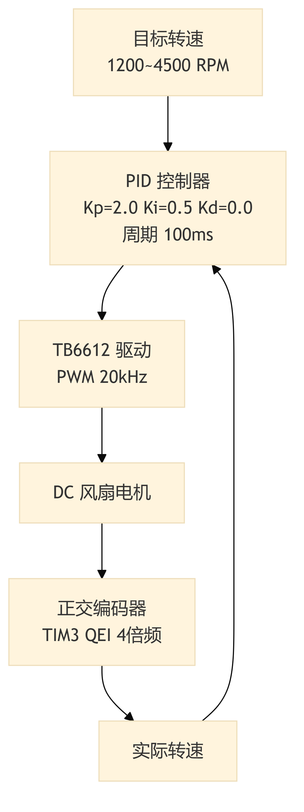
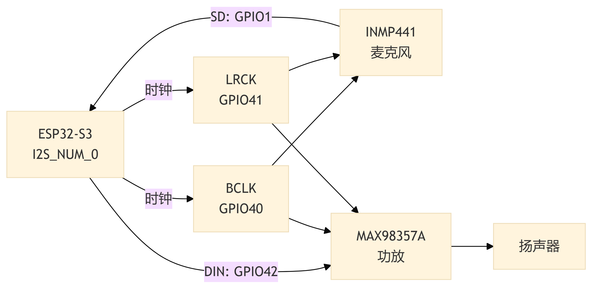

# 第3章 硬件电路设计

## 3.1 系统硬件总体框图

本系统采用分布式多节点架构，由 ESP32-S3 主节点和多个 STM32F407VET6 从节点通过 CAN 总线互联。主节点负责 GUI 显示、语音交互与云端 AI 调用，从节点负责传感器数据采集与执行器控制。系统硬件总体框图如图 3-1 所示。

**图 3-1 系统硬件总体框图**

## 3.2 主控芯片选型

主节点选用 ESP32-S3（双核 Xtensa LX7，240 MHz，8 MB PSRAM），内置 WiFi 可直接联网调用 DeepSeek API 和百度语音服务，双核架构使 Core 0 运行 WiFi 协议栈、Core 1 运行 LVGL 界面[@esp32techref][@hercog2023esp32]。从节点选用 STM32F407VET6（ARM Cortex-M4F，168 MHz），硬件 FPU 单周期完成浮点运算，适合 PID 等实时控制任务[@stm32f407datasheet][@hu2014automatic]。两款芯片均内置 CAN 控制器（TWAI/bxCAN），无需外挂 MCP2515。

## 3.3 传感器模块设计

系统集成三类传感器，均挂载在 STM32 从节点上。SHT30 温湿度传感器与 BH1750 光照传感器共享 I2C2 总线（PB10/PB11），总线速率配置为 100 kHz。SHT30 驱动采用命令-等待-读取三阶段测量流程，发送测量命令 `0x2400`（高精度模式，无时钟拉伸）后异步等待 20 ms，最后读取 6 字节原始数据并进行 CRC-8 校验[@sht30datasheet]。BH1750 以连续高分辨率模式运行，1 秒周期读取 2 字节原始值[@bh1750datasheet]。

土壤湿度传感器输出 0～3.3 V 模拟信号，接入 ADC1 通道（PC1），12-bit 采样精度。湿度百分比通过以下公式映射：

$$H_{soil} = \text{clamp}\left(\frac{4000 - D_{ADC}}{4000 - 1000} \times 100,\ 0,\ 100\right)$$

其中干燥状态 ADC 约 4000 对应 0%，饱和状态 ADC 约 1000 对应 100%，阈值通过实际标定获得。

> 💡 [人类作者请注意：请在此处插入一张传感器模块实物接线照片。]

## 3.4 执行器模块设计

系统包含五种执行器，引脚配置如表 3-1 所示。

**表 3-1 执行器引脚配置**

| 执行器 | 驱动方式 | 定时器/引脚 |
|:---|:---|:---|
| 通风风扇 | TB6612 H 桥 | TIM1 CH1 (PE9)，编码器 TIM3 (PC6/PC7) |
| 水泵 | 光耦继电器 | GPIO PD13 |
| 加湿器 | 光耦继电器 | GPIO PE4 |
| 补光灯 | WS2812B x25 | TIM4 CH1 (PD12) + DMA |
| 遮阳舵机 | MG995 | TIM5 CH2 (PA1)，50 Hz |

通风风扇是系统中唯一需要连续调节的执行器。PWM 输出配置为 20 kHz（TIM1 CH1，PE9），正交编码器接口（TIM3，64 tick/rev）提供转速反馈。离散位置式 PID 控制器以 100 ms 周期计算偏差并更新 PWM 占空比，默认参数 $K_p = 2.0$、$K_i = 0.5$、$K_d = 0.0$，积分项限幅 $I_{max} = 5 \times \text{max\_duty}$，输出限幅 $U_{max} = \text{max\_duty}$。PID 控制框图如图 3-2 所示。

**图 3-2 通风风扇 PID 闭环控制框图**

水泵与加湿器为开关型执行器，由 GPIO 驱动继电器。补光灯采用 WS2812B RGB 灯带（25 颗灯珠），通过 TIM4 通道 1（PD12）配合 DMA 实现 800 kHz 单总线协议驱动。遮阳舵机 MG995 由 TIM5 通道 2（PA1）输出 50 Hz PWM，仅使用收起（0°）和展开（90°）两个固定位置。代码实现中需注意 PA1 对应 TIM5 的 Channel 2，PWM 引脚必须配置在第二个参数位置。

## 3.5 通信与电源模块设计

CAN 总线选用 NXP TJA1051T 高速 CAN 收发器[@tja1051datasheet]，支持最高 1 Mbps 速率。ESP32 通过 TWAI（GPIO48/GPIO47）、STM32 通过 bxCAN（PB9/PB8）分别连接收发器。CAN 2.0A 标准帧的 11-bit 标识符结构与功能码分类按第 2 章 2.2.2 节设计，硬件层面需在总线两端各并联 120Ω 终端电阻以匹配阻抗。

音频模块仅部署在 ESP32 主节点，由 INMP441 麦克风和 MAX98357A 功放组成[@inmp441datasheet][@max98357datasheet]，通过 I2S 总线全双工运行，连接如图 3-3 所示。

**图 3-3 音频模块 I2S 连接图**

系统采用 USB 供电，板载 LDO 将 5 V 转换为 3.3 V，传感器由 3.3 V 供电，执行器由 5 V 供电。电源分配如图 3-4 所示。

**图 3-4 系统电源分配框图**

