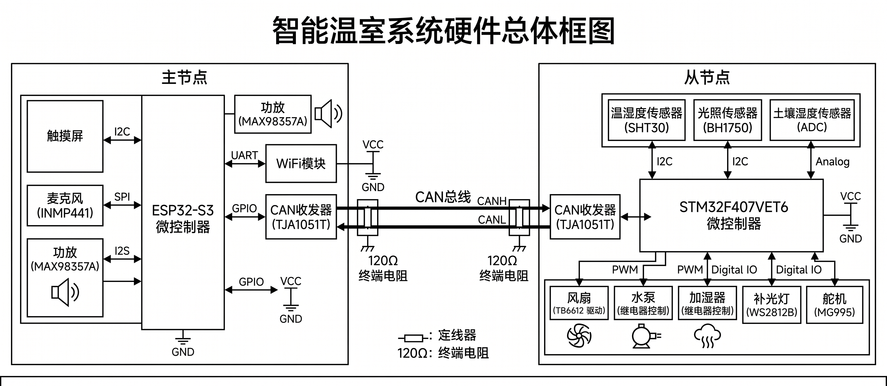
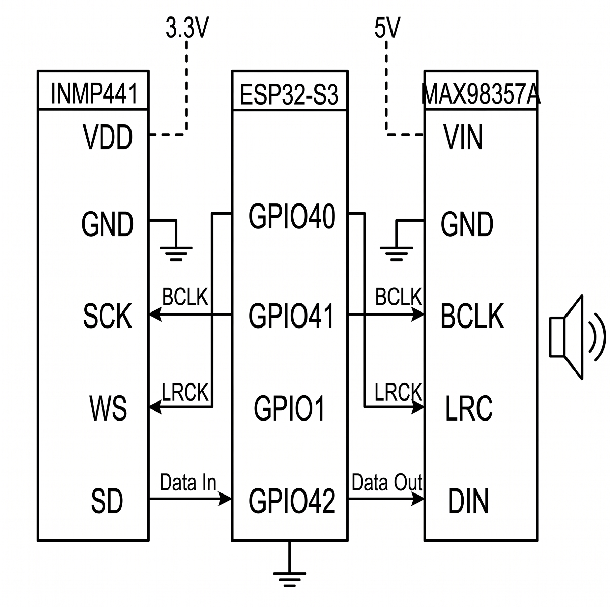

# 第三章 硬件电路设计

## 3.1 系统硬件总体框图

本系统采用分布式多节点架构，由 ESP32-S3 主节点和多个 STM32F407VET6 从节点通过 CAN 总线互联。主节点负责 GUI 显示、语音交互与云端 AI 调用，从节点负责传感器数据采集与执行器控制。系统硬件总体框图如图 3-1 所示。

**图 3-1 系统硬件总体框图**

图 3-2 为系统实物照片，展示了 ESP32-S3 主节点、STM32F407 从节点、CAN 总线连接以及各传感器与执行器的实际接线情况。

**图 3-2 系统硬件实物照片**

## 3.2 主控芯片选型

主节点选用 ESP32-S3（双核 Xtensa LX7，240 MHz，8 MB PSRAM），内置 WiFi 可直接联网调用 DeepSeek API 和百度语音服务，双核架构使 Core 0 运行 WiFi 协议栈、Core 1 运行 LVGL 界面[@esp32techref][@hercog2023esp32]。从节点选用 STM32F407VET6（ARM Cortex-M4F，168 MHz），硬件 FPU 单周期完成浮点运算，适合 PID 等实时控制任务[@stm32f407datasheet][@hu2014automatic]。两款芯片均内置 CAN 控制器（TWAI/bxCAN），无需外挂 MCP2515。

## 3.3 传感器模块设计

系统集成三类传感器，均挂载在 STM32 从节点上。SHT30 温湿度传感器与 BH1750 光照传感器共享 I2C2 总线（PB10/PB11），总线速率配置为 100 kHz，两款传感器均为 3.3 V 供电[@sht30datasheet][@bh1750datasheet]。土壤湿度传感器输出 0～3.3 V 模拟信号，接入 ADC1 通道（PC1），12-bit 采样精度。

传感器接口配置如表 3-1 所示。

**表 3-1 传感器接口配置**

| 传感器 | 型号 | 接口 | 引脚 |
|:---|:---|:---|:---|
| 温湿度传感器 | SHT30 | I2C2，100 kHz | PB10 (SCL), PB11 (SDA) |
| 光照传感器 | BH1750 | I2C2，共用总线 | PB10 (SCL), PB11 (SDA) |
| 土壤湿度传感器 | — | ADC1 | PC1 |

## 3.4 显示模块设计

系统包含两块显示屏，分别部署在主节点和从节点。

主节点搭载 ILI9341 TFT 彩屏（240×320 像素，RGB565 格式），通过 8-bit 8080 并行总线与 ESP32-S3 连接，数据总线占用 GPIO 4～11，控制信号包括 WR（GPIO 12）、RS/DC（GPIO 13）、CS（GPIO 14）、RST（GPIO 15），背光由 GPIO 16 通过 PWM 调节亮度。并口写入频率配置为 20 MHz，满足 LVGL 界面刷新需求。此外，屏幕集成 SPI 接口触摸控制器（SCLK: GPIO 17, MOSI: GPIO 38, MISO: GPIO 18, CS: GPIO 21, INT: GPIO 39）。显示模块引脚配置如表 3-2 所示。

**表 3-2 ILI9341 显示模块引脚配置**

| 信号 | 引脚 | 说明 |
|:---|:---|:---|
| D0～D7 | GPIO 4～11 | 8-bit 数据总线 |
| WR | GPIO 12 | 写使能 |
| RS (DC) | GPIO 13 | 数据/命令选择 |
| CS | GPIO 14 | 片选 |
| RST | GPIO 15 | 复位 |
| BL | GPIO 16 | 背光（PWM） |
| SCLK | GPIO 17 | 触摸 SPI 时钟 |
| MOSI | GPIO 38 | 触摸 SPI 主出 |
| MISO | GPIO 18 | 触摸 SPI 主入 |
| T_CS | GPIO 21 | 触摸片选 |
| T_INT | GPIO 39 | 触摸中断 |

从节点搭载 SSD1306 OLED 屏（128×64 像素），通过 I2C1 总线（PB6/PB7，400 kHz）与 STM32 通信，用于显示传感器实时数据和系统状态。

## 3.5 执行器模块设计

系统包含五种执行器，引脚配置如表 3-3 所示。

**表 3-3 执行器引脚配置**

| 执行器 | 驱动方式 | 定时器/引脚 |
|:---|:---|:---|
| 通风风扇 | TB6612 H 桥 | TIM1 CH1 (PE9)，编码器 TIM3 (PC6/PC7) |
| 水泵 | 光耦继电器 | GPIO PD13 |
| 加湿器 | 光耦继电器 | GPIO PE4 |
| 补光灯 | WS2812B x25 | TIM4 CH1 (PD12) + DMA |
| 遮阳舵机 | MG995 | TIM5 CH2 (PA1)，50 Hz |

通风风扇采用 TB6612 H 桥驱动，PWM 输出配置为 20 kHz（TIM1 CH1，PE9），正交编码器接口（TIM3，64 tick/rev）提供转速反馈，为闭环控制提供硬件基础。水泵与加湿器为开关型执行器，由 GPIO 驱动光耦继电器。补光灯采用 WS2812B RGB 灯带（25 颗灯珠），通过 TIM4 通道 1（PD12）配合 DMA 实现 800 kHz 单总线协议驱动。遮阳舵机 MG995 由 TIM5 通道 2（PA1）输出 50 Hz PWM，仅使用收起（0°）和展开（90°）两个固定位置。

## 3.6 通信与电源模块设计

CAN 总线选用 NXP TJA1051T 高速 CAN 收发器[@tja1051datasheet]，支持最高 1 Mbps 速率。ESP32 通过 TWAI（GPIO48/GPIO47）、STM32 通过 bxCAN（PB9/PB8）分别连接收发器。CAN 2.0A 标准帧的 11-bit 标识符结构与功能码分类按第 2 章 2.2.2 节设计，硬件层面需在总线两端各并联 120Ω 终端电阻以匹配阻抗。

音频模块仅部署在 ESP32 主节点，由 INMP441 麦克风和 MAX98357A 功放组成[@inmp441datasheet][@max98357datasheet]，通过 I2S 总线全双工运行，连接如图 3-3 所示。

**图 3-3 音频模块 I2S 连接图**

系统采用 USB 供电，板载 LDO 将 5 V 转换为 3.3 V，传感器由 3.3 V 供电，执行器由 5 V 供电。电源分配如图 3-4 所示。

**图 3-4 系统电源分配框图**
