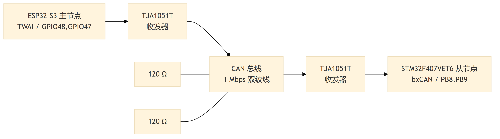
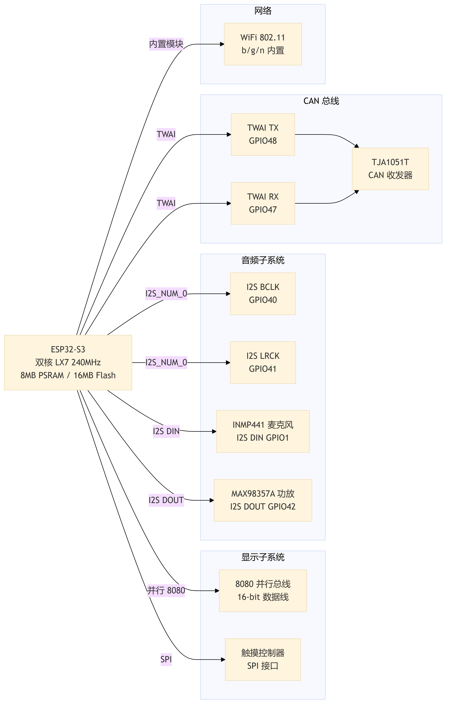
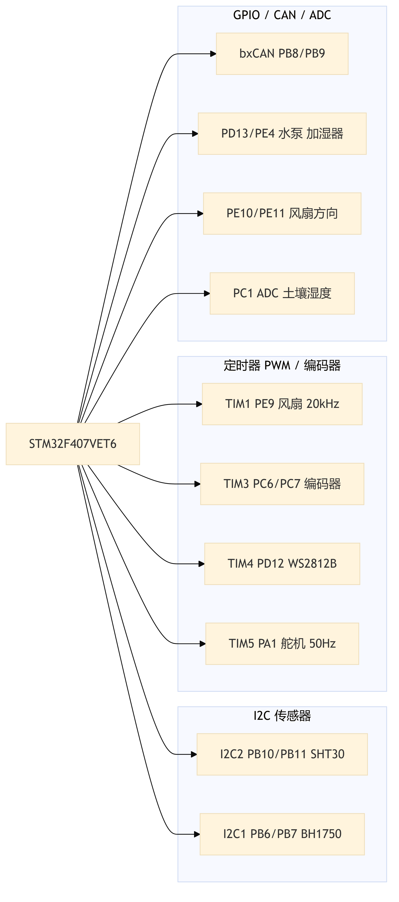
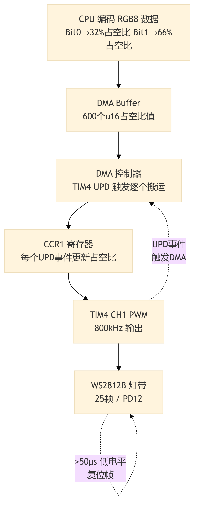

# 第3章 硬件电路设计

## 3.1 系统硬件总体框图

本系统的硬件架构遵循分布式多节点设计理念，由 ESP32-S3 主节点和多个 STM32F407VET6 从节点组成，通过 CAN 总线互联。系统硬件总体框图如图 3-1 所示。

**图 3-1 系统硬件总体框图**

主节点以 ESP32-S3 为核心，通过 8080 总线驱动 TFT 触摸屏，I2S 连接 INMP441 麦克风与 MAX98357A 功放，SPI 连接触摸控制器，WiFi 接入互联网调用 DeepSeek API 和百度语音服务，TWAI 经 TJA1051T 收发器接入 CAN 总线。

从节点以 STM32F407VET6 为核心，通过 I2C 连接 SHT30 和 BH1750 传感器，ADC 采样土壤湿度，TB6612 驱动风扇（含编码器 PID 闭环），光耦继电器控制水泵与加湿器，PWM-DMA 驱动 WS2812B 补光灯，PWM 控制 MG995 遮阳舵机，bxCAN 经 TJA1051T 收发器接入总线。

CAN 总线采用总线型拓扑，两端各连接 120 Ω 终端电阻，波特率 1 Mbps。新增从节点只需接入总线并配置唯一 7-bit 节点 ID 即可加入系统。CAN 总线网络拓扑如图 3-2 所示。

**图 3-2 CAN 总线网络拓扑图**

## 3.2 主控芯片选型

本系统根据主节点与从节点的不同功能定位，分别选择 ESP32-S3 和 STM32F407VET6 两款微控制器。

### 3.2.1 ESP32-S3 选型分析

ESP32-S3 是乐鑫科技推出的高性能 WiFi/蓝牙双模微控制器，采用双核 Xtensa LX7 架构，主频 240 MHz，配备 8 MB PSRAM 和 16 MB Flash[@esp32techref]。其选型优势体现在三个方面：**无线通信**方面，内置 WiFi 802.11 b/g/n 模块无需外挂芯片即可联网，用于调用 DeepSeek API 和百度语音服务[@hercog2023esp32]；**双核架构**方面，Core 0 负责 WiFi 协议栈，Core 1 负责 LVGL 界面渲染，避免资源竞争；**外设接口**方面，I2S 连接 INMP441 麦克风与 MAX98357A 功放，SPI 驱动 TFT 显示屏与触摸控制器，TWAI 外设通过 GPIO48/GPIO47 连接 TJA1051T 收发器接入 CAN 总线。相比 ESP8266（单核 80 MHz、内存有限）和 Raspberry Pi（功耗高、实时性差），ESP32-S3 在性能、功耗与成本间取得了良好平衡。ESP32-S3 外设引脚分配如图 3-3 所示。

**图 3-3 ESP32-S3 外设引脚分配图**

### 3.2.2 STM32F407VET6 选型分析

STM32F407VET6 是意法半导体推出的 ARM Cortex-M4F 微控制器，主频 168 MHz，内置硬件 FPU 和 DSP 指令集，512 KB Flash 和 192 KB SRAM[@stm32f407datasheet]。其选型优势体现在三方面：**浮点运算**方面，硬件 FPU 单周期完成单精度浮点运算，PID 计算效率相比无 FPU 的 STM32F103 提升约 5～10 倍[@hu2014automatic]；**定时器资源**方面，TIM1 生成 20 kHz 风扇 PWM，TIM3 配置为编码器接口读取转速，TIM5 生成 50 Hz 舵机 PWM，TIM4 配合 DMA 驱动 WS2812B，各通道独立配置互不干扰；**片上 CAN** 方面，内置 bxCAN 控制器支持 CAN 2.0A/B，28 组过滤器中使用两组 Mask32 过滤器匹配广播与本节点地址，硬件过滤无关帧降低 CPU 负载，无需外挂 MCP2515。STM32F407VET6 外设引脚分配如图 3-4 所示。

**图 3-4 STM32F407VET6 外设引脚分配图**

**表 3-1 主控芯片关键参数对比**

| 参数 | ESP32-S3 | STM32F407VET6 |
|:---|:---|:---|
| 内核架构 | 双核 Xtensa LX7 | ARM Cortex-M4F |
| 主频 | 240 MHz | 168 MHz |
| Flash | 16 MB（外部） | 512 KB（片上） |
| RAM | 512 KB SRAM + 8 MB PSRAM | 192 KB SRAM |
| FPU | 单精度 | 单精度 |
| WiFi/蓝牙 | 内置 | 无 |
| CAN 控制器 | TWAI（兼容 CAN 2.0） | bxCAN（CAN 2.0A/B） |
| 定时器 | 4× 通用 + 2× 看门狗 | 2× 高级 + 10× 通用 + 2× 基本 |
| I2S 接口 | 2 路 | 2 路 |
| ADC | 2× 12-bit SAR | 3× 12-bit SAR |
| 定位 | 交互层主节点 | 控制层从节点 |

## 3.3 传感器模块设计

本系统部署三类传感器：SHT30 温湿度传感器、BH1750 光照传感器和模拟量土壤湿度传感器。

### 3.3.1 SHT30 温湿度传感器

SHT30 是 Sensirion 公司的数字温湿度传感器，温度精度 ±0.3°C，湿度精度 ±2%RH，I2C 接口直接输出校准后的数字量，无需外部信号调理电路[@sht30datasheet]。ADDR 引脚接 GND 时地址为 0x44，通过 STM32 的 I2C2 外设（PB10/PB11）连接，与 BH1750 共享总线。I2C 总线需 4.7 kΩ 上拉电阻至 3.3 V，电源引脚并联 10 μF 与 100 nF 去耦电容。I2C 总线传感器连接如表 3-2 所示。

**表 3-2 I2C 总线传感器连接**

| 信号 | STM32 引脚 | 连接目标 | 备注 |
|:---|:---|:---|:---|
| SCL | PB10（I2C2） | SHT30 Pin 4, BH1750 Pin 1 | 4.7 kΩ 上拉至 3.3 V |
| SDA | PB11（I2C2） | SHT30 Pin 3, BH1750 Pin 2 | 4.7 kΩ 上拉至 3.3 V |
| ADDR | — | SHT30 Pin 2 → GND | 地址 0x44 |
| ADDR | — | BH1750 Pin 3 → GND | 地址 0x23 |

> 💡 [人类作者请注意：请在此处插入一张 SHT30 传感器模块的实物接线照片，展示传感器与 STM32 开发板的 I2C 连接方式，包括上拉电阻的焊接位置。]

### 3.3.2 BH1750 光照传感器

BH1750 是 ROHM 公司的数字光照传感器，量程 1～65535 Lux，分辨率 1 Lux，I2C 接口输出 16-bit 光强值[@bh1750datasheet]。ADDR 接 GND 时地址为 0x23，与 SHT30 共存于 I2C2 总线。系统采用连续高分辨率模式（0x10），约 120 ms 更新一次数据，从节点以 1 秒周期读取。DVI 引脚通过 10 kΩ 上拉至 VCC 并并联 100 nF 电容实现上电复位。

### 3.3.3 土壤湿度传感器

土壤湿度传感器采用电容式模拟量输出模块，通过检测土壤介电常数变化反映含水量，输出 0～3.3 V 模拟信号。传感器连接至 STM32 的 ADC1 通道（PC1），12-bit 分辨率采样，通过以下公式映射为百分制湿度值：

$$\text{SoilHumidity} = \text{clamp}\left(\frac{4000 - \text{ADC\_Value}}{4000 - 1000} \times 100,\ 0,\ 100\right)$$

其中干燥状态（空气中）ADC 约 4000 对应 0%，饱和状态（水中）ADC 约 1000 对应 100%，阈值通过实际标定获得。

> 💡 [人类作者请注意：请在此处插入一张土壤湿度传感器模块的实物照片，展示传感器探针与控制板的接线方式。这能增强论文的真实感。]

## 3.4 执行器模块设计

本系统包含五种执行器：通风风扇（PID 闭环调速）、水泵与加湿器（继电器开关）、补光灯（WS2812B）和遮阳舵机（MG995）。

### 3.4.1 通风风扇驱动

通风风扇通过 TB6612 双 H 桥驱动模块实现 PWM 调速与方向控制。TIM1 通道 1（PE9）输出 20 kHz PWM 信号驱动电机，方向引脚 AIN1/AIN2（PE10/PE11）控制正反转。转速反馈通过正交编码器实现：编码器 A/B 相分别连接 TIM3 通道 1/2（PC6/PC7），配置为 QEI 模式硬件 4 倍频计数。离散位置式 PID 控制器以 100 ms 周期计算偏差，输出经限幅后更新 PWM 占空比，默认参数 $K_p = 2.0$、$K_i = 0.5$、$K_d = 0.0$，转速范围 1200～4500 RPM。PID 参数可通过 CAN 总线远程调整（索引 PidP=0x52、PidI=0x53、PidD=0x54）。通风风扇 PID 闭环控制如图 3-5 所示。

**图 3-5 通风风扇 PID 闭环控制框图**

> 💡 [人类作者请注意：请在此处插入一张通风风扇模块的实物接线照片，展示风扇电机、TB6612 驱动板与 STM32 开发板之间的连接方式，以及编码器的安装位置。]

### 3.4.2 水泵与加湿器驱动

水泵（PD13）与加湿器（PE4）均为开关型执行器，采用光耦隔离继电器成品模块驱动。该模块具备光耦电气隔离、续流二极管保护和内置驱动电路，支持高/低电平触发，通过跳线帽选择。本系统配置为高电平触发：GPIO 输出高电平继电器吸合，执行器通电；输出低电平继电器释放，执行器断电。自动模式下由迟滞调度器根据阈值控制启停，手动模式下用户通过触摸屏远程操控，指令经 CAN 总线 WriteSet 功能码下发。

### 3.4.3 补光灯驱动

补光灯采用 WS2812B RGB LED 灯带（25 颗灯珠），支持独立亮度与颜色调节，单总线级联控制。WS2812B 数据协议时序精度要求在百纳秒级别，本系统通过 TIM4 通道 1（PD12）配合 DMA 传输实现精确波形生成：将 600-bit 帧数据预编码为 PWM 占空比数组，DMA 自动搬运至 CCR1 寄存器，定时器以 800 kHz 频率输出。自动模式下根据光照反馈比例调节亮度，手动模式下用户可通过 HSV 色彩空间独立调节。WS2812B PWM-DMA 驱动原理如图 3-6 所示。

**图 3-6 WS2812B PWM-DMA 驱动原理图**

### 3.4.4 遮阳舵机驱动

遮阳舵机选用 MG995，扭矩 10～13 kg·cm，控制信号为 50 Hz PWM 波。TIM5 通道 2（PA1）输出 PWM，本系统仅使用两个固定位置：收起（0°，500 μs）和展开（90°，1000 μs），作为开关式遮阳执行器。自动模式下根据光照阈值切换位置，供电由开发板 5 V 引脚直接提供。

## 3.5 通信模块设计

### 3.5.1 CAN 总线多节点网络设计

CAN 总线是主从节点间唯一的通信通道。每个节点由片上 CAN 控制器和外部 CAN 收发器组成，控制器负责帧编解码与仲裁，收发器负责逻辑电平与差分信号的转换。本系统选用 NXP TJA1051T 高速 CAN 收发器[@tja1051datasheet]，符合 ISO 11898-2 标准，支持最高 1 Mbps 速率，共模电压范围 −27 V～+40 V，内置过温与短路保护。ESP32 主节点通过 TWAI 外设（GPIO48/TX、GPIO47/RX）连接收发器，STM32 从节点通过 bxCAN 外设（PB9/TX、PB8/RX）连接收发器。物理层采用双绞线传输差分信号，总线两端各连接 120 Ω 终端电阻匹配阻抗，1 Mbps 波特率下总线长度建议不超过 40 米。CAN 协议帧格式如表 3-3 所示。

**表 3-3 CAN 协议帧格式**

| 字段 | 位域 | 含义 |
|:---|:---|:---|
| 功能码 | Bit 10..7（4-bit） | 操作类型（Read=0x1, Write=0x2, Report=0x3 等） |
| 节点 ID | Bit 6..0（7-bit） | 目标从节点地址（0x01～0x7F），0x7F 为广播 |
| Byte 0 | 8-bit | 参数索引（1 字节） |
| Byte 1–3 | 24-bit | 保留（3 字节） |
| Byte 4–7 | 32-bit | 参数值（4 字节，小端序） |

### 3.5.2 音频输入输出模块

音频模块仅部署在 ESP32 主节点上，由 INMP441 数字麦克风和 MAX98357A 功率放大器组成，通过 I2S 总线（I2S_NUM_0）以全双工主模式运行，BCLK（GPIO40）和 LRCK（GPIO41）为两者共享的时钟线，数据方向分别为 GPIO1（输入）和 GPIO42（输出）[@inmp441datasheet][@max98357datasheet]。音频模块 I2S 连接如图 3-7 所示。

**图 3-7 音频模块 I2S 连接图**

## 3.6 电源模块设计

本系统直接采用两块开发板自带的 USB 供电方案，板载 LDO 将 5 V 转换为 3.3 V。传感器由 3.3 V 引脚供电，执行器由 5 V 引脚供电，WS2812B 灯带电源线直接从 5 V 引脚引出以避免压降。各节点电源入口并联 10 μF 电解电容与 100 nF 陶瓷电容滤波。对于舵机启停、补光灯全亮等突发大电流场景，当前方案依赖电源本身的瞬态响应能力。系统电源分配如图 3-8 所示。

**图 3-8 系统电源分配框图**

