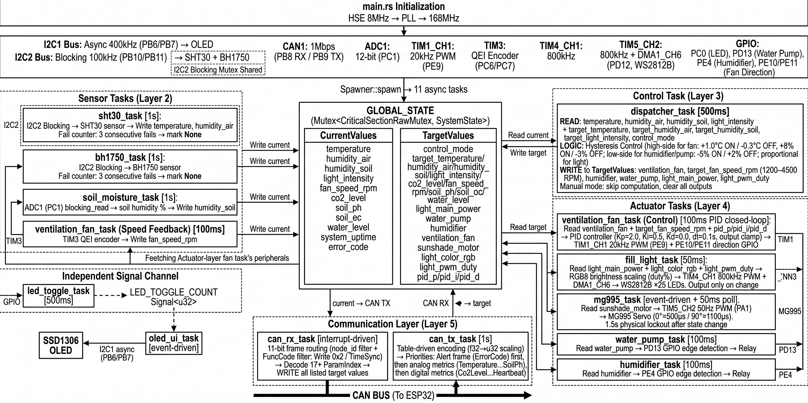
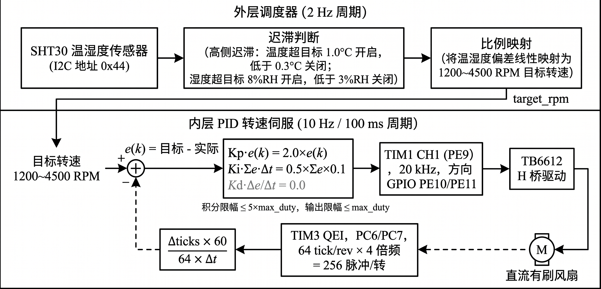
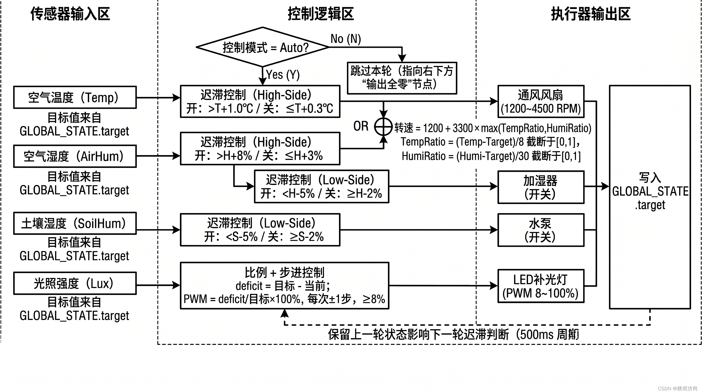
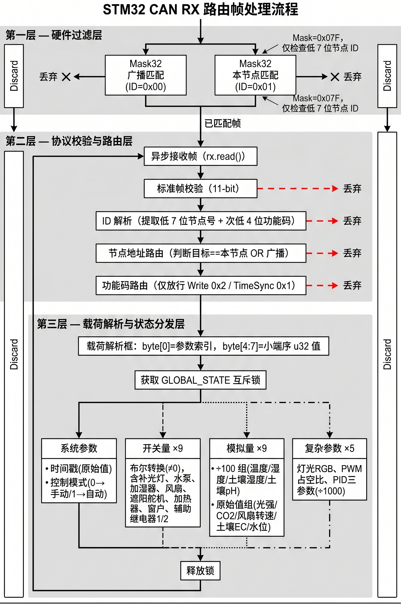

# 第四章 STM32控制层软件设计

## 4.1 软件总体架构

STM32 从节点软件采用 Rust 语言开发，基于 Embassy 异步运行时框架[@embassy2024]，按 Cargo crate 组织为四层结构：firmware 固件层包含入口函数 `main.rs` 与全局状态单例 `shared.rs`，以及按功能域组织的 11 个异步任务；crates/app 应用层封装传感器读取与执行器高级控制逻辑；crates/bsw 基础软件层提供 CAN 协议编解码、PID 控制器、电机闭环控制和 I2C 传感器驱动等底层模块；crates/service 服务层提供颜色转换等公共服务。各层通过 Rust 的模块系统实现编译期依赖隔离，上层模块仅能调用下层暴露的公开接口。

Embassy 框架的核心优势在于零成本异步抽象：每个外设操作（如 I2C 读写、CAN 收发、ADC 采样）被封装为 `Future`，当等待硬件中断时任务自动让出 CPU，无需传统 RTOS 的上下文切换开销。`main.rs` 中的入口函数通过 `#[embassy_executor::main]` 宏生成异步执行器，依次完成系统时钟配置（HSE 8 MHz 经 PLL 倍频至 168 MHz）、外设初始化和任务派发（`Spawner::spawn`），随后主任务进入无限等待循环。任务派发关系如图 4-1 所示。

::: {custom-style="图片"}

:::
::: {custom-style="表题"}
图 4-1 STM32 从节点异步任务派发关系
:::

全局状态单例 `GLOBAL_STATE` 是所有任务间数据交换的唯一通道，其类型为 `Mutex<CriticalSectionRawMutex, SystemState>`。`SystemState` 包含 `CurrentValues`（传感器实时读数）和 `TargetValues`（执行器目标状态与控制参数）两个子结构，均以 `Option` 封装防止未初始化数据误用。I2C 总线共享采用分层互斥策略，OLED 显示屏使用异步互斥锁，SHT30 与 BH1750 使用阻塞互斥锁（传感器读写耗时微秒级，不影响异步调度）。

## 4.2 传感器驱动开发

### 4.2.1 SHT30 温湿度传感器驱动

SHT30 驱动位于 `bsw/src/sht30.rs`，通过 `embedded-hal` 1.0 标准的 `I2c` Trait 接口实现硬件无关性[@embeddedhal2024]。驱动采用命令-等待-读取的三阶段测量流程：首先发送测量命令 `0x2400`（高精度模式，无时钟拉伸），随后异步等待 20 ms（SHT30 高精度模式最大转换时间 15 ms，留 5 ms 余量），最后读取 6 字节原始数据。

数据完整性校验包含全零/全 0xFF 异常检测和 CRC-8 校验两层。校验通过后，按式（4.1）和式（4.2）将 16-bit 原始值转换为物理量：

$$T = -45 + 175 \times \frac{S_T}{65535} \quad (°C)$$

$$RH = 100 \times \frac{S_{RH}}{65535} \quad (\%RH)$$

其中 $S_T$ 和 $S_{RH}$ 分别为温度和湿度的 16-bit 原始值。域任务 `sht30_task` 以 1 秒周期调用驱动，测量成功后将结果写入 `GLOBAL_STATE`；连续失败 3 次后将对应字段置为 `None`，标记传感器离线。

### 4.2.2 BH1750 光照传感器驱动

BH1750 驱动位于 `bsw/src/bh1750.rs`，初始化后以连续高分辨率模式运行，1 秒周期读取 2 字节原始值并按 $E_v = R / 1.2$（Lux）转换。光照值作为补光灯和遮阳舵机自动控制的反馈输入。

### 4.2.3 土壤湿度 ADC 采集

土壤湿度传感器输出 0～3.3 V 模拟信号，由 ADC1（12-bit）在 PC1 引脚采样，驱动位于 `firmware/src/bin/domains/soil_moisture.rs`。传感器浸水时输出低电压、干燥时输出高电压，因此采用反向线性映射将原始值转换为湿度百分比，如式（4.3）所示：

$$M = \frac{4000 - D_{ADC}}{4000 - 1000} \times 100\%$$

其中 $D_{ADC}$ 为 12-bit 原始采样值，4000 和 1000 分别为干燥状态和浸水状态对应的经验校准常数，结果限幅至 $[0, 100]$。域任务 `soil_moisture_task` 以 1 秒周期循环采样。

## 4.3 执行器控制算法

### 4.3.1 通风风扇 PID 转速闭环控制

通风风扇是系统中唯一需要连续调节的执行器，采用离散位置式 PID 控制算法实现转速闭环[@ang2005pid; @astrom2006pid]。PID 控制器位于 `bsw/src/pid.rs`，其输出 $u(k)$ 由比例、积分、微分三项组成，如式（4.4）所示：

$$u(k) = K_p \cdot e(k) + K_i \cdot \sum_{j=0}^{k} e(j) \cdot \Delta t + K_d \cdot \frac{e(k) - e(k-1)}{\Delta t}$$

其中 $K_p$、$K_i$、$K_d$ 分别为比例、积分、微分增益，$e(k) = r - y(k)$ 为设定值 $r$ 与实际转速 $y(k)$ 的偏差，$\Delta t = 0.1\ \text{s}$ 为控制周期。为防止积分饱和，积分项采用限幅处理，限幅值为 $I_{max} = 5 \times \text{max\_duty}$；为防止执行器过载，输出值限幅至 $U_{max} = \text{max\_duty}$。当采样周期 $\Delta t < 0.0001\ \text{s}$ 时，微分项置零以避免除零错误。默认 PID 参数为 $K_p = 2.0$、$K_i = 0.5$、$K_d = 0.0$，可通过 CAN 总线远程调整（参数索引 0x52～0x54）。

电机控制模块 `motor_ctrl.rs` 中的 `FanMotor` 封装了 PWM 输出（TIM1 通道 1，20 kHz）、方向控制引脚和正交编码器接口（TIM3，64 tick/rev）。每 100 ms 执行一次 `control_tick`：若目标转速为 0 则复位 PID 并关闭 PWM；否则读取编码器增量计数换算为实际转速，送入 PID 控制器计算输出，通过方向引脚和 PWM 占空比驱动电机。PID 控制流程如图 4-2 所示。

::: {custom-style="图片"}

:::
::: {custom-style="表题"}
图 4-2 通风风扇 PID 闭环控制流程
:::

### 4.3.2 迟滞调度器

自动控制模式下，迟滞调度器（`dispatcher.rs`）以 500 ms 周期从 `GLOBAL_STATE` 读取传感器数据与目标阈值，根据迟滞控制（Hysteresis Control）逻辑计算各执行器的目标状态[@hu2014automatic]。调度逻辑如图 4-3 所示。

::: {custom-style="图片"}

:::
::: {custom-style="表题"}
图 4-3 迟滞调度器控制逻辑
:::

以温度控制通风风扇为例，迟滞函数的逻辑为：风扇开启状态下温度降至目标值以下 0.3°C 时关闭，关闭状态下温度升至目标值以上 1.0°C 时开启，形成 0.7°C 迟滞带。湿度控制采用相同逻辑（偏移量分别为 8%RH 和 3%RH），两者通过逻辑 OR 合并。风扇启动后转速根据温湿度偏差比例动态映射至 1200～4500 RPM 区间。加湿器和水泵采用低侧迟滞策略（迟滞带 3%RH），补光灯采用比例控制实现平滑亮度过渡。

所有自动控制输出均写入 `GLOBAL_STATE` 的 `TargetValues` 字段，由各执行器域任务读取并驱动硬件。当控制模式切换为手动时，调度器清空上一轮输出状态并跳过本轮计算。

### 4.3.3 WS2812B 补光灯驱动

WS2812B 驱动位于 `bsw/src/ws2812.rs`，通过 TIM4 通道 1（PD12）配合 DMA 实现 800 kHz 单总线协议。25 颗灯珠的帧数据（600 bit）被预编码为 PWM 占空比数组，由 DMA 自动搬运输出。域任务 `fill_light_task` 以 50 ms 周期读取 RGB 颜色和亮度值，仅在输出变化时触发 DMA 搬运以减少总线占用。

### 4.3.4 其他执行器控制

遮阳舵机 MG995 由 TIM5 通道 2 输出 50 Hz PWM，仅使用收起（0°）和展开（90°）两个固定位置，状态变化时更新脉宽。水泵（PD13）和加湿器（PE4）为开关型执行器，由 GPIO 驱动继电器，事件触发通断。

## 4.4 CAN 通信协议实现

### 4.4.1 协议编解码

CAN 协议编解码模块位于 `bsw/src/can_proto.rs`，实现第二章 2.2 节所述的标识符构建与载荷编解码逻辑。本从节点 ID 配置为 `0x01`，广播地址为 `0x00`。除 ×100 缩放外，PID 参数采用 ×1000 缩放以保留更高精度。

### 4.4.2 收发流程

CAN 接收任务 `can_rx_task` 异步等待接收帧，处理流程如图 4-4 所示。校验为 11-bit 标准帧且节点 ID 匹配后，解析载荷并按参数索引写入 `GLOBAL_STATE`，浮点参数执行相应反缩放。硬件过滤器配置两组 Mask32 规则分别匹配广播地址和本节点地址，无关帧在硬件层丢弃以降低 CPU 负载。

::: {custom-style="图片"}

:::
::: {custom-style="表题"}
图 4-4 CAN 接收路由处理流程
:::

CAN 发送任务 `can_tx_task` 以 1 秒周期执行遥测上报。优先发送非零错误码的 Alert 帧，随后表驱动遍历模拟量和整型量数组，对每个非 `None` 的值缩放后封装为 Report 帧发送。表驱动设计使新增参数只需添加一行即可。

## 4.5 全局状态管理与任务间同步

本系统的任务间数据共享采用全局状态单例模式，以 `GLOBAL_STATE` 作为唯一数据中枢。相比消息传递或信号量方案，单例模式在本系统的 11 个任务和微秒级锁持有时间下竞争概率极低，且代码结构最为简洁。

各任务与 `GLOBAL_STATE` 的交互关系如表 4-1 所示。传感器任务以 1 Hz 写入 `CurrentValues`；CAN 接收任务更新 `TargetValues` 中的控制参数；迟滞调度器读取两侧数据计算执行器目标状态；执行器任务读取 `TargetValues` 驱动硬件，风扇任务同时回写实际转速；CAN 发送任务读取 `CurrentValues` 上报遥测。

::: {custom-style="表题"}
表 4-1 任务与全局状态的读写关系
:::

| 任务 | 读取字段 | 写入字段 | 周期 |
|:---|:---|:---|:---|
| sht30_task | — | temperature, humidity_air | 1 s |
| bh1750_task | — | light_intensity | 1 s |
| soil_moisture_task | — | humidity_soil | 连续 |
| dispatcher_task | CurrentValues, TargetValues | 执行器目标状态 | 500 ms |
| ventilation_fan_task | 目标转速、PID 参数 | fan_speed_rpm | 100 ms |
| ws2812_task | RGB、亮度 | — | 50 ms |
| 其他执行器任务 | 对应布尔/枚举字段 | — | 事件驱动 |
| can_rx_task | — | TargetValues 全部字段 | 事件驱动 |
| can_tx_task | CurrentValues 全部字段 | — | 1 s |
