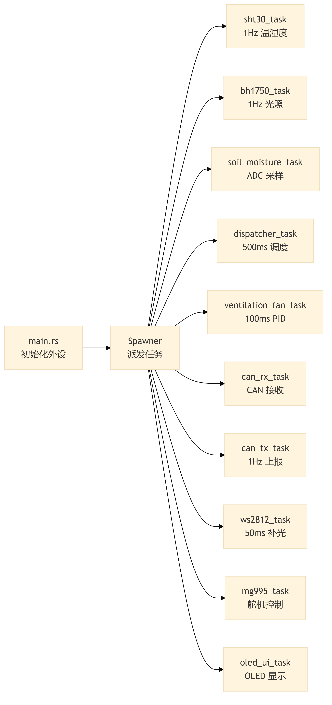
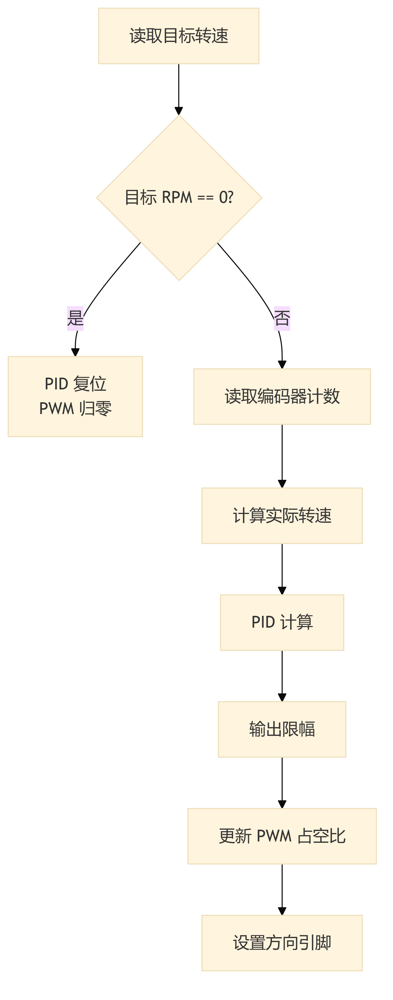
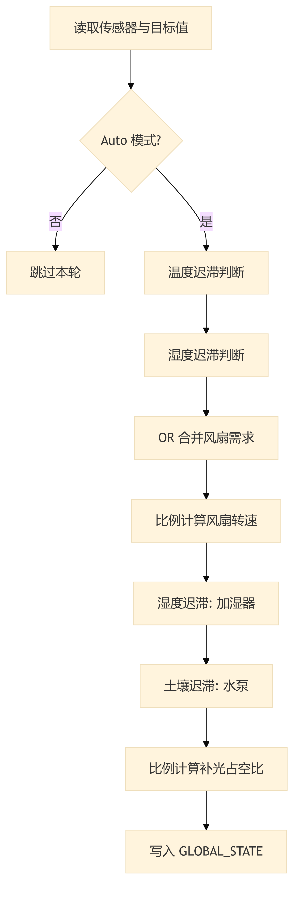

# 第4章 STM32控制层软件设计

## 4.1 软件总体架构

STM32 从节点软件采用 Rust 语言开发，基于 Embassy 异步运行时框架[@embassy2024]，按 Cargo crate 组织为四层结构：firmware 固件层包含入口函数 `main.rs` 与全局状态单例 `shared.rs`，以及按功能域组织的 11 个异步任务；crates/app 应用层封装传感器读取与执行器高级控制逻辑；crates/bsw 基础软件层提供 CAN 协议编解码、PID 控制器、电机闭环控制和 I2C 传感器驱动等底层模块；crates/service 服务层提供颜色转换等公共服务。各层通过 Rust 的模块系统实现编译期依赖隔离，上层模块仅能调用下层暴露的公开接口。

Embassy 框架的核心优势在于零成本异步抽象：每个外设操作（如 I2C 读写、CAN 收发、ADC 采样）被封装为 `Future`，当等待硬件中断时任务自动让出 CPU，无需传统 RTOS 的上下文切换开销。`main.rs` 中的入口函数通过 `#[embassy_executor::main]` 宏生成异步执行器，依次完成系统时钟配置（HSE 8 MHz 经 PLL 倍频至 168 MHz）、外设初始化和任务派发（`Spawner::spawn`），随后主任务进入无限等待循环。任务派发关系如图 4-1 所示。

**图 4-1 STM32 从节点异步任务派发关系**

全局状态单例 `GLOBAL_STATE` 是所有任务间数据交换的唯一通道，其类型为 `Mutex<CriticalSectionRawMutex, SystemState>`，由 `CriticalSectionRawMutex` 提供中断级互斥保护。`SystemState` 结构体包含两个子结构：`CurrentValues` 存储传感器实时读数（温度、湿度、光照等，均为 `Option<f32>` 类型），`TargetValues` 存储执行器目标状态与控制参数（控制模式、PID 参数等）。`Option` 封装确保未初始化的参数不会被误用——读取任务写入 `Some(value)`，调度任务遇到 `None` 时跳过对应逻辑。

I2C 总线共享采用分层互斥策略：I2C1（OLED 显示屏）使用异步 `Mutex<ThreadModeRawMutex>` 保护，支持多任务非阻塞访问；I2C2（SHT30 与 BH1750）使用阻塞 `Mutex<ThreadModeRawMutex, RefCell>` 保护，因传感器驱动的读写操作耗时极短（微秒级），阻塞方式不会对异步调度产生实质性影响。

## 4.2 传感器驱动开发

### 4.2.1 SHT30 温湿度传感器驱动

SHT30 驱动位于 `bsw/src/sht30.rs`，通过 `embedded-hal` 1.0 标准的 `I2c` Trait 接口实现硬件无关性[@embeddedhal2024]。驱动采用命令-等待-读取的三阶段测量流程：首先发送测量命令 `0x2400`（高精度模式，无时钟拉伸），随后异步等待 20 ms（SHT30 高精度模式最大转换时间 15 ms，留 5 ms 余量），最后读取 6 字节原始数据。

数据完整性校验包含两个层次：首先检查返回数据是否全为 `0x00` 或 `0xFF`（传感器离线或总线故障的典型特征），然后对温度和湿度两组数据分别执行 CRC-8/SENSIRION 校验。CRC 多项式为 $x^8 + x^5 + x^4 + 1$（值 `0x31`），初始值 `0xFF`。校验通过后，按以下公式将 16-bit 原始值转换为物理量：

$$T = -45 + 175 \times \frac{S_T}{65535} \quad (°C)$$

$$RH = 100 \times \frac{S_{RH}}{65535} \quad (\%RH)$$

其中 $S_T$ 和 $S_{RH}$ 分别为温度和湿度的 16-bit 原始值。域任务 `sht30_task` 以 1 秒周期调用驱动，测量成功后将结果写入 `GLOBAL_STATE`；连续失败 3 次后将对应字段置为 `None`，标记传感器离线。

### 4.2.2 BH1750 光照传感器驱动

BH1750 驱动位于 `bsw/src/bh1750.rs`，同样基于 `I2c` Trait。初始化阶段依次发送通电指令 `0x01` 和连续高分辨率模式指令 `0x10`，等待 180 ms 首次转换完成后进入周期读取。数据读取仅需 2 字节，合并后按以下公式转换为 Lux 值：

$$E_v = \frac{R}{1.2} \quad (\text{Lux})$$

其中 $R$ 为 16-bit 原始值。域任务 `bh1750_task` 以 1 秒周期读取并更新全局状态。光照值是补光灯自动调节和遮阳舵机控制的反馈输入。

### 4.2.3 土壤湿度 ADC 采集

土壤湿度传感器输出 0～3.3 V 模拟信号，由 STM32 的 ADC1（12-bit 分辨率）在 PC1 引脚采样。为消除电源波动对采样精度的影响，每次转换同时读取内部参考电压 VREFINT（典型值 1.21 V）和温度传感器，通过以下公式计算真实供电电压：

$$V_{DDA} = \frac{1.21 \times 4095}{D_{VREFINT}} \quad (V)$$

土壤湿度百分比通过线性映射获得：

$$H_{soil} = \text{clamp}\left(\frac{4000 - D_{ADC}}{4000 - 1000} \times 100,\ 0,\ 100\right)$$

其中干燥状态 ADC 约 4000 对应 0%，饱和状态 ADC 约 1000 对应 100%，阈值通过实际标定获得。域任务 `soil_moisture_task` 采用循环连续采样，ADC 转换在 STM32F4 上仅需几微秒，`blocking_read` 不会对异步调度器造成实质性阻塞。

> 💡 [人类作者请注意：请在此处插入一张 STM32 开发板与传感器模块的实物接线照片，展示 SHT30、BH1750 和土壤湿度传感器与 STM32 的实际连接方式。]

## 4.3 执行器控制算法

### 4.3.1 通风风扇 PID 转速闭环控制

通风风扇是系统中唯一需要连续调节的执行器，采用离散位置式 PID 控制算法实现转速闭环。PID 控制器位于 `bsw/src/pid.rs`，其输出 $u(k)$ 由比例、积分、微分三项组成：

$$u(k) = K_p \cdot e(k) + K_i \cdot \sum_{j=0}^{k} e(j) \cdot \Delta t + K_d \cdot \frac{e(k) - e(k-1)}{\Delta t}$$

其中 $e(k) = r - y(k)$ 为设定值与实际转速的偏差，$\Delta t = 0.1\ \text{s}$ 为控制周期。为防止积分饱和，积分项采用限幅处理，限幅值为 $I_{max} = 5 \times \text{max\_duty}$；为防止执行器过载，输出值限幅至 $U_{max} = \text{max\_duty}$。当采样周期 $\Delta t < 0.0001\ \text{s}$ 时，微分项置零以避免除零错误。默认 PID 参数为 $K_p = 2.0$、$K_i = 0.5$、$K_d = 0.0$，可通过 CAN 总线远程调整（参数索引 0x52～0x54）。

电机控制模块 `motor_ctrl.rs` 中的 `FanMotor` 结构体封装了 PWM 输出（TIM1 通道 1，20 kHz）、方向控制引脚（PE10/PE11）和正交编码器接口（TIM3，硬件 4 倍频，64 tick/rev）。每 100 ms 执行一次 `control_tick`：若目标转速为 0 则复位 PID 状态并关闭 PWM；否则读取编码器增量计数，经 16-bit wrapping 减法和方向校正后计算实际转速，送入 PID 控制器计算输出，最后通过方向引脚和 PWM 占空比驱动电机。PID 控制流程如图 4-2 所示。

**图 4-2 通风风扇 PID 闭环控制流程**

转速计算公式为：

$$n = \frac{\Delta C \times 60}{N_{tick} \times \Delta t} \quad (\text{RPM})$$

其中 $\Delta C$ 为编码器增量计数（带符号），$N_{tick} = 64$ 为每转脉冲数。方向校正系数为 $-1$，用于将编码器计数方向对齐到"正 PWM = 正转速"的软件约定。

### 4.3.2 迟滞调度器

自动控制模式下，迟滞调度器（`dispatcher.rs`）以 500 ms 周期从 `GLOBAL_STATE` 读取传感器数据与目标阈值，根据迟滞控制（Hysteresis Control）逻辑计算各执行器的目标状态[@hu2014automatic]。调度逻辑如图 4-3 所示。

**图 4-3 迟滞调度器控制逻辑**

以温度控制通风风扇为例，迟滞函数 `hysteresis_high_side` 的逻辑为：若风扇当前处于开启状态，当温度降至 $T_{target} + T_{off}$（0.3°C）以下时关闭；若风扇当前处于关闭状态，当温度升至 $T_{target} + T_{on}$（1.0°C）以上时开启。由此形成 0.7°C 的迟滞带，避免被控量在阈值附近频繁波动。湿度对风扇的控制采用相同逻辑（开启偏移 8%RH，关闭偏移 3%RH），两者通过逻辑 OR 合并：任一条件满足即启动风扇。

风扇启动后，转速根据温度偏差和湿度偏差的比例关系动态计算：

$$n_{target} = n_{min} + (n_{max} - n_{min}) \times \max\left(\frac{\Delta T}{8}, \frac{\Delta RH}{30}\right)$$

其中 $\Delta T = T_{current} - T_{target}$，$\Delta RH = RH_{current} - RH_{target}$，$n_{min} = 1200\ \text{RPM}$，$n_{max} = 4500\ \text{RPM}$。需求比例取温度和湿度中较大者，映射至 1200～4500 RPM 区间。

加湿器和水泵采用低侧迟滞策略（`hysteresis_low_side`）：当实际值低于目标值减去开启偏移时启动，高于目标值减去关闭偏移时停止。加湿器的迟滞带为 3%RH，水泵的迟滞带为 3%RH。补光灯采用比例控制方式，根据光照差值 $\Delta E = E_{target} - E_{current}$ 占目标值的比例计算期望占空比，每次调度周期递增或递减 1% 实现平滑亮度过渡，避免光照突变对植物生长的影响。

所有自动控制输出均写入 `GLOBAL_STATE` 的 `TargetValues` 字段，由各执行器域任务读取并驱动硬件。当控制模式切换为手动时，调度器清空上一轮输出状态并跳过本轮计算。

### 4.3.3 WS2812B 补光灯驱动

WS2812B 驱动位于 `bsw/src/ws2812.rs`，通过 TIM4 通道 1（PD12）配合 DMA 传输实现 800 kHz 单总线协议波形生成。驱动预计算两种占空比：逻辑 0 对应 32% 占空比（$T_{0H} \approx 400\ \text{ns}$），逻辑 1 对应 66% 占空比（$T_{1H} \approx 800\ \text{ns}$）。25 颗灯珠的完整帧数据（$25 \times 24 = 600\ \text{bit}$）被预编码为 PWM 占空比数组，附加 40 位低电平复位信号后，由 DMA 自动搬运至 CCR1 寄存器，定时器在 800 kHz 频率下连续输出。

域任务 `fill_light_task` 以 50 ms 周期运行，从 `GLOBAL_STATE` 读取开关状态、RGB 颜色值（0x00RRGGBB 格式）和亮度占空比（0～100%），将 RGB 各通道与亮度相乘后通过 DMA 写入灯带。任务内部维护 `current_output` 状态变量，仅在输出值发生变化时才触发 DMA 搬运，避免不必要的总线占用。

### 4.3.4 其他执行器控制

遮阳舵机 MG995 由 TIM5 通道 2（PA1）输出 50 Hz PWM 控制，仅使用两个固定位置：收起（0°，500 μs 脉宽）和展开（90°，1100 μs 脉宽）。域任务 `mg995_task` 监测 `GLOBAL_STATE` 中的 `sunshade_motor` 字段，状态变化时更新 PWM 脉宽，无变化时不做寄存器写入。

水泵（PD13）和加湿器（PE4）为开关型执行器，由 GPIO 直接驱动光耦隔离继电器模块。域任务 `water_pump_task` 和 `humidifier_task` 分别监测对应的布尔状态字段，输出高电平继电器吸合、低电平释放。

> 💡 [人类作者请注意：请在此处插入一张 WS2812B 灯带与 TB6612 风扇驱动板的实物接线照片，展示补光灯和风扇模块与 STM32 开发板的连接方式。]

## 4.4 CAN 通信协议实现

### 4.4.1 协议编解码

CAN 协议模块位于 `bsw/src/can_proto.rs`，定义了 11-bit 标准标识符的编解码逻辑。标识符构建公式为 $\text{CAN\_ID} = (\text{func\_code} \ll 7) \, | \, \text{node\_id}$，其中 4-bit 功能码（Bit 10..7）定义帧的业务类型，7-bit 节点 ID（Bit 6..0）标识目标或来源地址。本从节点的节点 ID 为 `0x01`，广播地址为 `0x00`。

功能码定义按优先级从高到低为：Alert（0x0，异常告警）、TimeSync（0x1，时间同步）、Write（0x2，控制命令）、Report（0x3，数据上报）。接收帧解析函数 `parse_id` 从标识符中提取节点 ID 和功能码，`parse_rx_payload` 从 8 字节数据域中提取参数索引（Byte 0）和参数值（Byte 4～7，小端序）。发送帧构建函数 `build_tx_frame` 将功能码、参数索引和参数值封装为标准帧。

参数字典 `ParamIndex` 枚举覆盖系统所需的全部参数，浮点物理量采用缩放因子转换为整数传输：温度、湿度、土壤 pH 采用 ×100 缩放（如 25.5°C 传输为 2550），PID 参数采用 ×1000 缩放（如 $K_p = 2.0$ 传输为 2000），光照强度等整数量直接传输。

### 4.4.2 CAN 接收路由

CAN 接收任务 `can_rx_task` 通过 `embassy_stm32::can::CanRx` 异步等待接收帧，处理流程如图 4-4 所示。接收到帧后首先校验是否为 11-bit 标准帧（丢弃扩展帧），然后通过 `parse_id` 提取节点 ID 和功能码，仅处理节点 ID 匹配本节点（0x01）或广播地址（0x00）的帧，且功能码必须为 Write 或 TimeSync。校验通过后解析载荷，根据参数索引将值写入 `GLOBAL_STATE` 的对应字段。温度、湿度等浮点参数在写入前执行 ÷100 反缩放，PID 参数执行 ÷1000 反缩放。

**图 4-4 CAN 接收路由处理流程**

### 4.4.3 CAN 遥测上报

CAN 发送任务 `can_tx_task` 以 1 秒周期执行遥测上报。每轮上报首先检查错误码，若存在非零错误码则优先发送 Alert 帧。随后采用表驱动方式遍历模拟量数组（温度、湿度、土壤湿度、光照、土壤 pH）和整型量数组（CO₂、风扇转速、土壤 EC、水位、心跳），对每个非 `None` 的值调用 `scale_f32_to_u32` 缩放后封装为 Report 帧发送。表驱动设计将参数遍历逻辑与具体参数解耦，新增参数只需在数组中添加一行即可。

### 4.4.4 硬件过滤器配置

STM32F407 的 bxCAN 控制器提供 28 组过滤器，本系统配置两组 Mask32 过滤器：第一组匹配广播地址（ID = 0x000，掩码 0x07F），第二组匹配本节点地址（ID = 0x01，掩码 0x07F）。掩码仅匹配低 7 位节点 ID，忽略高 4 位功能码，使所有功能码发往本节点的帧均能通过。无关帧在硬件层面被丢弃，降低 CPU 负载。

## 4.5 全局状态管理与任务间同步

本系统的任务间数据共享采用全局状态单例模式，以 `GLOBAL_STATE` 作为唯一数据中枢。该设计的核心权衡在于：相比消息传递（Channel）或信号量（Signal）方案，单例模式虽然引入了锁竞争，但在本系统的任务数量（11 个）和锁持有时间（微秒级）下，竞争概率极低，且代码结构最为简洁。

各任务与 `GLOBAL_STATE` 的交互关系如表 4-1 所示。传感器任务（sht30、bh1750、soil_moisture）为写入方，以 1 Hz 频率更新 `CurrentValues`；CAN 接收任务（can_rx）为写入方，更新 `TargetValues` 中由主节点下发的控制参数；迟滞调度器（dispatcher）同时读取 `CurrentValues` 和 `TargetValues`，计算后写入执行器目标状态；执行器任务（ventilation_fan、ws2812、mg995、water_pump、humidifier）读取 `TargetValues` 驱动硬件，风扇任务同时回写实际转速至 `CurrentValues`；CAN 发送任务（can_tx）读取 `CurrentValues` 上报遥测数据。

**表 4-1 任务与全局状态的读写关系**

| 任务 | 读取字段 | 写入字段 | 周期 |
|:---|:---|:---|:---|
| sht30_task | — | temperature, humidity_air | 1 s |
| bh1750_task | — | light_intensity | 1 s |
| soil_moisture_task | — | humidity_soil | 连续 |
| dispatcher_task | CurrentValues, TargetValues | ventilation_fan, water_pump, humidifier, light_pwm_duty 等 | 500 ms |
| ventilation_fan_task | ventilation_fan, target_fan_speed_rpm, pid_p/i/d | fan_speed_rpm | 100 ms |
| ws2812_task | light_main_power, light_color_rgb, light_pwm_duty | — | 50 ms |
| mg995_task | sunshade_motor | — | 事件驱动 |
| water_pump_task | water_pump | — | 事件驱动 |
| humidifier_task | humidifier | — | 事件驱动 |
| can_rx_task | — | TargetValues 全部字段 | 事件驱动 |
| can_tx_task | CurrentValues 全部字段 | — | 1 s |

`CriticalSectionRawMutex` 保护下的 `Mutex` 确保了中断安全：当任一任务持有锁时，其他任务的 `lock().await` 调用会自动挂起，待锁释放后恢复执行。由于 Embassy 的异步调度器运行在线程模式（Thread Mode），`CriticalSectionRawMutex` 通过禁用中断实现互斥，锁持有时间控制在微秒级，不会导致中断延迟超过可接受范围。
