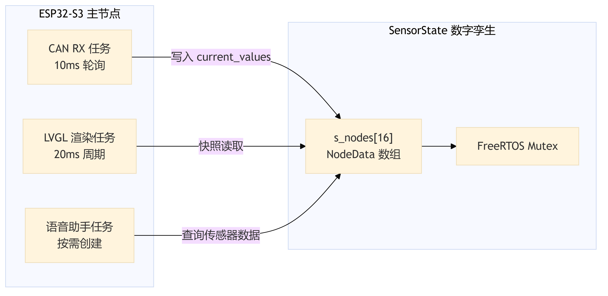
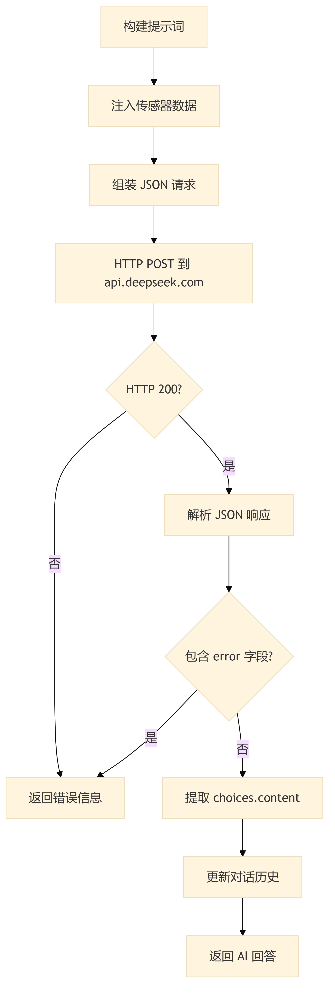
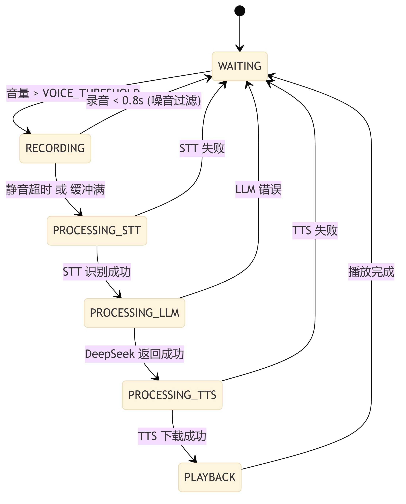
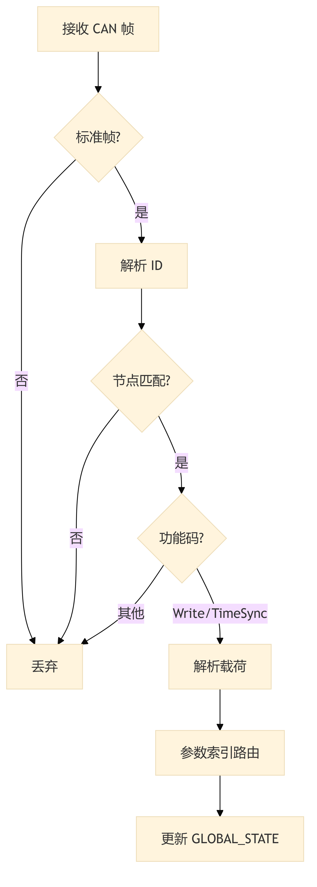

# 第5章 ESP32交互层软件设计

## 5.1 软件架构概述

ESP32-S3 主节点作为整个智能温室系统的交互中枢，承担 GUI 显示、语音交互、WiFi 联网、大模型推理和多节点状态管理等核心职责。软件采用 ESP-IDF 框架结合 Arduino 生态，按五层架构组织：App 应用层包含 CAN 和 LVGL 两个应用模块；Service 服务层提供 SensorState 数字孪生、CAN 网络服务、DeepSeek API、语音助手、GUI 管理器和 WiFi 服务等六大核心服务；ECUAL 层封装显示屏、麦克风和功放的硬件抽象；MCAL 层提供 I2S 和 WiFi 的底层驱动接口；BSP 层定义 FreeRTOS 任务优先级和栈大小等系统配置。各层通过头文件接口实现编译期依赖隔离，上层模块仅能调用下层暴露的公开 API。

系统启动时，`main.cpp` 中的 `setup()` 函数依次完成 CAN 应用层初始化（含 SensorState 和 TWAI 驱动）和 LVGL 应用层初始化（含显示驱动和 GUI 任务），随后将主任务降级为监控任务，以 60 秒周期打印系统内存状态。所有业务逻辑均运行在 FreeRTOS 任务中，主节点的任务划分如图 5-1 所示。

**图 5-1 ESP32 主节点任务架构**



CAN 接收任务以 10ms 周期轮询 TWAI 总线，接收到从节点上报的 Report 帧后，通过 `can_protocol` 模块解包并将物理数据写入 SensorState；LVGL 渲染任务以 20ms 周期驱动界面刷新，通过快照读取机制从 SensorState 获取节点数据；语音助手任务采用懒汉式单例模式，仅在用户进入 AI 领航页面时按需创建，退出页面时销毁释放资源。

ESP32-S3 的分层软件架构如图 5-2 所示，其中 Service 层是系统的核心业务逻辑层，各服务之间通过 SensorState 实现数据共享与解耦。

**图 5-2 ESP32 主节点分层软件架构**


## 5.2 多节点数字孪生状态管理

### 5.2.1 SensorState 数据结构设计

SensorState 模块（`sensor_state.c`）是 ESP32 主节点的数据中枢，采用"数字孪生"模式维护所有从节点的实时状态。该模块以纯 C 语言实现，确保与 LVGL 的 C 语言代码无缝兼容。核心数据结构 `NodeData` 定义了单个节点的完整状态：

```c
typedef struct {
    bool is_online;
    uint32_t last_seen_timestamp;
    float current_values[MAX_PARAM_INDEX];  // 当前传感器读数
    float target_values[MAX_PARAM_INDEX];   // 目标设定值
} NodeData;
```

全局存储采用静态数组 `s_nodes[MAX_NODES]`（`MAX_NODES = 16`），通过 7-bit 节点 ID 直接索引访问。参数索引范围为 `0x00` 至 `0x5F`（`MAX_PARAM_INDEX = 0x60`），覆盖温度（0x30）、空气湿度（0x31）、土壤湿度（0x32）、光照强度（0x33）等全部传感器参数和执行器目标状态。未初始化或无效的参数值统一标记为 `INVALID_VALUE`（-9999.0f），上层代码通过此哨兵值判断数据可用性。

### 5.2.2 线程安全与快照读取机制

SensorState 内部使用 FreeRTOS 互斥锁（`SemaphoreHandle_t s_mutex`）保护所有读写操作，确保多任务并发访问的数据一致性。写入 API（`sensor_state_update_current`、`sensor_state_update_target`）在更新数据的同时刷新节点的在线状态和时间戳；读取 API 提供两种模式：单参数读取（`sensor_state_get_current`）和整体快照读取（`sensor_state_get_node_snapshot`）。

快照读取机制专为 LVGL 渲染优化：调用一次 `sensor_state_get_node_snapshot` 即可获取指定节点的全部状态数据（约 700+ 字节），通过单次加锁和 `memcpy` 完成拷贝后立即释放锁。相比多次单参数读取，快照机制避免了 LVGL 渲染过程中数据被 CAN 任务更新导致的"界面撕裂"问题。节点在线判定采用超时机制：若节点最后通信时间距当前超过 `DEFAULT_NODE_TIMEOUT_MS`（5 分钟），则自动标记为离线。该判定利用无符号整数减法的溢出特性，天然处理了 `uint32_t` 时间戳的 49.7 天翻转问题。

## 5.3 LVGL 图形界面设计

### 5.3.1 GUI 框架与驱动

图形界面基于 LVGL v9.3.0 框架实现，通过 PlatformIO 依赖管理引入。界面布局采用 NXP GUI Guider 可视化设计工具生成页面骨架代码，自定义业务逻辑在 `custom.c` 中手动补充。显示驱动层面，LVGL 的显示缓冲区通过 `display_hal` 模块与 LovyanGFX 库对接，驱动 SPI 接口的 240×320 TFT 彩色触摸屏；触摸输入通过 XPT2046_Touchscreen 库处理，事件回调统一由 `events_init.c` 路由到各页面的交互逻辑。

### 5.3.2 页面设计与功能划分

系统设计了 8 个功能页面，其中 6 个已实现完整逻辑，2 个作为未来扩展预留骨架：

| 页面 | 标识 | 核心功能 |
|:---|:---|:---|
| 主页 | `screen_home` | 系统状态概览、在线节点数量、快捷入口 |
| 总览页 | `screen_overview` | 多节点传感器数据仪表盘、节点状态指示 |
| 控制页 | `screen_control` | 选择目标从节点、手动控制执行器 |
| 自动模式页 | `screen_auto_mode` | 选择目标从节点、配置自动模式阈值 |
| AI 领航页 | `screen_ai_pilot_mode` | 语音交互界面、多节点数据聚合展示 |
| 手动模式页 | `screen_manual_mode` | 手动模式详细控制面板 |
| 趋势页 | `screen_trend` | 骨架已生成，功能未实现 |
| 设置页 | `screen_setting` | 骨架已生成，功能未实现 |

总览页的数据更新流程体现了 SensorState 的快照机制：`custom_update_screen_overview()` 首先检查当前页面是否为活跃页面（避免非前台页面的无效刷新），然后调用 `sensor_state_get_node_snapshot` 获取节点数据快照，最后将温度、湿度、土壤湿度和光照强度分别格式化为字符串并更新到对应的 Label 控件。

### 5.3.3 语音交互与页面生命周期

AI 领航页面与语音助手的联动通过页面生命周期回调实现：当用户进入 `screen_ai_pilot_mode` 时，`events_init.c` 触发 `custom_ui_start_voice_assistant_on_screen_enter()`，该函数通过 `voice_assistant_bridge` 的 C 接口启动语音助手服务；当用户离开该页面时，`custom_ui_stop_voice_assistant_on_screen_exit()` 停止服务并释放资源。这种按需创建的懒加载策略避免了语音助手长期占用 PSRAM 内存（约 512KB 录音缓冲区）。

> 💡 [人类作者请注意：请在此处插入一张 LVGL 界面的实物截图，展示总览页或 AI 领航页在 TFT 屏幕上的实际显示效果。]

## 5.4 DeepSeek 大模型集成

### 5.4.1 API 调用流程

DeepSeek 大模型集成模块（`deepseek_api.cpp`）封装了与 DeepSeek Chat API 的完整交互流程。API 调用采用非流式模式（`stream: false`），等待服务器返回完整 JSON 响应后一次性解析。调用流程如图 5-3 所示。

**图 5-3 DeepSeek API 调用流程**



HTTP 请求通过自定义的 `HttpClient` 类发送，目标地址为 `api.deepseek.com:443/v1/chat/completions`，请求头携带 Bearer Token 认证。请求 JSON 包含四个顶层字段：`model`（模型名称）、`temperature`（温度参数）、`max_tokens`（最大生成长度）和 `messages`（对话消息数组）。`messages` 数组由系统提示词、历史对话和当前用户输入三部分组成，历史对话通过 `chat_history` 向量维护，超出 `max_history_messages` 上限时自动淘汰最早的消息。

### 5.4.2 多节点传感器数据注入

DeepSeek API 的核心设计在于将多节点传感器数据实时注入 LLM 上下文。`build_status_prompt()` 方法从 SensorState 获取指定节点的数据快照，通过 `append_sensor_line` 辅助函数将温度、空气湿度、土壤湿度、光照强度、CO₂ 浓度、水位和风扇转速等参数格式化为中文描述字符串。数据注入的完整提示词结构为：

> "请基于以下温室实时状态先做简短点评，再结合用户问题回答。当前节点编号为{N}。节点在线/离线。当前可用传感器数据为温度{X}摄氏度，空气湿度{Y}百分比...用户问题是{Q}。"

该设计使 LLM 能够基于实时传感器数据进行分析和建议，而非仅依赖通用知识回答。例如当温度高于设定阈值时，LLM 可以建议用户调整通风策略或检查遮阳系统。

### 5.4.3 响应解析与错误处理

API 响应通过 ArduinoJson 库解析，分配 8KB 的 `DynamicJsonDocument` 存储响应 JSON。解析逻辑首先检查 HTTP 状态码（200 为成功），然后验证响应是否包含 `error` 字段（API 层面的错误），最后从 `choices[0].message.content` 提取生成的文本内容。解析成功后，当前问答对被追加到 `chat_history` 中，支持多轮对话上下文延续。错误处理覆盖网络连接失败、HTTP 非 200 状态码、JSON 解析失败和 API 返回错误四种场景，每种场景返回对应的错误标识字符串。

## 5.5 语音助手设计

### 5.5.1 语音交互流程

语音助手服务（`voice_assistant_service.cpp`）实现了完整的"录音→识别→推理→合成→播放"语音交互链路。音频输入通过 INMP441 数字麦克风（I2S 接口，16kHz 采样率，16-bit 量化）采集；语音识别调用百度 STT（Speech-to-Text）API 将音频转换为文本；大模型推理调用 DeepSeek Chat API 生成回答；语音合成调用百度 TTS（Text-to-Speech）API 将回答文本转换为 WAV 音频；音频输出通过 MAX98357A 功放模块（I2S 接口）驱动扬声器播放。

I2S 音频子系统采用全双工模式，麦克风和功放共享 BCLK（GPIO40）和 LRCK（GPIO41）时钟信号，数据方向分离：INMP441 的 SD 引脚连接 I2S DIN（GPIO1），MAX98357A 的 DIN 引脚连接 I2S DOUT（GPIO42）。音频缓冲区分配在 ESP32-S3 的 8MB PSRAM 中，最大容量 512KB（`MAX_PSRAM_BYTES`），可存储约 16 秒的 16kHz/16-bit 单声道音频。

### 5.5.2 语音助手状态机

语音助手采用六状态有限状态机驱动，如图 5-4 所示。

**图 5-4 语音助手状态机**



各状态的转换逻辑如下：

**WAITING（等待）状态**：麦克风持续读取音频帧（`FRAME_SIZE` 采样点），计算平均音量，当音量超过 `VOICETHRESHOLD` 时判定为语音起始，转入 RECORDING 状态。

**RECORDING（录音）状态**：音频数据持续写入 PSRAM 缓冲区，同时监测静音帧数。当静音帧数超过 `SILENCE_TIMEOUT_MS` 对应的采样点数，或缓冲区达到最大容量时，录音结束。为过滤突发噪音，录音时长不足 0.8 秒的片段被判定为噪音并丢弃，直接返回 WAITING 状态。

**PROCESSING_STT（语音识别）状态**：将录音缓冲区的 PCM 数据发送至百度 STT API，识别成功后将文本传递给 LLM 推理阶段。

**PROCESSING_LLM（大模型推理）状态**：调用 DeepSeek API 的 `ask()` 方法，将识别文本与当前节点传感器数据一并发送。推理失败时返回错误日志并回到 WAITING 状态。

**PROCESSING_TTS（语音合成）状态**：调用百度 TTS API 将 LLM 回答文本转换为 WAV 音频，下载至 PSRAM 缓冲区。

**PLAYBACK（播放）状态**：解析 WAV 头部提取真实采样率（第 24-27 字节，小端序），动态切换 I2S 硬件时钟后，将音频数据通过 DMA 写入 MAX98357A 功放。播放完成后回到 WAITING 状态。

### 5.5.3 C/C++ 桥接设计

语音助手服务以 C++ 类实现（`VoiceAssistantService`），但 LVGL 的自定义逻辑层（`custom.c`）为纯 C 代码。为此设计了 `voice_assistant_bridge` 桥接层，通过 `extern "C"` 将 C++ 类的 `start_task()` 和 `stop()` 方法封装为 C 函数 `voice_assistant_start()` 和 `voice_assistant_stop()`。桥接层维护全局唯一的 `VoiceAssistantService` 实例指针（懒汉式单例），首次调用时创建实例并初始化 I2S、PSRAM 和百度 API，后续调用直接复用实例。

## 5.6 CAN 通信与多节点管理

### 5.6.1 CAN 网络服务

CAN 网络服务（`can_network_service.c`）封装了 ESP32-S3 的 TWAI（Two-Wire Automotive Interface）驱动，实现了 CAN 总线的硬件初始化、报文非阻塞轮询接收和协议解包。服务层维护三组状态：初始化标志（`s_is_initialized`）、启动标志（`s_is_started`）和总线恢复标志（`s_recovery_in_progress`），通过互斥锁保护状态一致性。

TWAI 驱动配置支持 8 种标准波特率（25kbps～1Mbps），本系统采用 1Mbps 以满足多节点高频数据上报的需求。接收队列深度配置为 30 帧，发送队列深度为 15 帧。当检测到 Bus-Off 状态时，服务自动发起总线恢复流程：调用 `twai_initiate_recovery()` 进入恢复状态，待 TWAI 状态机回到 STOPPED 后重新调用 `twai_start()` 恢复通信。

CAN 接收任务以 10ms 周期调用 `can_service_poll()`，处理流程如图 5-5 所示。接收到帧后首先过滤非标准帧（扩展帧、远程帧）和非 8 字节帧，然后调用 `can_proto_parse_packet()` 解析 11-bit 标识符和 8 字节数据域。解析成功后根据功能码分发：Report 帧调用 `sensor_state_update_current()` 更新当前值，WriteSet 帧调用 `sensor_state_update_target()` 更新目标值，Alert 帧输出告警日志。所有有效帧均调用 `sensor_state_mark_online()` 刷新节点心跳。

**图 5-5 CAN 接收路由与数据同步流程**



### 5.6.2 节点在线状态管理

节点在线状态管理依赖 SensorState 的超时检测机制。每个节点维护独立的 `last_seen_timestamp`，在每次收到有效 CAN 帧时更新为当前系统时间。当 LVGL 或 DeepSeek API 调用 `sensor_state_is_online()` 查询节点状态时，若当前时间与最后通信时间的差值超过 5 分钟（`DEFAULT_NODE_TIMEOUT_MS`），则判定节点离线并清除 `is_online` 标志。该机制使主节点能够动态感知从节点的上下线状态，GUI 总览页据此显示在线节点数量和各节点的数据可用性。

## 5.7 WiFi 网络服务设计

WiFi 网络服务（`wifi_service.cpp`）采用单例模式管理 ESP32-S3 的 WiFi 连接。服务维护一组 WiFi 凭证列表（`WifiCredential`，包含 SSID 和密码），连接时自动遍历凭证列表尝试连接，首个成功的连接被缓存以加速后续重连。连接超时默认 10 秒，超时后自动尝试下一组凭证。

DeepSeek API 和百度语音 API 均依赖 WiFi 网络服务提供的 HTTP 客户端。`HttpClient` 类封装了 HTTPS 请求的 TLS 握手和数据收发，支持自定义超时（默认 30 秒）和调试模式。WiFi 断线时，各 API 调用前会检查连接状态并尝试自动重连，确保网络服务的可用性。
