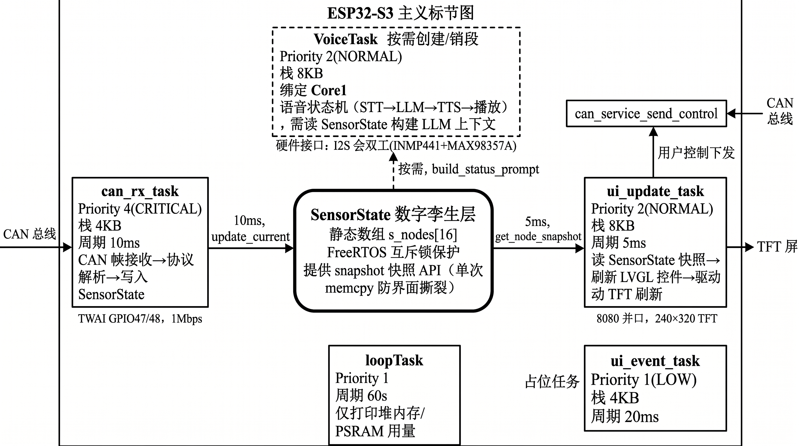
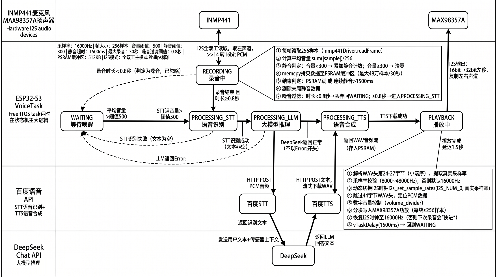

# 第五章 ESP32交互层软件设计

在确立底层硬件控制机制的基础之上，系统需借助顶层交互层开展设备统筹与决策下发。ESP32 交互层借助 FreeRTOS 调度体系充当全局计算与通信中枢。本章探讨主节点通过数字孪生机制维护多路节点状态的技术实现，并围绕图形用户界面设计、云端大语言模型嵌入以及语音交互链路搭建等关键模块，阐明系统的自然语言处理与执行映射策略。

## 5.1 软件架构概述

ESP32-S3 主节点作为整个智能温室系统的交互中枢，承担 GUI 显示、语音交互、WiFi 联网、大模型推理和多节点状态管理等核心职责。所有业务逻辑均运行在 FreeRTOS 任务[@freertos2024]中，主节点的任务划分如图 5-1 所示。CAN 接收任务以 10ms 周期轮询总线并更新 SensorState；LVGL 渲染任务以 20ms 周期驱动界面刷新；语音助手任务采用懒汉式单例模式，仅在用户进入 AI 领航页面时按需创建。

::: {custom-style="图片"}

:::
::: {custom-style="表题"}
图 5-1 ESP32 主节点任务架构
:::

## 5.2 多节点数字孪生状态管理

SensorState 模块（`sensor_state.c`）是 ESP32 主节点的数据中枢，采用"数字孪生"模式维护所有从节点的实时状态。该模块以纯 C 语言实现，确保与 LVGL 的 C 语言代码无缝兼容。核心数据结构 `NodeData` 包含节点在线状态、最后通信时间戳、当前传感器读数组和目标设定值数组。全局存储采用静态数组 `s_nodes[MAX_NODES]`（`MAX_NODES = 16`），通过 7-bit 节点 ID 直接索引访问，参数索引覆盖温度、湿度、光照等全部传感器和执行器状态。

SensorState 内部使用 FreeRTOS 互斥锁保护所有读写操作，确保多任务并发访问的数据一致性。读取 API 提供整体快照读取模式（`sensor_state_get_node_snapshot`），通过单次加锁和 `memcpy` 完成拷贝，避免 LVGL 渲染过程中数据被 CAN 任务更新导致的"界面撕裂"问题。节点在线判定采用超时机制：若节点最后通信时间距当前超过 5 分钟，则自动标记为离线。

## 5.3 LVGL 图形界面设计

图形界面基于 LVGL v9.3.0 框架[@lvgl2024]实现，界面布局采用 NXP GUI Guider 可视化设计工具生成页面骨架代码，自定义业务逻辑在 `custom.c` 中手动补充。显示驱动通过 `display_hal` 模块与 LovyanGFX 库对接，驱动 240×320 TFT 彩色触摸屏（显示采用 8080 并行总线，触摸控制器采用 SPI 接口）。

系统设计了 8 个功能页面：主页提供系统状态概览和快捷入口；总览页展示多节点传感器数据仪表盘；控制页支持手动控制执行器；自动模式页用于配置阈值；AI 领航页集成语音交互界面和多节点数据聚合展示；另有手动模式页和两个预留扩展页面。总览页通过 `sensor_state_get_node_snapshot` 获取节点数据快照，将传感器读数格式化后更新到对应控件，避免多任务并发导致的"界面撕裂"问题。

AI 领航页面与语音助手的联动通过页面生命周期回调实现：进入页面时通过 `voice_assistant_bridge` 的 C 接口启动语音助手服务，离开时停止服务并释放资源。这种懒加载策略避免了语音助手长期占用 PSRAM 内存。

## 5.4 DeepSeek 大模型集成

DeepSeek 大语言模型集成模块（`deepseek_api.cpp`）封装了与 DeepSeek Chat API 的完整交互流程，如图 5-2 所示。API 调用采用非流式模式，通过 `HttpClient` 类发送 HTTPS 请求，`messages` 数组由系统提示词、历史对话和当前用户输入组成，支持多轮对话上下文延续。

::: {custom-style="图片"}

:::
::: {custom-style="表题"}
图 5-2 DeepSeek API 调用流程
:::

DeepSeek API 的核心设计在于将多节点传感器数据实时注入大语言模型（LLM）上下文[@tzachor2023llm]。`build_status_prompt()` 方法从 SensorState 获取指定节点的数据快照，将温度、湿度、土壤湿度、光照强度等参数格式化为中文描述字符串，拼接为提示词发送给 LLM。该设计使 LLM 能够基于实时传感器数据进行分析和建议，而非仅依赖通用知识回答。

## 5.5 语音助手设计

语音助手服务（`voice_assistant_service.cpp`）实现了完整的"录音→识别→推理→合成→播放"语音交互链路。音频输入通过 INMP441 数字麦克风采集，语音识别调用百度 STT API 转换为文本，大模型推理调用 DeepSeek Chat API 生成回答，语音合成调用百度 TTS API 将回答转换为音频，最终通过 MAX98357A 功放驱动扬声器播放。音频缓冲区分配在 ESP32-S3 的 PSRAM 中，最大容量 512KB。

语音助手采用六状态有限状态机驱动，如图 5-3 所示。WAITING 状态监测麦克风音量，超过阈值时进入 RECORDING 状态；录音结束后依次经历 STT 识别、LLM 推理、TTS 合成三个处理状态；最终在 PLAYBACK 状态播放音频后回到 WAITING 状态。录音时长不足 0.8 秒的片段被判定为噪音并丢弃。

::: {custom-style="图片"}

:::
::: {custom-style="表题"}
图 5-3 语音助手状态机
:::

语音助手以 C++ 类实现，通过 `voice_assistant_bridge` 桥接层为 LVGL 的纯 C 代码提供 `voice_assistant_start()` 和 `voice_assistant_stop()` 接口。桥接层维护懒汉式单例，首次调用时创建实例并初始化 I2S、PSRAM 和百度 API，后续调用直接复用。

## 5.6 CAN 通信与多节点管理

CAN 网络服务（`can_network_service.c`）封装了 ESP32-S3 的 TWAI 驱动，实现了 CAN 总线的硬件初始化、报文非阻塞轮询接收和协议解包。CAN 总线的硬件电路设计详见第三章 3.6 节，帧格式与协议编解码逻辑详见第二章 2.2 节和第四章 4.4 节。本系统采用 1Mbps 波特率以满足多节点高频数据上报需求。

CAN 接收任务以 10ms 周期调用 `can_service_poll()`，接收到帧后过滤非标准帧，然后调用 `can_proto_parse_packet()` 解析标识符和数据域，根据功能码分发至 SensorState 的不同写入接口。所有有效帧均刷新节点心跳时间戳。该接收路由的帧解析逻辑与第四章图 4-4 的从节点接收流程一致，区别在于主节点解析后将数据写入 SensorState 而非本地 GLOBAL_STATE。

节点在线状态管理依赖 SensorState 的超时检测机制：若节点最后通信时间距当前超过 5 分钟，则判定节点离线。该机制使主节点能够动态感知从节点的上下线状态，GUI 总览页据此显示各节点的数据可用性。

## 5.7 WiFi 网络服务设计

WiFi 网络服务（`wifi_service.cpp`）采用单例模式管理 ESP32-S3 的 WiFi 连接，维护凭证列表并自动遍历尝试连接，首个成功的连接被缓存以加速后续重连。DeepSeek API 和百度语音 API 均依赖该服务提供的 `HttpClient` 类进行 HTTPS 通信，断线时各 API 调用前会检查连接状态并尝试自动重连。
