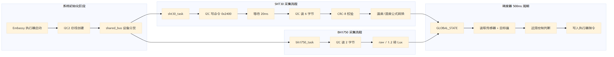

## 3.1 STM32 控制层的数据采集与调度实现

STM32 控制层是整个智能温室系统的底层感知与执行核心，承担着环境数据采集、自动控制决策和执行器驱动等关键职能。本节将详细阐述基于 Embassy 异步框架的传感器数据采集机制、I2C 总线通信过程以及迟滞控制调度器的设计与实现。

### 3.1.1 Embassy 异步任务架构

STM32 控制层的固件基于 Embassy 嵌入式异步运行时构建，采用协作式多任务调度模型。与传统的 FreeRTOS 抢占式调度不同，Embassy 使用 Rust 语言的 `async/await` 语法糖实现任务之间的协作式切换，每个任务在遇到 I/O 阻塞点（如 I2C 传输、定时器等待）时主动让出 CPU 控制权，从而在单核 MCU 上实现高并发的任务执行。

系统启动时，`main` 函数首先完成外设初始化，随后通过 `embassy_executor::Spawner` 将各个域任务（domain task）注册到执行器中。传感器采集相关的任务包括 `sht30_task`、`bh1750_task` 和 `soil_moisture_task`，调度决策任务为 `dispatcher_task`，这些任务在 Embassy 执行器的调度下并发运行。每个任务均通过 `#[embassy_executor::task]` 宏进行标注，由编译器自动生成任务状态机代码。

### 3.1.2 I2C 总线共享与设备抽象

SHT30 温湿度传感器和 BH1750 光照传感器均挂载在 STM32F407 的 I2C2 总线上，总线速率为 100kHz。由于 Embassy 的 I2C 驱动要求独占所有权，而多个传感器任务需要共享同一物理总线，系统引入了 `shared_bus` crate 提供的总线互斥机制。

具体实现中，`main` 函数首先创建 `BlockingMasterI2c` 类型的 I2C 驱动实例，随后将其封装到 `StaticCell<Mutex<ThreadModeRawMutex, RefCell<BlockingMasterI2c>>>` 类型的静态互斥单元中。各传感器任务通过 `shared_bus::blocking::i2c::I2cDevice::new(i2c2_bus)` 获取总线设备句柄，该句柄在每次 I2C 操作前自动获取互斥锁，操作完成后立即释放，确保同一时刻只有一个任务访问 I2C 总线。这种设计将物理总线的时分复用逻辑完全封装在类型系统中，避免了手动管理锁的复杂性。

### 3.1.3 SHT30 温湿度传感器驱动实现

SHT30 传感器驱动位于 `Src/Stm32_Control/crates/bsw/src/sht30.rs`，采用嵌入式硬件抽象层（embedded-hal 1.0）的 `I2c` Trait 进行接口抽象。驱动结构体 `Sht30<I>` 持有 I2C 总线句柄和设备地址（默认 `0x44`，ADDR 引脚接地）。

数据采集流程如下：首先，驱动通过 I2C 总线向 SHT30 发送测量命令字节 `[0x24, 0x00]`，该命令对应高精度模式（High Repeatability）、无时钟拉伸（No Clock Stretching）。随后，驱动调用 `Timer::after_millis(20).await` 异步等待 20 毫秒，为 SHT30 的 ADC 转换留出充足余量（数据手册标称最大转换时间为 15 毫秒）。等待结束后，驱动执行 6 字节的 I2C 读取操作，获得的数据格式为 `[TempMsb, TempLsb, TempCrc, HumMsb, HumLsb, HumCrc]`。

数据解析阶段，驱动首先进行完整性快速校验——若 6 字节全为 `0x00` 或全为 `0xFF`，则判定为无效数据并返回 `Error::InvalidData`。随后执行 CRC-8/SENSIRION 校验，该校验算法的多项式为 `0x31`（即 $x^8 + x^5 + x^4 + 1$），初始值为 `0xFF`。校验函数 `check_crc` 对温度和湿度两组数据分别进行 8 位循环冗余校验，确保传输过程中未发生位翻转错误。

通过校验后，驱动将高低字节合并为 16 位无符号整数，并按照 SHT30 数据手册规定的转换公式计算实际物理量：

$$T = -45 + 175 \times \frac{S_T}{65535}$$

$$RH = 100 \times \frac{S_{RH}}{65535}$$

其中 $S_T$ 和 $S_{RH}$ 分别为原始温度和湿度的 16 位 ADC 值。转换结果封装在 `Measurement { temp_c: f32, hum_rh: f32 }` 结构体中返回。

### 3.1.4 BH1750 光照传感器驱动实现

BH1750 光照传感器驱动位于 `Src/Stm32_Control/crates/bsw/src/bh1750.rs`，同样基于 `I2c` Trait 抽象。驱动结构体 `Bh1750<I>` 持有 I2C 总线句柄和设备地址（默认 `0x23`，ADDR 引脚接地）。

初始化阶段，驱动依次发送通电指令 `0x01` 和连续高分辨率模式指令 `0x10`，随后等待 180 毫秒以完成首次 ADC 转换。数据读取时，驱动执行 2 字节的 I2C 读取操作，将高低字节合并为 16 位原始值后，按照 BH1750 数据手册的转换公式计算光照强度：

$$E = \frac{raw}{1.2} \text{ (Lux)}$$

其中 $raw$ 为 16 位原始 ADC 值，1.2 为 BH1750 的默认分辨率因子（1 Lux/count）。该传感器采用同步读取方式（`read_lux` 方法无需 `await`），因为 BH1750 工作在连续测量模式下，寄存器中始终保存着最新的转换结果。

### 3.1.5 全局状态与任务间数据共享

传感器采集到的数据通过 Embassy 提供的 `Mutex<CriticalSectionRawMutex, SystemState>` 全局互斥锁进行共享。`SystemState` 结构体包含两个子结构：`CurrentValues` 存储当前环境参数（温度、空气湿度、土壤湿度、光照强度等），每个字段均为 `Option<f32>` 类型；`TargetValues` 存储控制目标值和执行器指令。

传感器任务在每次成功采集后，通过短暂持有互斥锁将数据写入 `GLOBAL_STATE`。以 `sht30_task` 为例，任务在获取 `Measurement` 后立即进入临界区，将 `temp_c` 和 `hum_rh` 分别写入 `state.current.temperature` 和 `state.current.humidity_air`，随后立即释放锁。这种"最小化临界区"的策略有效降低了任务间的锁竞争概率。此外，每个传感器任务均维护一个 `fail_count` 计数器，当连续失败次数达到阈值 `MAX_FAILURES`（默认为 3）时，任务将对应的全局状态字段置为 `None`，向下游消费者广播传感器离线信号。

### 3.1.6 迟滞控制调度器

调度器任务 `dispatcher_task` 以 500 毫秒为周期运行，采用迟滞控制（Hysteresis Control）策略对温室环境进行自动调节。调度器首先从 `GLOBAL_STATE` 中批量读取当前传感器值和目标设定值，随后依次对温度、空气湿度、土壤湿度和光照强度四个维度进行独立的控制决策。

以温度控制为例，调度器调用 `hysteresis_high_side` 函数判断是否需要启动通风风扇。该函数的逻辑为：若风扇当前处于关闭状态，则当实际温度超过目标温度加上 `TEMP_FAN_ON_MARGIN_C`（1.0°C）时开启风扇；若风扇当前处于开启状态，则当实际温度降至目标温度加上 `TEMP_FAN_OFF_MARGIN_C`（0.3°C）以下时才关闭风扇。开启阈值和关闭阈值之间的差值（即迟滞带）有效避免了执行器在临界点附近的频繁切换，延长了机械部件的使用寿命。

对于光照控制，调度器采用逐步调节策略。当实测光照强度低于目标值减去 `LIGHT_OFF_MARGIN_LUX`（100 Lux）时，补光灯 PWM 占空比以 `LIGHT_PWM_STEP_UP`（每周期增加 1）的步长逐步增大；反之则以 `LIGHT_PWM_STEP_DOWN` 步长逐步减小。占空比的最小有效值为 `LIGHT_PWM_MIN_ACTIVE_DUTY`（8），低于此值时补光灯直接关闭。风扇转速的计算则综合考虑温度偏差和湿度偏差，通过 `compute_fan_speed_rpm` 函数将偏差比值映射到 1200~4500 RPM 的有效转速区间内。

调度器的全部控制输出写回 `GLOBAL_STATE` 的 `TargetValues` 中，由下游的执行器任务（如 `ventilation_fan_task`、`water_pump_task`）读取并驱动对应的硬件外设，形成完整的"感知—决策—执行"闭环。图 3-1 展示了 STM32 控制层数据采集与调度的整体流程。

**图 3-1 STM32 控制层数据采集与调度流程图**
