## 4.3 通风风扇转速的 PID 闭环控制

温室环境控制的核心在于将温度、湿度、光照等连续物理量维持在目标设定值附近。本系统的自动控制策略采用**分层混合架构**：上层调度器（`dispatcher_task`）基于迟滞控制算法做出开关决策，下层执行器任务则对需要精细调节的被控量（如通风风扇转速）采用 PID 闭环控制。本节将详细阐述 PID 控制器的算法设计、代码实现及其在通风风扇转速控制中的具体应用。

### 4.3.1 系统控制策略总览

在正式讨论 PID 之前，有必要先厘清系统中各执行器所采用的控制策略，因为不同执行器的物理特性决定了其控制方法的差异。

**迟滞控制（开关控制）** 适用于响应特性简单、只需"开/关"二值操作的执行器。在 `Src/Stm32_Control/firmware/src/bin/domains/dispatcher.rs` 中，调度器以 500 毫秒为周期运行，对以下维度采用迟滞控制：

- **温度 → 通风风扇开关**：当温度超过目标值加上 `TEMP_FAN_ON_MARGIN_C`（1.0°C）时开启风扇，当温度降至目标值加上 `TEMP_FAN_OFF_MARGIN_C`（0.3°C）以下时关闭风扇。开启阈值与关闭阈值之差形成迟滞带，避免执行器在临界点附近频繁切换。
- **空气湿度 → 加湿器开关**：当湿度低于目标值减去 `AIR_HUM_HUMIDIFIER_ON_MARGIN`（5.0%）时开启加湿器，高于目标值减去 `AIR_HUM_HUMIDIFIER_OFF_MARGIN`（2.0%）时关闭。
- **土壤湿度 → 水泵开关**：当土壤湿度低于目标值减去 `SOIL_HUM_PUMP_ON_MARGIN`（5.0%）时开启水泵，高于目标值减去 `SOIL_HUM_PUMP_OFF_MARGIN`（2.0%）时关闭。

**比例步进调节** 适用于补光灯。调度器通过 `compute_light_pwm_duty` 函数计算目标 PWM 占空比，以每周期 `LIGHT_PWM_STEP_UP` / `LIGHT_PWM_STEP_DOWN`（步长为 1）的速度逐步趋近目标值，避免亮度突变。

**PID 闭环控制** 仅用于通风风扇的转速调节。迟滞控制决定了风扇"是否需要运转"，而 PID 控制器则负责将风扇的实际转速精确地稳定在目标转速上。这是系统中唯一使用 PID 算法的执行器通道。

### 4.3.2 PID 控制原理

PID（Proportional-Integral-Derivative）控制器是一种经典的线性反馈控制算法，其连续时间域的数学表达为：

$$u(t) = K_p \cdot e(t) + K_i \cdot \int_0^t e(\tau) d\tau + K_d \cdot \frac{de(t)}{dt}$$

其中 $e(t) = r(t) - y(t)$ 为设定值 $r(t)$ 与实际测量值 $y(t)$ 之间的偏差，$K_p$、$K_i$、$K_d$ 分别为比例、积分、微分三个环节的增益系数。比例环节对当前偏差做出即时响应；积分环节消除稳态误差；微分环节预测偏差变化趋势，抑制超调。

在嵌入式离散控制系统中，连续积分和微分运算需通过数值近似实现。本系统采用**位置式 PID** 的离散形式：

$$u(k) = K_p \cdot e(k) + K_i \cdot \sum_{j=0}^{k} e(j) \cdot \Delta t + K_d \cdot \frac{e(k) - e(k-1)}{\Delta t}$$

其中 $\Delta t$ 为控制周期，$e(k)$ 和 $e(k-1)$ 分别为当前周期和上一周期的偏差值。位置式 PID 的输出 $u(k)$ 直接对应执行器的绝对控制量（即 PWM 占空比），而非增量式 PID 所输出的控制量变化值 $\Delta u(k)$。选择位置式 PID 的原因是风扇电机的 PWM 控制需要直接指定占空比绝对值，而增量式 PID 更适用于阀门、步进电机等需要相对位移控制的场景。

### 4.3.3 PID 控制器代码实现

PID 控制器的核心实现位于 `Src/Stm32_Control/crates/bsw/src/pid.rs` 文件中，以 `PidController` 结构体封装。该结构体维护以下内部状态：

```rust
pub struct PidController {
    integral: f32,          // 积分累加值
    prev_error: f32,        // 上一周期偏差 (用于微分计算)
    integral_limit: f32,    // 积分限幅阈值 (Anti-windup)
    output_limit: f32,      // 输出限幅阈值
    last_error: f32,        // 最近一次偏差 (供外部查询)
    last_derivative: f32,   // 最近一次微分值 (供外部查询)
    last_output: f32,       // 最近一次输出值 (供外部查询)
}
```

构造函数 `PidController::new(integral_limit, output_limit)` 接受两个限幅参数，将所有内部状态初始化为零。`integral_limit` 用于防止积分饱和（Integral Windup），`output_limit` 用于将控制输出约束在执行器的有效工作范围内。

核心计算逻辑封装在 `compute` 方法中，其签名为：

```rust
pub fn compute(
    &mut self,
    setpoint: f32,   // 目标设定值
    measured: f32,   // 实际测量值
    dt: f32,         // 控制周期 (秒)
    kp: f32,         // 比例增益
    ki: f32,         // 积分增益
    kd: f32,         // 微分增益
) -> f32             // 返回控制输出
```

该方法的执行流程分为三个阶段：

**第一阶段：偏差计算与积分累加。** 首先计算当前偏差 `error = setpoint - measured`，随后将偏差乘以时间步长后累加到积分项 `self.integral` 中。为防止积分饱和，累加结果立即通过 `clamp` 函数限制在 `[-integral_limit, integral_limit]` 区间内。这种"先累加后限幅"的策略属于条件积分 Anti-windup 的一种简化实现——当积分值达到限幅边界时，继续累加同方向的偏差将不再产生效果，从而避免了积分项在执行器饱和时的过度积累。

**第二阶段：微分计算。** 微分项通过一阶后向差分近似实现，即 `(error - prev_error) / dt`。代码中增加了对 `dt` 的安全检查：当 `dt` 小于 0.0001 秒时，微分项直接置零，避免除零异常。

**第三阶段：输出合成与限幅。** 将三个分量加权求和得到原始输出 `output = kp * error + ki * integral + kd * derivative`，随后通过 `clamp(-output_limit, output_limit)` 将最终输出约束在有效范围内。限幅后的值同时写入 `last_error`、`last_derivative`、`last_output` 三个查询字段，供上层任务监控 PID 内部状态。

`PidController` 还提供了 `reset` 方法，将全部内部状态清零，用于控制模式切换时（如从手动模式切换到自动模式）消除历史积分和微分状态的残留影响。

### 4.3.4 通风风扇转速闭环控制

PID 控制器在系统中的唯一应用场景是通风风扇的转速闭环控制。该功能由 `Src/Stm32_Control/firmware/src/bin/domains/ventilation_fan.rs` 中的 `ventilation_fan_task` 任务实现，以 100 毫秒为周期运行（10Hz 控制频率）。

风扇电机驱动模块 `FanMotor`（定义于 `Src/Stm32_Control/crates/bsw/src/motor_ctrl.rs`）封装了编码器测速与 PID 控制器。其核心方法 `control_tick` 的逻辑如下：

```rust
pub fn control_tick(&mut self, target_rpm: f32, dt_sec: f32, kp: f32, ki: f32, kd: f32) {
    if target_rpm == 0.0 {
        self.pid.reset();
        self.apply_hardware_pwm(0.0);
        self.measure_rpm(dt_sec);
        return;
    }
    let actual_rpm = self.measure_rpm(dt_sec);
    let pwm_output = self.pid.compute(target_rpm, actual_rpm, dt_sec, kp, ki, kd);
    self.apply_hardware_pwm(pwm_output);
}
```

当目标转速为零时，`control_tick` 重置 PID 状态并关闭 PWM 输出；否则，它先通过编码器测量实际转速，再调用 PID 控制器计算所需的 PWM 占空比，最后将结果写入硬件 PWM 寄存器。默认 PID 参数为 $K_p = 2.0$、$K_i = 0.5$、$K_d = 0.0$，积分限幅和输出限幅由 `FanMotor` 构造时指定。

`ventilation_fan_task` 在每次循环中从全局状态读取风扇开关状态、目标转速和 PID 参数（支持运行时动态调整），然后调用 `motor.control_tick`。同时，它将 PID 内部状态（偏差、积分值、微分值、输出值、实际转速等）通过 `defmt` 日志框架输出，便于调试和参数整定。

> 💡 [人类作者请注意：请在此处插入一张风扇转速 PID 控制的实测响应曲线图，例如：目标转速从 0 阶跃到 3000 RPM 时的实际转速响应曲线，标注上升时间、超调量和稳态误差。这能直观展示 PID 闭环控制的效果。]

### 4.3.5 控制策略的整体协同

图 4-X 展示了系统自动控制模式下各控制策略的协同关系。调度器（`dispatcher_task`）作为决策中枢，根据当前传感器值与目标值的偏差，对不同执行器采用不同的控制策略：温度/湿度/土壤湿度通道采用迟滞控制做出开关决策，光照通道采用比例步进调节，而通风风扇通道则在迟滞控制决定"是否运转"之后，由 PID 控制器负责"以多快转速运转"的精细调节。



**图 4-X 自动控制模式下的分层控制策略协同图**


**图 4-Y 通风风扇位置式 PID 转速闭环控制框图**
