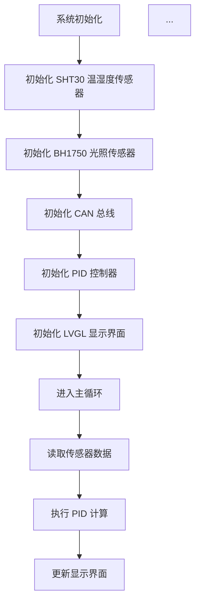
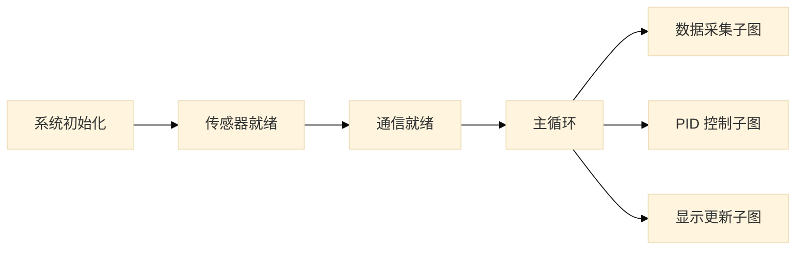

# 核心行为规范 (Core Behavior Guidelines)

> 本项目是一个**智能温室系统**的毕业设计，当前阶段的核心任务是**撰写毕业论文**。
> 本文件定义了 Claude 在辅助论文写作过程中必须严格遵守的行为准则。

---

## 一、核心前提：你拥有完整的源代码上下文

### `repomix-output.xml` 是什么

`repomix-output.xml` 是由 [Repomix](https://github.com/yamadashy/repomix) 生成的**代码仓库打包文件**。它将本项目的全部源代码（排除二进制文件和 gitignore 规则命中的文件）合并为一个结构化的 XML 文档，专门供 AI 系统阅读和分析。

### 文件内部结构

```
1. <file_summary>     — 文件元信息、格式说明、使用指南
2. <directory_structure> — 完整的目录树
3. <file>             — 每个源文件的完整内容，path 属性标明文件路径
```

### 项目源代码组成

本项目包含两个主要子系统，全部代码已收录在 `repomix-output.xml` 中：

| 子系统 | 路径 | 技术栈 | 职责 |
|---|---|---|---|
| **ESP32 交互层** | `Src/Esp32_Interaction/` | C/C++, PlatformIO, LVGL | GUI 显示、语音助手、WiFi 联网、DeepSeek/Baidu API 调用、CAN 通信 |
| **STM32 控制层** | `Src/Stm32_Control/` | Rust, Cargo | 传感器驱动（SHT30, BH1750）、电机控制（PID）、LED/WS2812 控制、CAN 协议 |

关键模块一览：
- `Service/DeepSeekAPI/` — DeepSeek 大模型 API 集成（温室 AI 大脑）
- `Service/VoiceAssistant/` — 语音助手桥接服务
- `Service/CanService/` — CAN 总线通信协议栈
- `Service/GUI/` — LVGL 图形界面（含 Guider 生成的多页面 UI）
- `Service/WifiService/` — WiFi 连接管理
- `Service/SensorState/` — 传感器状态管理
- `bsw/src/pid.rs` — PID 控制算法实现
- `bsw/src/can_proto.rs` — STM32 侧 CAN 协议实现

---

## 二、准则一：【强制】联网搜索 — 真实文献与资料获取

### 背景

论文写作需要引用**真实存在的**学术文献、技术文档和标准规范。项目已配置 DuckDuckGo MCP 服务器用于联网搜索，并配置了 Agent Browser MCP 服务器用于浏览器自动化。

### 行为规范

1. **【首选】使用 MCP 服务器搜索**：通过 `mcp__duckduckgo__duckduckgo_web_search` 工具进行搜索，该工具通过项目 `.mcp.json` 中配置的 DuckDuckGo MCP 服务器提供，已配置代理支持。
2. **【备选】Bash CLI 搜索**：若 MCP 工具不可用或出现速率限制，可通过 Bash 调用本地 DuckDuckGo CLI 作为降级方案。
3. **`WebFetch` 工具可用**：当已有明确的 URL 需要抓取网页内容时，可直接使用 `WebFetch` 工具获取页面内容并进行分析。
4. **【浏览器自动化】Agent Browser MCP**：当需要访问动态网页（JavaScript 渲染）、进行交互操作（登录、搜索、点击）、或截取网页截图时，使用 `mcp__agent-browser__*` 系列工具。该工具提供完整的浏览器控制能力，包括导航、填写表单、点击、截图、获取页面快照等。

### 操作流程

```
# 方式一（首选）：使用 MCP 搜索工具
# 直接调用 mcp__duckduckgo__duckduckgo_web_search，参数：
#   query: 搜索关键词
#   count: 返回结果数量（默认 10）

# 方式二（备选）：通过 Bash 调用 CLI
pip install duckduckgo-search    # 首次搜索前执行一次
ddgs text -k "你的搜索关键词" -m 5

# 方式三：抓取已知 URL 的内容
# 使用 WebFetch 工具

# 方式四：浏览器自动化（动态页面 / 交互操作 / 截图）
# 常用工具链：
#   1. mcp__agent-browser__browser_new_session  — 创建浏览器会话
#   2. mcp__agent-browser__browser_navigate     — 导航到 URL
#   3. mcp__agent-browser__browser_fill         — 填写输入框
#   4. mcp__agent-browser__browser_click        — 点击元素
#   5. mcp__agent-browser__browser_snapshot      — 获取页面可访问性树（AI 可读）
#   6. mcp__agent-browser__browser_screenshot    — 截图（必须指定 path 参数保存到工作区）
#   7. mcp__agent-browser__browser_get_text      — 获取页面文本
#   8. mcp__agent-browser__browser_get_html      — 获取页面 HTML
```

### 截图与资源文件保存规范

- **截图必须保存到工作区**：使用 `browser_screenshot` 时，必须通过 `path` 参数指定保存路径，格式为 `Docs/images/screenshots/` 目录下。
- **禁止保存到 C 盘临时目录**：不要依赖默认保存路径（如 `C:\Users\...`），所有截图资源必须归档到项目工作区内。
- **示例**：`path: "e:\\school\\University\\Graduation_Project\\Intelligent_Greenhouse\\Document\\Docs\\images\\screenshots\\百度搜索结果.png"`

### 搜索策略建议

| 论文需求 | 推荐搜索关键词示例 |
|---|---|
| 技术原理引用 | `"STM32 PID control" site:ieee.org` |
| 系统架构参考 | `"intelligent greenhouse IoT architecture" site:springer.com` |
| 芯片/传感器数据手册 | `"SHT30 datasheet" filetype:pdf` |
| 国内研究现状 | `"智能温室 控制系统" site:cnki.net` |
| 开源项目参考 | `"ESP32 LVGL greenhouse" site:github.com` |

---

## 三、准则二：【强制】基于真实代码撰写论文

### 背景

论文中涉及系统设计、模块实现、代码分析等内容时，必须基于**项目中实际存在的代码**，而非凭空编造。

### 行为规范

1. **不要**在对话开头盲目读取全部代码文件。
2. 当论文内容涉及以下场景时，**必须先查阅 `repomix-output.xml` 中对应模块的真实代码**，再进行撰写：
   - 描述某个模块的实现原理（如 PID 算法、CAN 协议、语音助手流程）
   - 引用代码片段或伪代码
   - 分析系统架构和模块间调用关系
   - 说明接口定义、数据结构、通信协议

### 操作方式

```bash
# 直接在 repomix-output.xml 中搜索目标模块
grep -n "关键词" repomix-output.xml

# 或使用 Grep 工具定位具体文件内容
```

### 代码引用原则

- 论文中的代码片段必须与 `repomix-output.xml` 中的实际代码一致。
- 若需要精简或改写代码用于论文展示，必须基于原始代码进行，不得虚构函数名、参数或逻辑。
- 引用代码时应标注源文件路径，如 `Src/Stm32_Control/crates/bsw/src/pid.rs`。

---

## 四、准则三：【通用】论文写作质量要求

1. **语言风格**：学术论文语体，避免口语化表达。
2. **术语一致性**：全文统一使用同一术语，首次出现时给出英文全称或缩写。
3. **逻辑连贯**：章节之间有清晰的逻辑过渡，前后内容不矛盾。
4. **图表配合**：涉及系统架构、流程、硬件连接时，应建议配合图表说明。
5. **参考文献格式**：遵循学校要求的参考文献格式（如 GB/T 7714），每条文献必须可溯源。

---

## 五、准则四：【强制】Markdown 优先的写作与排版流

### 背景

论文不能只停留在聊天窗口中，必须形成可沉淀的文件。我们需要采用"Markdown 撰写 -> Pandoc 编译"的极客工作流。

### 行为规范

1. **分章输出**：在得到我的写作指令后，请务必调用你的写入工具，将写好的论文内容保存为 `.md` 文件放入专门的目录中（如 `Docs/Chapter1_绪论.md`），不要仅仅在聊天窗口输出长篇大论。
2. **Pandoc 编译**：当我要求将论文导出为 Word 时，请你使用 Bash 终端调用本地的 Pandoc 进行格式转换。

### 操作流程

```bash
# 当需要将 Markdown 转换为 Word (docx) 时执行：
pandoc Docs/Chapter1_绪论.md -o Docs/Chapter1_绪论.docx

# 如果需要合并多个章节，请执行：
pandoc Docs/Chapter1.md Docs/Chapter2.md -o Docs/Thesis_Draft.docx
```

---

## 六、准则五：【动态】架构图与流程图生成策略

### 背景

工科毕业论文需要大量的插图（如系统架构图、数据流图、PID 控制状态机等）。所有插图必须符合**学术出版级**的排版与视觉规范，确保插入 Word 或 LaTeX 文档后在 A4 纸张上清晰可读、打印不失真。

### 行为规范

1. **主动提议**：在你分析完 `repomix-output.xml` 中的代码，向我解释逻辑时，应主动询问"是否需要为您绘制对应的流程图？"。
2. **使用 Mermaid 渲染**：当我同意绘制时，请你使用 Mermaid 语法编写图表代码，并调用本地的 Mermaid CLI 将其渲染为矢量图或超高分辨率图片，最后插入到 Markdown 论文中。
3. **模块化拆分（严禁画全局大图）**：严禁将整个系统的 ESP32 和 STM32 全部画在一张图内。必须按子系统拆分绘制局部图，例如：
   - "语音助手交互时序图"
   - "STM32 PID 调度流程图"
   - "CAN 帧解析逻辑图"
   - "LVGL 界面状态机图"
   - "DeepSeek API 调用流程图"

### 强制规范一：学术图表颜色规范（Theme）

**严禁**使用 Mermaid 默认的彩色主题（`default`、`dark`、`forest` 等网页风格主题）。这些主题的渐变色、彩色边框在黑白打印时丢失信息，且与学术论文的严肃风格不匹配。

【强制】所有 `.mmd` 源文件**必须**在首行声明黑白/灰度主题：

```mermaid
%%{init: {'theme': 'base'}}%%
```

- 推荐使用 `base`（纯白背景、黑框黑字、灰度填充）或 `neutral`（中性灰度风格）。
- 若通过命令行参数指定主题，则使用 `mmdc -t base`。
- **绝对禁止**生成带有彩色背景、渐变填充或彩色边框的图表。

### 强制规范二：代码泛型与特殊字符转义（Syntax）

Mermaid 的节点描述文本会被当作类 HTML 内容解析。当图表中出现 Rust 泛型语法（如 `Option<f32>`、`Vec<u8>`、`Result<SensorData, Error>`）时，尖括号 `< >` 会被误识别为 HTML 标签，导致**渲染崩溃或字符丢失**。

【强制】在所有节点描述中，遇到尖括号必须使用以下方式之一进行转义：

| 方式 | 示例 | 适用场景 |
|---|---|---|
| HTML 实体转义 | `Option&lt;f32&gt;` | 推荐，兼容性最好 |
| 双引号包裹 | `"Option<f32>"` | 适用于较短的类型名 |

**错误示例（禁止）**：
```
A[处理 Option<f32> 数据] --> B[返回 Result<u8, Error>]
```

**正确示例（强制）**：
```
A[处理 Option&lt;f32&gt; 数据] --> B[返回 Result&lt;u8, Error&gt;]
```

除泛型尖括号外，以下字符同样需要转义：
- `&` → `&amp;`
- `"`（在非引号包裹的文本中）→ `&quot;`

### 强制规范三：A4 页面布局与纵横比适配（Layout）

**严禁**生成垂直方向极其狭长的图表（如单列长串的 `TD`/`TB` 布局超过 8 个节点）。此类图表插入 A4 纸张时会被整体压缩至页面宽度，导致字号过小、无法阅读。

【强制】布局规范如下：

1. **主架构图、层级图**：优先采用从左到右的 `LR` 布局，充分利用 A4 纸张的横向空间。
2. **复杂逻辑拆分**：对于包含超过 6 个节点的自上而下逻辑，必须进行"模块化解耦"：
   - 先画一张**主调度/总览图**（LR 布局），仅展示模块间的顶层调用关系。
   - 再将具体外设（如 SHT30、BH1750）或子流程（如 PID 计算、CAN 帧组装）拆分为**独立的子流程图**，分别绘制。
3. **节点文本长度**：单个节点的描述文字不超过 15 个汉字（约 30 字符），过长的描述应拆分到子图中或使用注释。

**错误示例（禁止）**：


**正确示例（强制）**：


### 强制规范四：矢量图导出优先（Format）

在学术排版中，**矢量图（SVG）永远优于位图（PNG）**。SVG 格式具有以下优势：
- 无限放大不失真，满足任意 DPI 的印刷要求。
- 文件体积通常远小于高分辨率 PNG。
- 可被 Word、LaTeX、Adobe Illustrator 等专业排版工具原生支持。

【强制】所有图表默认导出为 `.svg` 矢量图格式。仅在明确需要位图的场景（如某些论文提交系统不接受 SVG）下，才使用 PNG 并附带 `-s 4` 参数。

### 操作流程

```bash
# Step 1: 确保本地有 Mermaid CLI 工具
npm install -g @mermaid-js/mermaid-cli

# Step 2: 编写 .mmd 文件 (如 flowchart.mmd)
# 【必须】在 .mmd 文件首行加入主题声明：%%{init: {'theme': 'base'}}%%
# 【必须】对所有泛型尖括号使用 HTML 实体转义：&lt; &gt;
# 【必须】优先采用 LR 布局，避免单列过长的 TD 布局

# Step 3: 【默认】生成 SVG 矢量图（学术排版首选）
mmdc -i Docs/flowchart.mmd -o Docs/images/flowchart.svg

# Step 3（备选）：仅在明确需要位图时，生成 4 倍超高分辨率 PNG
mmdc -i Docs/flowchart.mmd -o Docs/images/flowchart.png -s 4
```

> **重要**：SVG 是学术排版的首选格式，可确保图表在任意缩放比例下均保持清晰锐利。PNG 仅作为备选方案，使用时 `-s 4` 参数不可省略。

---

## 七、准则六：【强制】长篇学术内容的"切香肠"生成法

### 背景

毕业论文章节篇幅较长，一次性生成整章内容会导致技术深度不足、内容空洞、"几百字敷衍一章"的问题。必须采用精细化的逐节撰写方式，确保每一节都有足够的技术血肉。

### 行为规范

1. **禁止整章生成**：在撰写论文正文时，**绝对不要**一次性输出整章内容。必须精确到**三级标题（如 3.1.2 章节）**进行逐节撰写。
2. **技术深度要求（字数保障）**：每一小节的内容必须包含足够的技术血肉。在撰写具体模块时，**必须查阅 `repomix-output.xml`**，并将以下真实代码元素融入文字描述中：
   - 关键变量名及其含义
   - 数据结构定义（如 Rust 结构体、C 语言结构体）
   - 控制流逻辑（if/else 分支、状态机转换）
   - CAN 协议帧定义（帧 ID、数据域格式）
   - 函数调用关系与参数传递
3. **单节字数要求**：通过详细解释代码的运行逻辑来扩充学术字数，确保**单节（哪怕是一个三级子标题）的字数不少于 800 字**。

### 操作流程

```
# 撰写示例：第三章"系统详细设计"

❌ 错误做法：一次性写出整个第三章（3.1 ~ 3.6 全部内容）

✅ 正确做法：
  Step 1: 先写 3.1.1（如"传感器数据采集模块设计"），查阅 repomix-output.xml 中对应代码，融入真实变量名和数据结构，确保 ≥800 字
  Step 2: 确认 3.1.1 内容充实后，继续写 3.1.2（如"CAN 总线通信协议设计"）
  Step 3: 逐节推进，每节完成后暂停等待确认
```

### 代码融入示例

撰写 STM32 侧 PID 控制模块时，不能只写"系统采用 PID 算法进行温度控制"这样的泛泛之谈，而必须查阅 `repomix-output.xml` 中 `bsw/src/pid.rs` 的真实代码，将结构体定义、比例/积分/微分参数的计算逻辑、输出限幅处理等细节融入论文描述中，使每一节都具有扎实的技术深度。

---

## 八、准则七：【强制】多维度的图文穿插与实物证据防伪策略

### 背景

硬件系统的毕业论文不能只有纯文本和单一的逻辑流程图。为了证明系统的真实性和工作量，必须在原理描述后紧跟相应的波形图、实物图或更微观的时序图。

### 行为规范

1. **拒绝首尾堆砌，实行图文穿插**：
   - 绝对禁止在长达几千字的一整节末尾只放一张总结性的大图。
   - 图表必须紧跟在首次提到该图表的文字段落之后。

2. **区分图表类型（按需绘制）**：
   - 不要为了凑数而在每一小节都画流程图。应当根据技术特点区分类型：
     - 涉及协议时（如 I2C 读写、CAN 帧封装）：使用 Mermaid 的 `sequenceDiagram` 画时序图。
     - 涉及控制逻辑时（如迟滞调度器）：使用 `stateDiagram-v2` 画状态机。
     - 涉及数据流转时（如 Embassy 任务共享总线）：使用 `flowchart LR` 画模块架构图。

3. **【关键】主动预留实物图与测试图坑位**：
   - AI 无法生成真实的硬件照片。因此，当你写到具体的硬件外设、传感器或底层总线时，**必须**主动在 Markdown 中使用特定的语法为人类作者预留实物图占位符。
   - **占位符格式规范**：`> 💡 [人类作者请注意：请在此处插入一张 {具体实物/波形} 的照片，例如：逻辑分析仪抓取的 SHT30 I2C 报文波形图，或 TJA1051T CAN 节点的实物接线图。这能极大增强论文的真实性。]`
   - 在写数据采集（如 BH1750）、通信模块或电机控制模块时，至少预留 1-2 个实物图或测试波形图坑位。
`````