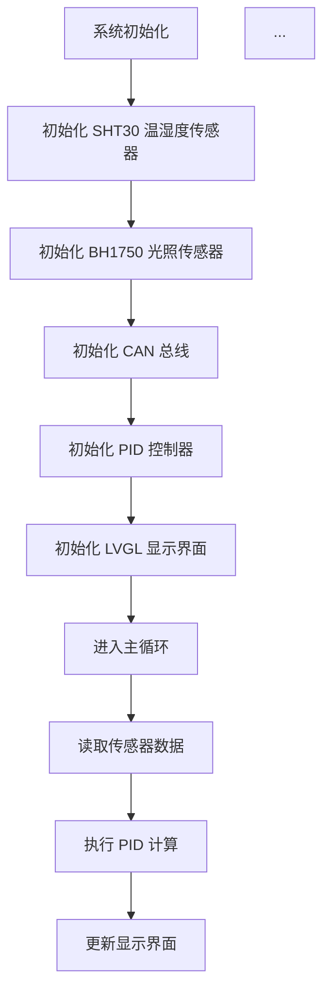
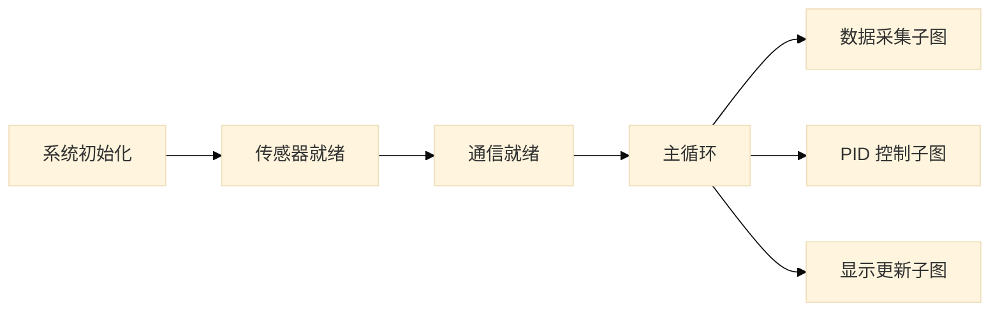

# 核心行为规范 (Core Behavior Guidelines)

> 本项目是一个**智能温室系统**的毕业设计，当前阶段的核心任务是**撰写毕业论文**。
> 本文件定义了 Claude 在辅助论文写作过程中必须严格遵守的行为准则。

---

## 一、核心前提：你拥有完整的源代码上下文

### `repomix-output.xml` 是什么

`repomix-output.xml` 是由 [Repomix](https://github.com/yamadashy/repomix) 生成的**代码仓库打包文件**。它将本项目的全部源代码（排除二进制文件和 gitignore 规则命中的文件）合并为一个结构化的 XML 文档，专门供 AI 系统阅读和分析。

### 文件内部结构

```
1. <file_summary>     — 文件元信息、格式说明、使用指南
2. <directory_structure> — 完整的目录树
3. <file>             — 每个源文件的完整内容，path 属性标明文件路径
```

### 项目源代码组成

本项目包含两个主要子系统，全部代码已收录在 `repomix-output.xml` 中：

| 子系统 | 路径 | 技术栈 | 职责 |
|---|---|---|---|
| **ESP32 交互层** | `Src/Esp32_Interaction/` | C/C++, PlatformIO, LVGL | GUI 显示、语音助手、WiFi 联网、DeepSeek/Baidu API 调用、CAN 通信 |
| **STM32 控制层** | `Src/Stm32_Control/` | Rust, Cargo | 传感器驱动（SHT30, BH1750）、电机控制（PID）、LED/WS2812 控制、CAN 协议 |

关键模块一览：
- `Service/DeepSeekAPI/` — DeepSeek 大模型 API 集成（温室 AI 大脑）
- `Service/VoiceAssistant/` — 语音助手桥接服务
- `Service/CanService/` — CAN 总线通信协议栈
- `Service/GUI/` — LVGL 图形界面（含 Guider 生成的多页面 UI）
- `Service/WifiService/` — WiFi 连接管理
- `Service/SensorState/` — 传感器状态管理
- `bsw/src/pid.rs` — PID 控制算法实现
- `bsw/src/can_proto.rs` — STM32 侧 CAN 协议实现

---

## 二、准则一：【强制】联网搜索 — 真实文献与资料获取

### 背景

论文写作需要引用**真实存在的**学术文献、技术文档和标准规范。本项目网络环境存在代理（端口 7890），DuckDuckGo 的 MCP 工具和 CLI 均因 SSL 握手失败而不可用。经测试，`WebFetch` 工具可正常访问 Google Scholar、GitHub、技术文档网站等。

### 行为规范

1. **【首选】WebFetch 访问学术搜索引擎**：使用 `WebFetch` 工具直接访问 Google Scholar、CNKI、IEEE Xplore 等学术搜索引擎的 URL，提取论文的书目信息（标题、作者、期刊、年份、DOI）。这是当前环境下最可靠的搜索方式。
2. **【文献详情】WebFetch 抓取论文页面**：对于搜索结果中的重要文献，再次使用 `WebFetch` 访问论文详情页（如 ScienceDirect、Springer、IOP Science），获取完整的卷号、期号、页码和 DOI。
3. **【数据手册】WebFetch 抓取芯片厂商官网**：传感器和芯片的数据手册（SHT30、BH1750、ESP32、STM32 等）可通过 `WebFetch` 直接访问厂商官网获取。
4. **【浏览器自动化】Agent Browser MCP**：当需要访问 JavaScript 渲染的动态页面、进行交互操作、或截取网页截图时，使用 `mcp__agent-browser__*` 系列工具。

### 操作流程

```
# 方式一（首选）：WebFetch 搜索学术论文
# 访问 Google Scholar 搜索页，提取论文书目信息
WebFetch(url="https://scholar.google.com/scholar?q=你的关键词&hl=en",
         prompt="Extract paper titles, authors, venues, years, and DOIs")

# 方式二：WebFetch 抓取论文详情页
# 在搜索结果中找到目标论文后，访问其详情页获取完整引用信息
WebFetch(url="https://www.sciencedirect.com/science/article/pii/...",
         prompt="Extract full bibliographic details: authors, title, journal, volume, issue, pages, DOI")

# 方式三：WebFetch 获取数据手册
WebFetch(url="https://sensirion.com/resource/datasheet/sht3x",
         prompt="Extract key technical specifications")

# 方式四：浏览器自动化（动态页面 / 交互操作 / 截图）
# 常用工具链：
#   1. mcp__agent-browser__browser_new_session  — 创建浏览器会话
#   2. mcp__agent-browser__browser_navigate     — 导航到 URL
#   3. mcp__agent-browser__browser_fill         — 填写输入框
#   4. mcp__agent-browser__browser_click        — 点击元素
#   5. mcp__agent-browser__browser_snapshot      — 获取页面可访问性树（AI 可读）
#   6. mcp__agent-browser__browser_screenshot    — 截图（必须指定 path 参数保存到工作区）
#   7. mcp__agent-browser__browser_get_text      — 获取页面文本
#   8. mcp__agent-browser__browser_get_html      — 获取页面 HTML
```

### 截图与资源文件保存规范

- **截图必须保存到工作区**：使用 `browser_screenshot` 时，必须通过 `path` 参数指定保存路径，格式为 `Docs/images/screenshots/` 目录下。
- **禁止保存到 C 盘临时目录**：不要依赖默认保存路径（如 `C:\Users\...`），所有截图资源必须归档到项目工作区内。
- **示例**：`path: "e:\\school\\University\\Graduation_Project\\Intelligent_Greenhouse\\Document\\Docs\\images\\screenshots\\百度搜索结果.png"`

### 搜索策略建议

| 论文需求 | 推荐 WebFetch URL 模板 |
|---|---|
| 英文论文搜索 | `https://scholar.google.com/scholar?q=关键词&hl=en` |
| 中文论文搜索 | `https://scholar.google.com/scholar?q=关键词&hl=zh-CN` |
| 特定论文详情 | `https://scholar.google.com/scholar?q="论文标题"&hl=en` |
| 芯片数据手册 | 厂商官网 datasheet 页面 URL |
| 技术标准文档 | `https://std.samr.gov.cn/` 或标准号直接搜索 |

### 文献筛选标准

搜索结果可能包含大量文献，需要筛选高质量文献用于论文引用。筛选标准如下：

| 筛选维度 | 优先选择 | 谨慎使用 |
|---|---|---|
| **被引次数** | 被引次数 > 50 的经典文献 | 被引次数 < 10 的新文献（除非是最新研究） |
| **发表期刊** | SCI/EI 索引期刊、IEEE/ACM/Springer 等知名出版商 | 非索引期刊、预印本（arXiv） |
| **发表年份** | 近 5 年文献（体现研究前沿）+ 经典文献（奠定理论基础） | 过于陈旧（> 10 年）且非经典的文献 |
| **作者机构** | 知名高校、研究机构、企业研究院 | 无法确认机构背景的作者 |
| **文献类型** | 期刊论文 > 会议论文 > 学位论文 > 技术报告 | 博客、论坛帖子、百科类网站 |

**操作建议**：
1. 优先选择被引次数排名前 5 的文献
2. 确保文献覆盖"经典理论"和"最新进展"两个维度
3. 每个小节引用 3-5 篇文献，避免过度引用单一文献
4. 中英文文献比例建议：英文 60-70%，中文 30-40%

### 已知不可用的工具（因代理 SSL 问题）

| 工具 | 错误表现 | 替代方案 |
|---|---|---|
| `mcp__duckduckgo__duckduckgo_web_search` | VQD 获取失败 | 用 WebFetch 访问 Google Scholar |
| `ddgs` CLI（Bash） | SSL 握手错误 | 用 WebFetch 访问 Google Scholar |

---

## 三、准则二：【强制】基于真实代码撰写论文

### 背景

论文中涉及系统设计、模块实现、代码分析等内容时，必须基于**项目中实际存在的代码**，而非凭空编造。

### 行为规范

1. **不要**在对话开头盲目读取全部代码文件。
2. 当论文内容涉及以下场景时，**必须先查阅 `repomix-output.xml` 中对应模块的真实代码**，再进行撰写：
   - 描述某个模块的实现原理（如 PID 算法、CAN 协议、语音助手流程）
   - 引用代码片段或伪代码
   - 分析系统架构和模块间调用关系
   - 说明接口定义、数据结构、通信协议

### 操作方式

```bash
# 直接在 repomix-output.xml 中搜索目标模块
grep -n "关键词" repomix-output.xml

# 或使用 Grep 工具定位具体文件内容
```

### 代码引用原则

- 论文中的代码片段必须与 `repomix-output.xml` 中的实际代码一致。
- 若需要精简或改写代码用于论文展示，必须基于原始代码进行，不得虚构函数名、参数或逻辑。
- 引用代码时应标注源文件路径，如 `Src/Stm32_Control/crates/bsw/src/pid.rs`。

### 代码转化为学术语言的示例

论文中不应直接堆砌代码，而应将代码逻辑转化为学术语言描述。以下是转化示例：

**原始代码**（`pid.rs`）：
```rust
pub fn compute(&mut self, setpoint: f32, measured: f32, dt: f32, kp: f32, ki: f32, kd: f32) -> f32 {
    let error = setpoint - measured;
    self.integral = (self.integral + error * dt).clamp(-self.integral_limit, self.integral_limit);
    let derivative = if dt > 0.0001 { (error - self.prev_error) / dt } else { 0.0 };
    let output = (kp * error) + (ki * self.integral) + (kd * derivative);
    let constrained_output = output.clamp(-self.output_limit, self.output_limit);
    self.prev_error = error;
    constrained_output
}
```

**学术语言描述**（错误示例）：
> 系统采用 PID 算法进行温度控制。

**学术语言描述**（正确示例）：
> 本系统采用离散位置式 PID 控制算法实现通风风扇的转速闭环控制。PID 控制器的输出 $u(k)$ 由比例、积分、微分三项组成，计算公式为：
>
> $$u(k) = K_p \cdot e(k) + K_i \cdot \sum_{j=0}^{k} e(j) \cdot \Delta t + K_d \cdot \frac{e(k) - e(k-1)}{\Delta t}$$
>
> 其中，$e(k) = r - y(k)$ 为设定值与测量值的偏差，$\Delta t$ 为采样周期。为防止积分饱和，积分项采用限幅处理，限幅值为 $I_{max}$；为防止执行器过载，输出值同样采用限幅处理，限幅值为 $U_{max}$。具体实现中，当采样周期 $\Delta t < 0.0001s$ 时，微分项置零以避免除零错误。

**转化要点**：
1. **变量命名**：将代码中的变量名（如 `setpoint`、`measured`）转化为学术符号（如 $r$、$y(k)$）
2. **数学公式**：将计算逻辑转化为数学公式，使用 LaTeX 语法
3. **物理含义**：解释每个参数的物理意义（如"积分限幅"、"输出限幅"）
4. **边界条件**：说明代码中的特殊处理（如"当 $\Delta t < 0.0001s$ 时"）
5. **引用来源**：标注代码来源文件路径

---

## 四、准则三：【通用】论文写作质量要求

1. **语言风格**：学术论文语体，避免口语化表达。
2. **术语一致性**：全文统一使用同一术语，首次出现时给出英文全称或缩写。
3. **逻辑连贯**：章节之间有清晰的逻辑过渡，前后内容不矛盾。
4. **图表规范**：涉及系统架构、流程、硬件连接时，应配合图表说明。**每张图表必须有完整的标题**，格式为 `**图 {章节号}-{序号} {图表标题}**`，紧跟在图表引用之后。例如：`**图 4-1 通风风扇位置式 PID 转速闭环控制框图**`。正文中必须有对图表的引用说明（如"如图 4-1 所示"），且引用必须出现在图表之前。
5. **参考文献格式**：遵循 GB/T 7714-2015 顺序编码制，通过 Pandoc `--citeproc` 自动生成，每条文献必须可溯源。详见下方"引用规范"。

---

## 五、准则四：【强制】引用规范与 Pandoc 编译工作流

### 5.1 引用规范

#### 背景

论文中的引用标记（如 `[1]`、`[2]`）和文末参考文献列表由 Pandoc 的 `--citeproc` 引擎**自动生成**，不需要手动编号。所有文献信息集中在 `Docs/references.bib` 中管理，在 Markdown 正文中通过 `[@key]` 语法引用。

#### 文件约定

| 文件 | 路径 | 说明 |
|---|---|---|
| 参考文献数据库 | `Docs/references.bib` | BibTeX 格式，所有文献的唯一存储位置 |
| 引用样式文件 | `Docs/csl/china-national-standard-gb-t-7714-2015-numeric.csl` | GB/T 7714-2015 顺序编码制（数字上标） |

#### BibTeX 条目类型速查

| 文献类型 | `@type` | 常用字段 |
|---|---|---|
| 期刊论文 | `@article` | `author`, `title`, `journal`, `year`, `volume`, `number`, `pages`, `doi` |
| 会议论文 | `@inproceedings` | `author`, `title`, `booktitle`, `year`, `pages`, `doi` |
| 专著/教材 | `@book` | `author`, `title`, `edition`, `publisher`, `year`, `address` |
| 学位论文 | `@phdthesis` / `@mastersthesis` | `author`, `title`, `school`, `year`, `address` |
| 技术手册/数据手册 | `@manual` | `author`, `title`, `year`, `url` |
| 网页/在线资源 | `@online` | `author`, `title`, `url`, `year`, `urldate` |

#### Markdown 正文中的引用语法

```markdown
# 单篇引用
温室温度控制常采用 PID 算法实现闭环调节[@wei2022intelligent]。

# 多篇引用（自动合并为 [1, 2] 或 [1-3]）
多项研究[@hooshmand2025smart; @huang2024vegetable; @ang2005pid]表明……

# 作者-年份形式（不带方括号，用于叙述性引用）
Ang 等[@ang2005pid]对 PID 控制进行了系统综述。

# 引用特定页码
根据控制理论教材[@hu2014automatic, pp. 120-125]，……

# 抑制作者名（仅显示编号）
温室监控系统已有成熟方案[@ma2025stm32monitor]。
```

#### 追加新文献的流程

1. 在 `Docs/references.bib` 末尾追加新的 BibTeX 条目，**key 必须全局唯一**，命名规则：`{作者姓小写}{年份}{关键词}`，如 `zhang2020pid`
2. 在 Markdown 正文中用 `[@key]` 引用
3. 重新执行 Pandoc 编译，引用编号自动更新

#### 注意事项

- **禁止手动编写 `[1]`、`[2]` 编号**：所有编号由 `--citeproc` 自动生成，手动编号会导致冲突
- **每条文献必须可溯源**：优先填写 `doi` 字段；无 DOI 的文献填写 `url`；中文教材至少填写 `publisher` + `year`
- **key 命名规范**：全小写，无特殊字符，格式为 `{作者姓}{年份}{关键词}`，如 `hu2014automatic`、`sht30datasheet`
- **CSL 文件来源**：`china-national-standard-gb-t-7714-2015-numeric.csl` 由 [zepinglee/chinese-std-gb-t-7714-2015-csl](https://github.com/zepinglee/chinese-std-gb-t-7714-2015-csl) 提供，遵循 CC BY-SA 3.0 许可

### 5.2 Pandoc 编译与构建工作流（唯一权威版本）

#### 背景

论文必须形成可沉淀的文件。采用"Markdown 撰写 -> Pandoc 编译"的工作流。

#### 文件目录规范

```
Docs/
├── chapters/                    # 论文章节 Markdown 源文件
│   ├── Chapter1_绪论.md
│   ├── Chapter2_需求分析与总体设计.md
│   ├── Chapter3_硬件电路设计.md
│   ├── Chapter4_STM32控制层软件设计.md
│   ├── Chapter5_ESP32交互层软件设计.md
│   └── Chapter6_总结与展望.md
├── images/                      # 所有图表资源
│   ├── architecture.png         # 系统架构图（PNG，供 Pandoc 引用）
│   ├── architecture.svg         # 系统架构图（SVG 底稿，不直接引用）
│   ├── pid_control_strategy.png # PID 控制策略图
│   ├── *.mmd                    # Mermaid 源文件
│   └── screenshots/             # 浏览器截图、搜索结果截图
├── csl/                         # 引用样式文件
│   └── china-national-standard-gb-t-7714-2015-numeric.csl
├── references.bib               # 参考文献数据库（BibTeX 格式）
└── output/                      # Pandoc 编译产物（docx 等）
    └── Thesis_Draft.docx
```

- **章节文件命名**：`Chapter{N}_{章节标题}.md`，如 `Chapter4_STM32控制层软件设计.md`
- **图表文件命名**：使用有意义的英文名称，与章节内容对应，如 `pid_fan_loop`
- **Mermaid 源文件**：`.mmd` 文件与渲染产物放在同一目录（`Docs/images/`），保持同名
- **编译产物**：统一输出到 `Docs/output/` 目录，避免与源文件混杂

#### 行为规范

1. **分章输出**：在得到写作指令后，必须调用写入工具将论文内容保存为 `.md` 文件放入 `Docs/chapters/` 目录中，不要仅在聊天窗口输出。
2. **Pandoc 编译**：当要求将论文导出为 Word 时，使用 Bash 终端调用本地的 Pandoc 进行格式转换。

#### Pandoc 编译命令

```bash
# 单章编译（含引用处理）
pandoc Docs/chapters/Chapter4_STM32控制层软件设计.md \
  --citeproc \
  --bibliography=Docs/references.bib \
  --csl=Docs/csl/china-national-standard-gb-t-7714-2015-numeric.csl \
  -o Docs/output/Chapter4.docx

# 多章合并编译
pandoc Docs/chapters/Chapter1_绪论.md Docs/chapters/Chapter2_需求分析与总体设计.md \
  --citeproc \
  --bibliography=Docs/references.bib \
  --csl=Docs/csl/china-national-standard-gb-t-7714-2015-numeric.csl \
  -o Docs/output/Thesis_Draft.docx
```

> **注意**：Pandoc 默认不支持在 docx 中嵌入 SVG 图片。因此 Markdown 正文中必须引用 `.png` 文件（由 `mmdc -s 4` 生成），详见准则五。

---

## 六、准则五：【强制】架构图与流程图生成策略

### 背景

工科毕业论文需要大量的插图（如系统架构图、数据流图、PID 控制状态机等）。所有插图必须符合**学术出版级**的排版与视觉规范，确保插入 Word 或 LaTeX 文档后在 A4 纸张上清晰可读、打印不失真。

### 行为规范

1. **主动提议**：在分析完 `repomix-output.xml` 中的代码，向用户解释逻辑时，应主动询问"是否需要为您绘制对应的流程图？"。
2. **使用 Mermaid 渲染**：当同意绘制时，使用 Mermaid 语法编写图表代码，并调用本地的 Mermaid CLI 将其渲染为图片，最后插入到 Markdown 论文中。
3. **模块化拆分（严禁画全局大图）**：严禁将整个系统的 ESP32 和 STM32 全部画在一张图内。必须按子系统拆分绘制局部图，例如：
   - "语音助手交互时序图"
   - "STM32 PID 调度流程图"
   - "CAN 帧解析逻辑图"
   - "LVGL 界面状态机图"
   - "DeepSeek API 调用流程图"

### 强制规范一：SVG 保留底稿，正文只引用 PNG

Pandoc 将 Markdown 编译为 docx 时**不支持嵌入 SVG**。为保证编译工作流顺畅：

1. 使用 `mmdc` 生成图表时，**必须先生成 `.svg` 文件保留为底稿**（用于后续编辑或 LaTeX 场景）。
2. **随后必须附加 `-s 4` 参数生成对应的 `.png` 高分辨率位图**。
3. **在 Markdown 正文中，绝对只能引用生成的 `.png` 文件，严禁在 Markdown 代码中写入 `.svg` 的引用路径。**

```bash
# 正确流程：先生成 SVG 底稿，再生成 PNG 供论文引用
mmdc -i Docs/images/architecture.mmd -o Docs/images/architecture.svg
mmdc -i Docs/images/architecture.mmd -o Docs/images/architecture.png -s 4
```

```markdown
<!-- ✅ 正确：引用 PNG -->


<!-- ❌ 错误：引用 SVG（Pandoc 编译 docx 时会丢失） -->

```

### 强制规范二：学术图表颜色规范（Theme）

**严禁**使用 Mermaid 默认的彩色主题（`default`、`dark`、`forest` 等网页风格主题）。这些主题的渐变色、彩色边框在黑白打印时丢失信息，且与学术论文的严肃风格不匹配。

所有 `.mmd` 源文件**必须**在首行声明黑白/灰度主题：

```mermaid
%%{init: {'theme': 'base'}}%%
```

- 推荐使用 `base`（纯白背景、黑框黑字、灰度填充）或 `neutral`（中性灰度风格）。
- 若通过命令行参数指定主题，则使用 `mmdc -t base`。
- **绝对禁止**生成带有彩色背景、渐变填充或彩色边框的图表。

### 强制规范三：代码泛型与特殊字符转义（Syntax）

Mermaid 的节点描述文本会被当作类 HTML 内容解析。当图表中出现 Rust 泛型语法（如 `Option<f32>`、`Vec<u8>`、`Result<SensorData, Error>`）时，尖括号 `< >` 会被误识别为 HTML 标签，导致**渲染崩溃或字符丢失**。

在所有节点描述中，遇到尖括号必须使用以下方式之一进行转义：

| 方式 | 示例 | 适用场景 |
|---|---|---|
| HTML 实体转义 | `Option&lt;f32&gt;` | 推荐，兼容性最好 |
| 双引号包裹 | `"Option<f32>"` | 适用于较短的类型名 |

**错误示例（禁止）**：
```
A[处理 Option<f32> 数据] --> B[返回 Result<u8, Error>]
```

**正确示例（强制）**：
```
A[处理 Option&lt;f32&gt; 数据] --> B[返回 Result&lt;u8, Error&gt;]
```

除泛型尖括号外，以下字符同样需要转义：
- `&` → `&amp;`
- `"`（在非引号包裹的文本中）→ `&quot;`

### 强制规范四：A4 页面布局与纵横比适配（Layout）

**严禁**生成垂直方向极其狭长的图表（如单列长串的 `TD`/`TB` 布局超过 8 个节点）。此类图表插入 A4 纸张时会被整体压缩至页面宽度，导致字号过小、无法阅读。

布局规范如下：

1. **主架构图、层级图**：优先采用从左到右的 `LR` 布局，充分利用 A4 纸张的横向空间。
2. **复杂逻辑拆分**：对于包含超过 6 个节点的自上而下逻辑，必须进行"模块化解耦"：
   - 先画一张**主调度/总览图**（LR 布局），仅展示模块间的顶层调用关系。
   - 再将具体外设（如 SHT30、BH1750）或子流程（如 PID 计算、CAN 帧组装）拆分为**独立的子流程图**，分别绘制。
3. **节点文本长度**：单个节点的描述文字不超过 15 个汉字（约 30 字符），过长的描述应拆分到子图中或使用注释。

### 图表设计原则

**1. 信息密度原则**
- 每张图表应传达一个核心信息，避免信息过载
- 节点数量控制在 5-10 个，超过时应拆分为子图
- 删除不必要的装饰元素（如背景色、阴影、渐变）

**2. 视觉层次原则**
- 使用线条粗细区分主要流程和次要流程
- 使用灰度深浅区分不同模块或层次
- 重要节点可使用边框加粗或填充色突出

**3. 一致性原则**
- 同一论文中的图表风格保持一致（颜色、字体、布局）
- 相同类型的节点使用相同的形状和样式
- 术语和缩写在图表中与正文保持一致

**4. 可读性原则**
- 字号不小于 10pt（打印后）
- 节点间距适中，避免过密或过疏
- 流程方向清晰，避免交叉线条

**图表类型选择指南**：

| 场景 | 推荐图表类型 | 示例 |
|---|---|---|
| 系统架构 | `graph LR`（模块架构图） | ESP32 与 STM32 的模块划分 |
| 数据流 | `flowchart LR`（数据流图） | 传感器数据从采集到显示的流程 |
| 时序交互 | `sequenceDiagram`（时序图） | I2C 读写 SHT30 的报文交互 |
| 状态转换 | `stateDiagram-v2`（状态机） | 自动调度器的状态切换逻辑 |
| 算法流程 | `flowchart TD`（流程图） | PID 控制算法的计算步骤 |

**错误示例（禁止）**：


**正确示例（强制）**：


### 强制规范五：Markdown 中必须插入渲染后的图片，禁止嵌入 Mermaid 源代码

Mermaid 代码块（` ```mermaid `）在 Markdown 预览和 Pandoc 转换为 docx 时**不会被渲染为图片**，只会以源代码形式显示，严重影响论文的可读性和专业性。

流程如下：

1. 将 Mermaid 图表代码保存为独立的 `.mmd` 源文件（如 `Docs/images/pid_control_strategy.mmd`）。
2. 使用 `mmdc` 将 `.mmd` 渲染为 `.svg`（底稿）和 `.png`（正文引用）。
3. **在 Markdown 论文中，使用标准图片语法引用 `.png` 渲染产物，禁止保留 ` ```mermaid ` 代码块**：

```markdown
<!-- ✅ 正确：引用渲染后的 PNG -->
**图 4-X 自动控制模式下的分层控制策略协同图**


<!-- ❌ 错误：直接嵌入 Mermaid 源代码 -->

```

4. 每张图片必须紧跟在首次引用该图的文字之后，并附带完整的图表标题（格式：`**图 {章节号}-{序号} {标题}**`）。

### 操作流程

```bash
# Step 1: 确保本地有 Mermaid CLI 工具
npm install -g @mermaid-js/mermaid-cli

# Step 2: 编写 .mmd 文件 (如 flowchart.mmd)
# 【必须】在 .mmd 文件首行加入主题声明：%%{init: {'theme': 'base'}}%%
# 【必须】对所有泛型尖括号使用 HTML 实体转义：&lt; &gt;
# 【必须】优先采用 LR 布局，避免单列过长的 TD 布局

# Step 3: 生成 SVG 底稿（保留用于后续编辑或 LaTeX 场景）
mmdc -i Docs/images/flowchart.mmd -o Docs/images/flowchart.svg

# Step 4: 生成高分辨率 PNG（-s 4 为 4 倍分辨率，供论文 Markdown 引用）
mmdc -i Docs/images/flowchart.mmd -o Docs/images/flowchart.png -s 4
```

---

## 七、准则六：【强制】高信噪比与浓缩的论文生成法

### 背景

毕业论文章节篇幅较长，一次性生成整章内容会导致技术深度不足、内容空洞。必须采用精细化的逐节撰写方式，确保每一节都有足够的技术血肉。同时，**核心正文总字数严格控制在 8,000 - 12,000 字**（不含代码、参考文献、附录），各章节需按此目标分配篇幅。

### 论文字数分配建议

| 章节 | 内容 | 建议字数 | 撰写重点 |
|---|---|---|---|
| 第一章 | 绪论 | 1,000-1,500 | 研究背景、国内外现状、研究内容、论文结构 |
| 第二章 | 需求分析与总体设计 | 1,000-1,500 | 功能需求、性能需求、系统架构设计 |
| 第三章 | 硬件电路设计 | 1,500-2,000 | 各模块电路设计、元器件选型、原理图分析 |
| 第四章 | STM32 控制层软件设计 | 2,000-3,000 | 驱动开发、控制算法、调度器、通信协议 |
| 第五章 | ESP32 交互层软件设计 | 1,500-2,500 | GUI 设计、网络通信、API 集成、语音交互 |
| 第六章 | 总结与展望 | 500-1,000 | 工作总结、创新点、不足与展望 |

**注意事项**：
1. 第四章和第五章（软件设计）是论文的核心，字数应最多
2. 图表、代码、公式不计入正文字数
3. 所有长篇源码、协议真值表、完整配置清单必须移至**附录**，正文仅保留精炼的伪代码或核心逻辑片段

### 浓缩原则

1. **剥离代码，正文禁堆砌**：禁止在正文堆砌大段源代码。正文仅使用精炼的伪代码或核心逻辑说明（单段代码不超过 10 行），完整的源码、协议真值表、寄存器映射表等一律移至附录。
2. **以图代文，拒绝"说明书式"科普**：对于硬件参数、微控制器架构、底层通信机制等描述，**必须使用 UML 图、系统框图或状态图来替代冗长的文字说明**。例如：用一张模块架构图替代逐个外设的文字罗列，用一张状态机图替代调度逻辑的逐步文字描述。
3. **信噪比优先**：每一段文字都应承载有效信息。删除空洞的过渡句、重复的背景介绍和无信息量的修饰语。

### 行为规范

1. **禁止整章生成**：在撰写论文正文时，**绝对不要**一次性输出整章内容。必须精确到**三级标题（如 3.1.2 章节）**进行逐节撰写。
2. **技术深度要求**：每一小节的内容必须包含足够的技术血肉。在撰写具体模块时，**必须查阅 `repomix-output.xml`**，并将以下真实代码元素融入文字描述中：
   - 关键变量名及其含义
   - 数据结构定义（如 Rust 结构体、C 语言结构体）
   - 控制流逻辑（if/else 分支、状态机转换）
   - CAN 协议帧定义（帧 ID、数据域格式）
   - 函数调用关系与参数传递
3. **图表优先**：能用一张图说清楚的内容，不要用三段文字来描述。图的信息密度远高于文字。

### 代码融入示例

撰写 STM32 侧 PID 控制模块时，不能只写"系统采用 PID 算法进行温度控制"这样的泛泛之谈。**必须先查阅源码确认实际控制策略**：本系统中温度/湿度/土壤湿度采用迟滞控制（开关控制），PID 算法仅用于通风风扇的转速闭环控制。撰写时必须查阅 `repomix-output.xml` 中 `dispatcher.rs`（调度器逻辑）和 `pid.rs`（PID 算法）的真实代码，将控制策略分层、结构体定义、比例/积分/微分参数的计算逻辑、输出限幅处理等细节准确地融入论文描述中。

---

## 八、准则七：【强制】多维度的图文穿插与实物证据防伪策略

### 背景

硬件系统的毕业论文不能只有纯文本和单一的逻辑流程图。为了证明系统的真实性和工作量，必须在原理描述后紧跟相应的波形图、实物图或更微观的时序图。

### 行为规范

1. **拒绝首尾堆砌，实行图文穿插**：
   - 绝对禁止在长达几千字的一整节末尾只放一张总结性的大图。
   - 图表必须紧跟在首次提到该图表的文字段落之后。

2. **区分图表类型（按需绘制）**：
   - 不要为了凑数而在每一小节都画流程图。应当根据技术特点区分类型：
     - 涉及协议时（如 I2C 读写、CAN 帧封装）：使用 Mermaid 的 `sequenceDiagram` 画时序图。
     - 涉及控制逻辑时（如迟滞调度器）：使用 `stateDiagram-v2` 画状态机。
     - 涉及数据流转时（如 Embassy 任务共享总线）：使用 `flowchart LR` 画模块架构图。

3. **【关键】主动预留实物图与测试图坑位**：
   - AI 无法生成真实的硬件照片。因此，当写到具体的硬件外设、传感器或底层总线时，**必须**主动在 Markdown 中使用特定的语法为人类作者预留实物图占位符。
   - **占位符格式规范**：`> 💡 [人类作者请注意：请在此处插入一张 {具体实物/波形} 的照片，例如：逻辑分析仪抓取的 SHT30 I2C 报文波形图，或 TJA1051T CAN 节点的实物接线图。这能极大增强论文的真实性。]`
   - 在写数据采集（如 BH1750）、通信模块或电机控制模块时，至少预留 1-2 个实物图或测试波形图坑位。
